# M10 — UI parity with the approved prototype

Source: `docs/agent-goal-ui-parity.md`, before the remaining M9 items.
Implementation branch: `codex/ui-parity`, based on `main` at `6d78415`.

## Starting review

Read `docs/ui/review-2026-10-10/README.md` and personally inspected all 14
PNG images before changing code. The reviewed app is `55b315b`; the review
and parity objective were added to main in `84eb670`; `6d78415` adds the
source-port requirement and markup line map.

The implementation source is the prototype's markup and inline styles, not
its screenshots. Each block is ported to TSX, its styles lifted into CSS
classes using the existing tokens, and its bindings replaced by the current
app's queries and mutation handlers. Prototype icons map to Lucide; its
Button, Switch and Badge map to the existing `components/ui` primitives,
extending a primitive only when a used variant is missing. Captures check
the result. The existing accessibility floor takes precedence over the
prototype's smaller targets and 11 px labels.

| Screen | Observed difference to address |
| --- | --- |
| Shell | Global top bar and large heading consume the phone's first third; the prototype has compact screen headers, a square FAB, toast, and desktop organization/search/agent sidebar. |
| Today | Tall run cards and inline creation replace the prototype's timed schedule, agent block, now-line, and compact due rows. |
| Projects | Project/filter forms and status selectors dominate the board; reference cards put the ID, due date, title, parent and member chips in a compact hierarchy. Desktop lacks the selected-task panel. |
| Task detail | Full-page title/description/date forms replace the bottom sheet's field rows and inline deliverable review. |
| Inbox | Tall grouped cards omit agent identity, excerpt and inline approval; the reference has dense rows, unread dots, status chips and a desktop review panel. |
| Calendar | Extra route heading and header controls push the grid down; the reference uses a compact month/segmented header, hint, day dots, unscheduled chips and bordered blocks. |
| Me | Account/workspace forms and separated sections replace the avatar, role/team line, chevron rows and segmented preferences. |
| Type and density | 48 px route titles and generous form spacing must follow the prototype's 28 px titles, 15 px card titles and 12 px metadata. |

## Acceptance ledger

A screen remains pending until its real seeded app capture is shown beside
its matching reference, the committed visual baseline passes, and existing
behavioral flows remain green. Reference captures alone do not approve the
app. No production database will be seeded for this work.

| Step | State | Evidence |
| --- | --- | --- |
| 0 — offline prototype and capture tooling | Accepted locally; strict checks before push pending | 38 native zh/en reference captures; independent full navigation rerun passed with zero external requests or browser errors. [Matrix and provenance](../ui/reference/README.md). |
| 1 — shell | Visuals accepted at `dfcbefb`; committed-baseline and behavioral gates pending | Six native element captures personally inspected by the root agent; reference/app comparisons below. Phone tabs/FAB from lines 376–410, desktop sidebar from 940–953; existing session/cache guards retained. |
| 2 — Today and Northwind seed | Phone accepted at `e1c2d1a`, corrected desktop at `e5165f9`; behavioral gates pending | Four native captures inspected; independent comparison passed. Source 47–114, existing real schedule/tasks/run bindings. |
| 3 — Projects | Visuals accepted at `e5165f9`; behavioral gates pending | Eight production board/list captures, source 223–279/935–1045; side-by-side evidence below. |
| 4 — task detail and review | Visuals accepted at `e5165f9`; behavioral gates pending | Four task and eight review production captures; source 791–934/1034–1214 and sticky phone toolbar. |
| 5 — Inbox | Visuals accepted at `e5165f9`; behavioral gates pending | Four production captures, compact inactive desktop rows and focus-visible 44 px actions; source 280–322/1010–1034. |
| 6 — Calendar | Visuals accepted at `a93ca59`; behavioral gates pending | Twelve production day/week/month captures, source 115–222; exact day hatch and inverse month date fill. |
| 7 — Me | Visuals accepted at `e5165f9`; behavioral gates pending | Four production captures, source 323–375; real identity, members and preferences. |
| 8 — type, density and dark theme | Visuals accepted at `e5165f9`; behavioral gates pending | Eight production light/dark captures; actual source scale, existing tokens, 12 px/44 px floor. |

Before each push: lint, typecheck, licence gate, unit tests, web build,
server build, bundle budget, Playwright and MCP smoke. Final performance
acceptance also includes Lighthouse and three LCP runs in each locale.

## Step 0 evidence

React 18.3.1 and the prototype fonts are local, with MIT/OFL licences and
source hashes. The self-serving runner captures 22 phone and 16 supported
desktop views, verifies native dimensions, font loading and initial task
state, and rejects external requests and browser errors. The root agent
independently walked every view in both languages using this runner, then
inspected the resulting references. English and Chinese both retain NW-138
working at 2/4; the simulation is frozen only by the capture harness.

The prototype does not define desktop Today, Calendar, Me, MCP or agent
profile layouts. Those gaps are listed explicitly in the reference matrix.
Phone references retain synthetic OS chrome; comparisons account for that
chrome without adding a fake status bar to the app.

## Shell candidate

The signed-in global header is removed. Quick Add moves to the 52 px dark
square FAB, language and sign-out to Me, and search to compact screen
headers and the desktop sidebar. The sidebar follows the source's 208 px
width, organization menu, search/⌘K control, two primary links and agent
rows; bottom utility links retain desktop access to Today, Calendar and Me.
The standing 44 px target floor enlarges the prototype's 32 px sidebar
controls. Counts and agent dots use actual API data. Foreground alerts keep
notification preferences and device delivery, with the source's dark bottom
toast and View action. Other screen ports remain pending.

The real Northwind fixture prerequisite is included: 12 Checkout tasks,
five workspace members, three agents, real reviews/blockers/inbox and
recurring scheduled meeting tasks. Quartz and Personal are separate demo
organizations. Deterministic identities let repeat seeds preserve edits,
passwords, approvals, permissions and calendar changes. Canonical untouched
fixture fields translate in all three locales; edited content stays verbatim.
`SEED_DATE` anchors isolated visual data to October 8; normal seeding uses
the current day in the existing demo account's time zone. No production
database is seeded.

Current checks: six-package typecheck, licence gate and three seed unit
tests pass. PostgreSQL integration and browser assertions are pending: the
local PostgreSQL container accepts internal connections but the host driver
query timed out before assertions. The initial browser run was stopped
while waiting for API readiness, with its owned processes cleaned up.
Acceptance will use the prepared isolated Linux environment.

## Shell visual checkpoint — 2026-10-10

The root agent personally inspected all six `dfcbefb` app captures and
accepted the Shell visuals. The six accepted PNGs are copied unchanged to
`e2e/__screenshots__/ui-parity.spec.ts/`, using the visual configuration's
four project names. This is visual acceptance, not a claim that the nine
validation gates have passed: the committed-baseline check and behavioral
acceptance remain pending.

The implementation inputs remain the HTML blocks: phone FAB and tabs at
376–410, desktop sidebar at 940–953. These comparisons use only native
pixel crops of the corresponding reference captures, without scaling or
reconstructed pixels. The phone tab crop omits the 28 px synthetic OS home
area; the app does not add fake OS chrome. The 52 px FAB and 208 px desktop
sidebar are compared at their source dimensions. [Crop coordinates and
hashes](../ui/screenshots/ui-parity/shell/README.md) preserve provenance.

| Region / locale | Prototype reference crop | Accepted real app |
| --- | --- | --- |
| Phone tabs / English |  |  |
| Phone tabs / Hong Kong Chinese |  |  |
| Phone FAB / English |  |  |
| Phone FAB / Hong Kong Chinese |  |  |
| Desktop sidebar / English |  |  |
| Desktop sidebar / Hong Kong Chinese |  |  |

Documented differences preserve working behavior and the accessibility
floor: targets are at least 44 px and text at least 12 px, enlarging the
source's 32 px controls and 11 px labels. The real API returns four unread
Inbox items, while the prototype shows three; badges and agent status dots
retain actual data. Desktop utility links for Today, Calendar and Me retain
access to those existing routes below the source sidebar's primary links
and agents. The native Lucide icon mappings and these differences are part
of the accepted Shell capture, not screenshot substitutions.

CI now runs the explicit Shell visual check before behavioral flows, after
the existing isolated `db:seed` step and builds. Behavioral tests can edit
the fixture and repeat seeding intentionally preserves edits, so running
visuals first avoids depending on a destructive reset. The visual check
uses the committed baselines and does not update them in CI.

## Today visual checkpoint

The root agent inspected all four `e1c2d1a` captures after an independent
comparison passed. Production verification at `e5165f9` revealed that the
earlier desktop images had captured an empty Sidebar before it loaded. Root
inspected and intentionally replaced those two desktop images; all reported
differences are inside the formerly blank left 208 px. The main content has
zero reported differences under the unchanged comparison settings. Both phone
baselines pass unchanged. Fresh full comparisons remain required.
The source's date/header, timed blocks, dashed agent work,
gold now-line and compact due rows bind actual Northwind data. Actual meeting
durations, attendees, authenticated-user initials, unread count and paused work
remain truthful. No planned-step total or progress percentage is invented.
The [capture manifest](../ui/screenshots/ui-parity/today/manifest.json) records
source, reference and byte-identical app/baseline hashes. Behavioral and full
release checks remain pending. Synthetic prototype OS chrome is absent in the app.

| Locale | Prototype reference | Accepted real app |
| --- | --- | --- |
| Phone English |  |  |
| Phone Hong Kong Chinese |  |  |

The prototype has no desktop Today view. These are responsive app evidence:

| Desktop English | Desktop Hong Kong Chinese |
| --- | --- |
|  |  |

## Integrated source ports — candidate, acceptance pending

### Search visual checkpoint

The root agent inspected all four native `e1c2d1a` Search captures after
strict independent comparison passed. The source's phone full-screen search
and desktop palette bind the existing query, scope, filters and keyboard
handlers. Fresh-session recent history is empty; the real search supports
Tasks, Comments and Settings and its existing filters. Prototype-only event
or people searches and invented recent queries are not presented. Controls
retain the 44 px floor and visible focus. Full behavioral gates remain pending.
The [manifest](../ui/screenshots/ui-parity/search/manifest.json) records unchanged
app/baseline bytes and references. CI compares these approved baselines.

| View | Prototype reference | Accepted real app |
| --- | --- | --- |
| Phone English |  |  |
| Phone Hong Kong Chinese |  |  |
| Desktop English |  |  |
| Desktop Hong Kong Chinese |  |  |

The source ports also include Notifications (613–635), the house Switch,
and Quick Add (794–812). Preference persistence, parsing, assignment,
creation and their error paths retain the existing handlers. Twelve further
offline phone references cover Calendar week/month, Projects list,
Notifications, Team and Quick Add; the root agent inspected each.

At `8489383`, Today generated four real seeded captures and passed an
independent comparison without updates. These are diagnostic captures, not
approved Today baselines: inspection prompted a compact worker-chip styling
correction. The font harness now loads the four actual stylesheet faces before
capture. It preserves their families, sources, weights and Unicode ranges;
product `font-display: optional` and cold performance measurements are unchanged.
Four Shell tab/sidebar baselines were explicitly reinspected and replaced to
correct the earlier fallback-font renders, with provenance in the Shell manifest.

Visual navigation now selects the real Project task cards for the phone sheet
and desktop detail pane. Desktop review opens the real Inbox control, then
restores the isolated recipient's read state in a `finally` block. Screens wait
for their dependent data before capture. These runner changes require the next
sealed browser run; no production deployment or database changes are included.

Today, Projects, task detail and review, Inbox, Calendar and Me now have TSX
and token CSS ports from the line map. The shared shell persists across routes;
Next intercepted task routes preserve the preceding phone screen. Desktop
Projects and Inbox bind the existing task editor in the source's detail pane.
Source Search, agent profile, MCP and Team blocks are also ported. Existing
permissions, version checks, form drafts, optimistic rollback, recurrence,
notifications, token reveal-once and cache identity guards remain in their
original handlers. House Button, Input, Label, SheetDialog and the shared
Lucide StatusGlyph map the prototype primitives.

Review found and repaired nested-dialog Escape propagation, cross-workspace
task member/run/comment scoping, and account-specific timezone initialization.
Schedule controls sit outside the metadata form; an embedded approval failure
keeps checks, item decisions and comment drafts. Existing 105 browser cases
retain their behavioral assertions; twelve regression cases cover Me preferences,
schedule-save isolation, approval rollback and cross-workspace nested editing.
The expanded suite has 117 cases; integrated browser execution is pending.

A local production build exposed Next 16 parallel-route validation: an explicit
implicit-slot fallback now preserves 404 behavior while the modal slot clears
on navigation. The build succeeds. A preliminary integrated Today measurement
is 196,993 bytes gzipped, below 204,800; this measurement precedes the last
auxiliary CSS imports and is not final acceptance. Full typecheck and lint pass.

The immutable Shell candidate `dfcbefb` completed seven required checks and
all three Lighthouse/LCP locale runs, but failed Playwright (95 passed,
10 failed); MCP smoke was not reached. Failures concern the held run navigation,
profile rollback after route changes, consumed invitation URL restoration and
one MCP attachment capability response. The integrated candidate addresses the route
lifetime and selector issues; it must pass the full runner before any push.
The failing candidate's evidence is retained and its disposable infrastructure
removed. Production and the previously accepted validation environment remain
unchanged.

Gaps reflect real APIs: runs report events but no planned-step total, so no
percentage or pending steps are fabricated. Agent client/skills/health and MCP
connection health are absent. Search supports tasks, comments and settings;
it has no member/event search. The prototype has no desktop-specific Today,
Calendar, Me, agent profile or MCP layout. These supported responsive screens
need captures, baselines and side-by-side acceptance before being marked done.

The `786dbfb` diagnostic capture pass exposed shared house styles overriding
unlayered screen ports: phone Projects retained desktop controls, Search lost
its grid, and task fields lost source styling. The original Base declarations
are now moved byte-for-byte to a native cascade layer beneath the screen CSS.
Projects uses the existing task toolbar to close its pane; compact card/list
spacing and readable disabled fields preserve their handlers and 44 px targets.
Inbox waits for its task pane and keeps action controls in the source row.

Calendar capture dates now freeze native Temporal alongside Playwright Date:
Chromium's native Temporal clock otherwise selected the real day without the
seed's events. The helper asserts the frozen instant. Task-detail/review
diagnostic renders wrote all four images but collided during trace teardown;
per-screen output directories and an exclusive, bounded validation lock prevent
shared artifacts and overlapping browser runs. These diagnostics are retained,
not accepted baselines. Fresh comparisons and all nine required checks remain
pending for the sealed revision.

The sealed `8c5a40b` run failed performance acceptance: Today JavaScript was
197,419 bytes gzipped, but Lighthouse performance was 96 / 78 / 78 and the
three-run LCP medians were 2,208 / 2,536 / 2,524 ms (en / zh-CN / zh-HK).
The strict runner stopped before Playwright and MCP smoke; the 117 behavior
cases were not executed. Its terminal evidence is retained and its owned
disposable resources are removed. Thresholds and the 20-task fixture stay fixed.

That revision's diagnostic captures and independent comparisons succeeded for
Shell, Today, Projects, task detail, review, Inbox, Me, type, Search, agent,
MCP, Team, Notifications and Quick Add. Calendar exposed an Intl prototype
incompatibility between Playwright's clock and the existing Temporal polyfill;
the capture helper now preserves the native formatter descriptors. Organization
capture did not start while the preceding bounded browser lock was held.
Neither failure is recorded as a visual pass.

Inspection requires further source refinements before accepting these baselines:
minimum-content card overflow and phone list footer overlap, the translated
parent link, review content immediately after the task description with the real
actions in the footer, desktop Search height and Quick Add positioning, and the
native Team directory context. An additional review capture scrolls to the real
deliverable. Two offline desktop Quick Add references now complement the twelve
extra phone references; all fourteen have zero external requests and browser
errors. Fresh captures, side-by-side approval and the complete unchanged runner
remain required before any UI push.

The cold-page waterfall identifies another source of delay: the desktop
Sidebar's default lazy wrapper has no local Suspense boundary. Mounting it
behind CSS on a phone suspended the containing shell after fresh identity
confirmation. It now mounts at the existing desktop breakpoint and has its
own loading boundary. A real held-chunk/resizing regression joins the suite
(120 locale cases total); session confirmation and provisional-cache purging
are unchanged. Generic Today labels and every localized month/weekday/date now
use the common Noto subset. The disjoint font coverage remains exactly 714
mappings with unchanged outlines, metrics and axes at six weights. Neither
change is a performance pass until the unchanged cold-browser gates run.

The `fb27a5a` diagnostic candidate passed independent Projects board/list
comparisons in all four configurations. Calendar rendered all twelve day,
week and month captures; the Chinese phone month comparison failed because
the SDK retained a time-grid scroll offset, clipping the month headings.
The shared engine now resets month scrolling only after its native month
DOM mounts. The existing phone touch/month flow covers switching from a
scrolled week, an unclipped first row and the subsequent real event move.
Month chips also follow source lines 210–218: title-only text, square date
labels, two-pixel gaps and compact padding. Their native interactive elements
retain the required 44 px size.

Shell comparison found small Chinese glyph raster differences after the
common-font expansion. Only the new common font's `prep` raster-control
table is removed to retain the earlier subset's controls; mappings, outlines,
metrics, axes and layout tables stay unchanged. The exact reproducible asset
and hashes are recorded in `apps/web/public/fonts/README.md`. Fresh strict
pixel comparisons and the complete runner remain pending. The diagnostic
candidate is superseded without starting gates; it is not a validation pass.

At `f3c4f5b`, Calendar generated twelve native captures and passed an independent
comparison in all four configurations. Shell's raster repair reduced the
Chinese differences to 14 phone and eight desktop text-antialias pixels.
The root agent inspected both actual/diff pairs and explicitly approved the
two font-change captures shown beside their references above. Geometry,
icons and data are unchanged. Their new hashes and source revision are in
the Shell manifest; English captures, FABs and comparison settings are unchanged.
A fresh comparison of these deliberately approved baselines and the complete
runner remain required. Desktop card parent IDs now use available width;
agent status wraps when its translated label cannot fit, and the selected
Board/List underline uses the source's gold token.

The corrected Shell baselines pass strictly at `e1c2d1a`, with all four
projects using unchanged comparison settings. Calendar's final density
refinement follows source line 1973: 56 px day hours, 44 px week hours and
hourly labels, applied through the installed controls API so native gesture
geometry remains coherent. The existing 24-hour scheduling range and
15-minute drag/resize snapping stay. Its existing phone flow now verifies
both grid scales across view changes; browser execution and fresh Calendar
captures remain pending.

The `e1c2d1a` diagnostic run passed strict comparisons for Shell, Today,
Projects board/list, task detail, review plus scrolled deliverables, Inbox and
Me. Native inspection prompted three final source repairs: desktop board
controls occupy their own row when visible, the phone task toolbar remains
sticky, and inactive desktop Inbox rows use the source's compact typography
and spacing. Selected, hovered or keyboard-focused Inbox rows expand their
existing actions to preserve the 44 px target floor. No handlers, permissions
or data are replaced with prototype simulations.

Me's desktop diagnostic captures exposed a capture readiness gap: the lazy
sidebar had not mounted when the body was captured. Both capture runners now
wait explicitly for the sidebar and its three real agent links. Those blank
sidebar images are not approved baselines. Fresh captures of the final source
and the complete behavior/performance gates remain required; diagnostic
generation followed by self-comparison alone does not approve a screen.

The completed `e1c2d1a` diagnostic pass covers all fifteen non-Calendar
screens, with generation and strict self-comparison succeeding. Native review
also exposed the Team fragment context and the old organization chooser;
both required product fixes rather than baseline approval. Team now selects
its directory context after mounting and on browser fragment/back changes.
The shared chooser ports phone markup 880–894 and desktop 1124–1135, showing
real workspace roles without invented teams or counts. Its phone Create action
opens the existing organization form. Existing Me flows now cover that entry.
Phone Agent, Team, MCP and Notifications use the source's Back navigation
without the underlying main tabs. These changes still require fresh captures.

That diagnostic candidate is superseded without starting release gates; its
evidence is retained and owned disposable resources removed. Production and
the previously accepted QA environment are unchanged. The next capture run
uses a production build/start, the explicit sidebar readiness checks and the
unchanged pixel-comparison settings, matching CI's rendering path.

## projects visual checkpoint — production `e5165f9`

Source 223–279 and 935–1045 supplies the phone board/grouped list and desktop board/table/header. Existing queries, card selection, parent navigation, menus, filters and keyboard move controls remain bound. Desktop action controls occupy their own row on hover/focus; phone list actions reserve space beside avatars and agent chips. Actual ordering, dates, counts, paused runs and 0/5 subtasks remain truthful. The 12 px text and 44 px target floor enlarges source controls. The detail panel retains real metadata, description and permission notice; review is separately captured below them. No synthetic OS chrome.

All 8 native images were inspected by root. Independent production comparisons passed unchanged settings. Behavioral and full performance acceptance remains pending. [Capture manifest](../ui/screenshots/ui-parity/projects/manifest.json).

| Capture | Prototype reference | Accepted real app |
| --- | --- | --- |
| phone-en / projects |  |  |
| phone-en / projects-list |  |  |
| phone-zh-HK / projects |  |  |
| phone-zh-HK / projects-list |  |  |
| desktop-en / projects |  |  |
| desktop-en / projects-list | No desktop prototype; responsive app evidence |  |
| desktop-zh-HK / projects |  |  |
| desktop-zh-HK / projects-list | No desktop prototype; responsive app evidence |  |

## task-detail visual checkpoint — production `e5165f9`

Source 791–934 and 1034–1214 supplies task identity, parent navigation, title, field rows and content hierarchy. Phone opens the existing bottom sheet over Projects; desktop uses the right panel. House field pickers bind real NW145 owner, unassigned worker, due date, schedule, priority, project and labels. Real description precedes subtasks and comments. Project/Labels and existing editing controls stay available; 44 px targets enlarge source rows. The app does not add synthetic OS chrome.

All 4 native images were inspected by root. Independent production comparisons passed unchanged settings. Behavioral and full performance acceptance remains pending. [Capture manifest](../ui/screenshots/ui-parity/task-detail/manifest.json).

| Capture | Prototype reference | Accepted real app |
| --- | --- | --- |
| phone-en / task-detail |  |  |
| phone-zh-HK / task-detail |  |  |
| desktop-en / task-detail |  |  |
| desktop-zh-HK / task-detail |  |  |

## review visual checkpoint — production `e5165f9`

Source 791–934 and 1034–1214 supplies the task/review hierarchy and review footer. Existing run, artifact, item decision, comment and permission handlers bind the actual seeded Markdown deliverable. Phone Back/status toolbar and Request changes/Approve footer remain visible after scrolling the deliverable; desktop keeps its source scrollable panel. Real fields, description and permission notice precede review; extra Project/Labels controls remain. The unchecked global decisions stay disabled. Stored Markdown and explicit bilingual sample provenance differ from the prototype PDF; no findings, source files or checklist state are fabricated. Supplemental deliverable captures show a different scroll position from the overview reference.

All 8 native images were inspected by root. Independent production comparisons passed unchanged settings. Behavioral and full performance acceptance remains pending. [Capture manifest](../ui/screenshots/ui-parity/review/manifest.json).

| Capture | Prototype reference | Accepted real app |
| --- | --- | --- |
| phone-en / review |  |  |
| phone-en / review-deliverable |  (overview reference; app is a supplemental scroll capture) |  |
| phone-zh-HK / review |  |  |
| phone-zh-HK / review-deliverable |  (overview reference; app is a supplemental scroll capture) |  |
| desktop-en / review |  |  |
| desktop-en / review-deliverable |  (overview reference; app is a supplemental scroll capture) |  |
| desktop-zh-HK / review |  |  |
| desktop-zh-HK / review-deliverable |  (overview reference; app is a supplemental scroll capture) |  |

## inbox visual checkpoint — production `e5165f9`

Source 280–322 and 1010–1034 supplies the header/tabs, avatar, actor/status/time, task, two-line excerpt, status badge and inline actions. Existing real grouped inbox queries, mark-read, snooze, review and grant routes remain bound. Desktop inactive rows are compact; selected, hover and keyboard focus expose existing 44 px actions. Phone actions remain visible. Actual four items, two reviews, one blocker, unread count, newest-first ordering and stored sample provenance are retained; selected state does not fabricate a read mutation. Approve and Grant access open the existing review/profile flows. The existing extra mark-read control and accessibility floor remain.

All 4 native images were inspected by root. Independent production comparisons passed unchanged settings. Behavioral and full performance acceptance remains pending. [Capture manifest](../ui/screenshots/ui-parity/inbox/manifest.json).

| Capture | Prototype reference | Accepted real app |
| --- | --- | --- |
| phone-en / inbox |  |  |
| phone-zh-HK / inbox |  |  |
| desktop-en / inbox |  |  |
| desktop-zh-HK / inbox |  |  |

The design-system mapping now includes `components/ui/Badge` at `c794b47`,
forwarding the same span props for Inbox and task/review status labels. A
source-equivalence check confirmed unchanged classes, children, test IDs and
handlers; scoped Biome and web typecheck pass. Fresh final visual comparisons
will validate this DOM-preserving extraction. MCP connection badges remain
absent where the actual API supplies no connection/OAuth state.

## me visual checkpoint — production `e5165f9`

Source 323–375 supplies the 28 px header, 56 px avatar, hairline navigation rows and segmented preferences. Existing user/workspace/member queries and language/theme/notification/sign-out handlers remain bound. Authenticated Alex, actual Admin role and Northwind remain; no Product team is invented for this user. Team counts five people and three agents use actual members. Notification summary shows four enabled categories and daily digest 09:00. Open MCP settings is honest navigation; no unsupported Running claim appears. More settings retains existing controls, and Sign out replaces the prototype Reset demo action. All three supported locales and 44 px targets remain. Desktop is a responsive extension with real Sidebar; no desktop Me prototype exists.

All 4 native images were inspected by root. Independent production comparisons passed unchanged settings. Behavioral and full performance acceptance remains pending. [Capture manifest](../ui/screenshots/ui-parity/me/manifest.json).

| Capture | Prototype reference | Accepted real app |
| --- | --- | --- |
| phone-en / me |  |  |
| phone-zh-HK / me |  |  |
| desktop-en / me | No desktop prototype; responsive app evidence |  |
| desktop-zh-HK / me | No desktop prototype; responsive app evidence |  |

## type visual checkpoint — production `e5165f9`

Source 223–279/935–1214 and TH.dark supplies the type, board density and light/dark tokens. Phone title is 28 px; card text follows the actual source at 14 px phone and 13 px desktop; metadata respects the 12 px minimum. The later source-port instruction takes precedence over a uniform 15 px card scale. Focused desktop controls occupy their own 44 px row. Dark background, surfaces, inverse buttons, text, borders and restrained gold map existing tokens; no legacy white-control leakage remains. Existing data/order, paused runs, actual counts, extra task fields and 44 px accessible controls retain the documented Projects/Task differences. These captures demonstrate the scale on the real Projects board; no separate fictional type-scale route is introduced.

All 8 native images were inspected by root. Independent production comparisons passed unchanged settings. Behavioral and full performance acceptance remains pending. [Capture manifest](../ui/screenshots/ui-parity/type/manifest.json).

| Capture | Prototype reference | Accepted real app |
| --- | --- | --- |
| phone-en / type |  |  |
| phone-en / type-dark |  |  |
| phone-zh-HK / type |  |  |
| phone-zh-HK / type-dark |  |  |
| desktop-en / type |  |  |
| desktop-en / type-dark |  |  |
| desktop-zh-HK / type |  |  |
| desktop-zh-HK / type-dark |  |  |

## notifications visual checkpoint — production `e5165f9`

Source 613–635 supplies Back navigation, compact title, preference rows, digest time and quiet-hours hierarchy. House Switch and existing preference query/update handlers retain real enabled categories, digest 09:00 and disabled quiet hours. Actual UTC, busy/error states, device opt-in and delivery history remain accessible. Phone push view covers tabs and FAB; desktop retains the real Sidebar as a responsive extension. Foreground-alert wording does not promise unsupported device delivery. The 44 px target and 12 px text floor applies; no synthetic OS chrome or desktop prototype is invented.

All 4 native images were inspected by root. Independent production comparisons passed unchanged settings. Behavioral and full performance acceptance remains pending. [Capture manifest](../ui/screenshots/ui-parity/notifications/manifest.json).

| Capture | Prototype reference | Accepted real app |
| --- | --- | --- |
| phone-en / notifications |  |  |
| phone-zh-HK / notifications |  |  |
| desktop-en / notifications | No desktop prototype; responsive app evidence |  |
| desktop-zh-HK / notifications | No desktop prototype; responsive app evidence |  |

## agent visual checkpoint — production `e5165f9`

Source 636–666 supplies Back, 56 px agent icon, 22 px name, tasks and segmented permission rows. Existing member lookup supplies actual supervisor Lin Xiao; NW141 and Needs review use real task/run queries. Ten capability tags represent current permissions, rather than inventing the prototype three skills or client metadata unavailable in the DTO. Allow/Ask/Deny retains authorization, busy/error and session/snapshot guards. Phone push view covers tabs/FAB, and both desktop Sidebars render; desktop is an adaptive extension with no native prototype. The 44 px target and 12 px text floor remains; no provider, health or performance claim is fabricated.

All 4 native images were inspected by root. Independent production comparisons passed unchanged settings. Behavioral and full performance acceptance remains pending. [Capture manifest](../ui/screenshots/ui-parity/agent/manifest.json).

| Capture | Prototype reference | Accepted real app |
| --- | --- | --- |
| phone-en / agent |  |  |
| phone-zh-HK / agent |  |  |
| desktop-en / agent | No desktop prototype; responsive app evidence |  |
| desktop-zh-HK / agent | No desktop prototype; responsive app evidence |  |

## quick-add visual checkpoint — production `e5165f9`

Source 791–830 and 1137–1139 supplies the phone bottom-flush sheet and desktop dialog at top 120 px, width 600 px. Existing parser request, manual Detect action, editable title and six real field pickers remain; confirmation creates separately from parsing. House buttons and fields retain 44 px targets and 12 px minimum text. One real example, explicit Detect control and extra Labels remain documented differences. These captures open the FAB without parsing or creating, and the desktop backdrop is actual Today rather than the prototype Projects page. No AI/provider execution or success is fabricated.

All 4 native images were inspected by root. Independent production comparisons passed unchanged settings. Behavioral and full performance acceptance remains pending. [Capture manifest](../ui/screenshots/ui-parity/quick-add/manifest.json).

| Capture | Prototype reference | Accepted real app |
| --- | --- | --- |
| phone-en / quick-add |  |  |
| phone-zh-HK / quick-add |  |  |
| desktop-en / quick-add |  |  |
| desktop-zh-HK / quick-add |  |  |

## Final source repairs before sealed validation

Fresh production inspection found Calendar day hatching/month date fill
(`95c4829`), a desktop organization menu below board cards (`c030dc9`), and
missing Team Invite/supervisor/capability details (`8b2e597`). The source
styles and existing real handlers/queries now supply those details. Team
workload labels in all three locales now say open tasks, matching the actual
count. Existing Me/guest browser cases exercise permitted Invite navigation
and absence of guest role/invite controls; both capture harnesses wait for
the three real agent profiles. These four screens require fresh captures
before acceptance; no earlier candidate images approve the repairs.

MCP agent and task owner/worker selectors now use the existing identity-aware
canonical name presenter (`d595c78`), preserving edited names and option IDs.
Local lint (265 files) and all six type checks pass. There are 62 accepted
native captures; Calendar, Team, MCP and Organizations (24 captures) await
fresh production inspection. Full browser and performance gates remain pending.

## calendar visual checkpoint — production `a93ca59`

Source 115–222 supplies the compact month navigation, segmented day/week/month controls, week strip, unscheduled chips and time grids. Existing ScheduleX gestures, recurring events, keyboard scheduling and resize handlers remain bound to real data. Day uses 56 px and week 44 px hourly axes, with the existing 08:00 initial scroll and month top reset. Dashed agent work restores the exact 135-degree 6 px source hatch in day view, and month today uses inverse tokens. Five actual unscheduled tasks and four unread items, real durations/run states, 44 px controls/short events, 12 px text floor, additional scheduling controls behind the hint, unscheduled tray in all modes and a wrapped year-bearing phone header remain explicit behavior/data/accessibility differences. Native SDK event chips use accessible height, increasing populated month rows; no visual-only times or task counts are fabricated. Desktop is an adaptive extension, without a desktop Calendar prototype.

All 12 native images were inspected by root. Independent production comparisons passed unchanged settings. Behavioral and full performance acceptance remains pending. [Capture manifest](../ui/screenshots/ui-parity/calendar/manifest.json).

| Capture | Prototype reference | Accepted real app |
| --- | --- | --- |
| phone-en / calendar |  |  |
| phone-en / calendar-week |  |  |
| phone-en / calendar-month |  |  |
| phone-zh-HK / calendar |  |  |
| phone-zh-HK / calendar-week |  |  |
| phone-zh-HK / calendar-month |  |  |
| desktop-en / calendar | No desktop prototype; responsive app evidence |  |
| desktop-en / calendar-week | No desktop prototype; responsive app evidence |  |
| desktop-en / calendar-month | No desktop prototype; responsive app evidence |  |
| desktop-zh-HK / calendar | No desktop prototype; responsive app evidence |  |
| desktop-zh-HK / calendar-week | No desktop prototype; responsive app evidence |  |
| desktop-zh-HK / calendar-month | No desktop prototype; responsive app evidence |  |

## mcp visual checkpoint — production `a93ca59`

Source 711–790 supplies Back navigation, Settings label, 28 px title, introduction, endpoint field/copy action, client configuration panel and credential/tool sections. Existing token issuance, scopes, agent choice, revocation, call logs and clipboard handlers remain bound and authorized. Canonical agent labels translate with the identity-aware presenter; edited names and option IDs remain untouched. Actual Tokens 0 and the local isolated endpoint/config are displayed. OAuth discovery, registration/client metadata and provider health unavailable in the current API remain explicit M9 gaps; no connected badge, DCR toggle, fictional clients or token are invented. Real token controls remain below the initial fold. Phone is a push view without tabs/FAB; desktop is an adaptive extension with Sidebar and no native desktop MCP prototype. All controls retain 44 px targets and 12 px minimum text.

All 4 native images were inspected by root. Independent production comparisons passed unchanged settings. Behavioral and full performance acceptance remains pending. [Capture manifest](../ui/screenshots/ui-parity/mcp/manifest.json).

| Capture | Prototype reference | Accepted real app |
| --- | --- | --- |
| phone-en / mcp |  |  |
| phone-zh-HK / mcp |  |  |
| desktop-en / mcp | No desktop prototype; responsive app evidence |  |
| desktop-zh-HK / mcp | No desktop prototype; responsive app evidence |  |

## organizations visual checkpoint — production `a93ca59`

Source phone organization sheet 880–894 and desktop chooser 1124–1135 supply the shared organization choices. Phone uses the bottom sheet, 36 px tiles, 15 px names, real role sublines and Create organization navigation to the existing form. Desktop uses the compact 314 px popover, 24 px tiles, 13 px names, 44 px rows and selected check. Its complete border and selected row now render above board cards through the open-Sidebar stacking context. Both variants show the actual five authorized workspaces and preserve workspace-selection/cache guards; no team/member counts are invented. Alex and actual Admin roles are retained. Tokens, restrained gold selection, keyboard interaction and the 44 px/12 px floors remain.

All 4 native images were inspected by root. Independent production comparisons passed unchanged settings. Behavioral and full performance acceptance remains pending. [Capture manifest](../ui/screenshots/ui-parity/organizations/manifest.json).

| Capture | Prototype reference | Accepted real app |
| --- | --- | --- |
| phone-en / organizations |  |  |
| phone-zh-HK / organizations |  |  |
| desktop-en / organizations |  |  |
| desktop-zh-HK / organizations |  |  |

## Server cleanup and capture transport — 2026-10-10

A fresh stage stopped at the unchanged 12 GiB free-space guard. Eleven
superseded, unvalidated UI candidates retained duplicate dependencies and
build output. Removed only their dependency/build caches, preserving source
archives, tracked source and every screenshot/report; archive and evidence
hashes remained unchanged. Docker reclaimed another 3.582 GB of unused
build cache. Free space reached 25.01 GiB, approximately 13 GiB recovered.
Running services, database volumes, pinned/rollback images and accepted QA
passed preservation checks. Other projects' live data and backups remain.

Intermittent direct SSH download timeouts also delayed captures. The
existing configured SSH hop fetched the four immutable MCP PNGs successfully
and matched every original SHA-256 hash. Remaining validation uses that
transport; source ownership, runtime, fixture and test guards stay unchanged.

## team visual checkpoint — production `9d395f8`

Source 667–710 supplies Back navigation, 28 px Team title, People and Agents sections, 36 px member avatars, supervisor/status/capability groups and the 44 px Invite row. Agent icons now align beside their names, matching the source. Existing member, agent-profile, task and run queries supply five people, three agents, actual supervisors, roles and open-task counts; ten actual permission capabilities replace unavailable fictional skill/client metadata and make real agent rows taller. Invite uses the existing authorized dialog and canInvite guard; role controls retain canManageRoles, session/snapshot and core authorization. Actual Admin/member controls remain accessible, and all three locale workload labels accurately say open tasks. Phone is a push view without tabs/FAB; desktop retains Sidebar as an extension without a native desktop reference. No data or authorization rules change.

All 4 native images were inspected by root. Independent production comparisons passed unchanged settings. Behavioral and full performance acceptance remains pending. [Capture manifest](../ui/screenshots/ui-parity/team/manifest.json).

| Capture | Prototype reference | Accepted real app |
| --- | --- | --- |
| phone-en / team |  |  |
| phone-zh-HK / team |  |  |
| desktop-en / team | No desktop prototype; responsive app evidence |  |
| desktop-zh-HK / team | No desktop prototype; responsive app evidence |  |

## Integrated visual acceptance ready for validation

All 16 screen sets now have 86 accepted native app/baseline images with
source and reference provenance. Root inspected each native capture;
independent source reviews and unchanged candidate comparisons passed.
The CI loop now names all 16 sets explicitly and cannot update snapshots.
The offline prototype reference matrix also includes six dark-theme and
14 supplemental views, totaling 58 native reference screens.

Team's last repair (`57eeb39`) is a one-line source alignment correction.
No behavioral feature, data contract, authorization rule, comparator mask
or performance threshold was removed or weakened. Full committed-baseline,
120 behavioral cases, nine gates, Lighthouse and three LCP measurements
per locale are still required before pushing. Capture generation is not
a substitute for those checks. Transport compression round-tripped the
38 MiB archive byte-identically at approximately 20 MiB; the original
archive SHA-256 and source manifests remain the validation boundary.

## Cold-load diagnosis — production `54dbdc6`

All 16 committed visual sets passed (64 cases / 86 PNGs). Lint, six type
checks, licence checks, 452 unit tests, builds and the 193.0 KiB initial
JavaScript budget passed. Performance failed: Lighthouse performance was
95/80/80 for en/zh-CN/zh-HK; default three-run LCP medians were
2156/2308/2308 ms against the unchanged 2000 ms limit. The runner stopped
before behavioral and MCP gates. This is a failed candidate, not acceptance.

Sanitized Lighthouse requests show the task preload finishing around
2.74 s and session confirmation around 3.07 s in Chinese. A stylesheet
imported by lazy foreground notifications finished at 4.35 s, immediately
before the largest task-title paint at 4.43 s. No remaining CJK font
subset was requested. The existing notification stylesheet now imports
once from the root layout rather than its lazy alert/preferences callers,
so it joins the initial CSS instead of blocking a later paint. Styles,
notification behavior and protected-read confirmation remain unchanged.
This repair still requires fresh visual and full performance validation.

## Notification CSS repair check — production `3741520`

All 16 committed visual sets again passed unchanged (64 cases / 86 PNGs).
Lint, six type checks, licences, all 452 unit tests, production builds and
193.0 KiB initial JS passed. Lighthouse now passes every locale:
performance 97/90/90, accessibility 96/96/96 and best practices 100/100/100.
Default three-run LCP medians improved to 1928/2128/2128 ms for
en/zh-CN/zh-HK. English passes; both Chinese medians still exceed the
unchanged 2000 ms limit. This candidate failed before the 120 behavioral
cases and MCP gate. No push or live UI deployment is claimed.

A separate traced diagnostic uses the same immutable source read-only,
pinned runtime and disposable database with providers disabled. Its
instrumented timing is diagnostic evidence only, never an acceptance run.

## CJK font request priority

The traced Chinese cold load downloads the 56 KiB common CJK font while
initial application scripts are still downloading. A browser experiment
with the exact unchanged font bytes reports default priority VeryHigh;
an explicit font preload with fetchpriority=low reports Low, without a
later promotion when CSS uses the face. The experiment used no API,
database or credentials, an isolated network and read-only mounts.

Chinese root layouts now emit that low-priority hint in the initial head.
Font files, glyphs, metrics, CSS, optional display and session confirmation
remain unchanged. The existing JavaScript-disabled locale test checks the
head hint for both Chinese locales and its absence for English/invalid
preferences. Fresh visual and original performance validation is pending;
the priority experiment is not an acceptance result.

## Server cleanup and review preparation — 2026-10-10

The user requested a current space inventory and deletion of obsolete builds
and archives. Guarded cleanup removed 87 unused generated directories and
reproducible Git archives, recovering 13.93 GiB of actual filesystem space.
Main-disk free space increased from 19.87 to 33.80 GiB during the operation;
the separate TIANSIGHT disk remains unchanged at 75.92 GiB free. All 1,092
protected evidence files retained their hashes. Accepted QA source/archive,
runtime and original runner checks passed, and existing services retained
their identities, images, start times and health. Live Taff image tags remain
`55b315b743a18113bed864191eb74c6f1d997d9b`.

All 16 visual sets passed against unchanged committed baselines for `de44b79`
(64 cases / 86 PNGs). The actual anonymous Chinese HTML includes the font hint
in the initial head with low priority. Fresh lint, types, licences, all 452
unit tests, builds and 193.0 KiB initial JS passed. Lighthouse passed
98/91/90 performance in en/zh-CN/zh-HK. Default three-run LCP medians were
1932/2152/2132 ms against 2000 ms; Chinese remains over budget. The runner
exited 1 before the 120 behavioral cases and MCP smoke. This is a failed
candidate, not release acceptance; no push or UI deployment is claimed.
The [space inventory and deployment handoff](../reviews/2026-10-10-server-space-and-deployment-readiness.md)
lists retained material, removed targets and the remaining deployment checks.

## Review fixes (2026-10-10, after PR #2 review)

The review in `docs/ui/review-2026-10-10/pr-2-review.md` found the port
right and the branch not mergeable. Fixed on the branch:

- **Real task references.** `workspaces.key` and `tasks.number` (migration
  0021 backfills existing rows: key from the name, numbers in creation
  order) replace the fixture-only `prototypeTaskReference`. Core assigns the
  next number under the workspace row lock; `taskReference(key, number)`
  renders `NW-141` for any workspace, and search hits carry the workspace
  key. The prototype seed sets `NW`, `QS` and `ME` and the prototype numbers.
- **No fixture code in the client.** `presentPrototypeField`, the fixture
  team label and the agent-chip hack are gone from `apps/web`; stored names
  and titles render as stored. The seed's review disclaimer is zh-HK only.
- **Browser suite.** The seven failing cases pass: a screen heading for
  assistive tech beside the calendar's month label; the calendar editor
  closes when its task link opens the task sheet; schedule fields show
  minutes unless an instant carries seconds; board card controls keep their
  position on hover, sit above the footer chips and columns stretch to the
  board height so a drag reaches its handle and every column is a drop
  target; the invitation list element is always present; the scroll, cache
  and held-chunk tests assert what the layout guarantees.
- **Smaller items.** Today shows six unscheduled runs and links to Projects
  for the rest; digest Inbox rows carry a dated title and a real excerpt;
  desktop Projects opens the most recently updated project.
- **Critical CSS.** Route stylesheets are imported by the component that owns
  their classes, so Today ships 13 KB of CSS gzipped instead of 21 KB; the
  session request is a real `<link rel="preload">` (the `preload()` call
  emitted nothing in the production HTML) and is only emitted when the
  server already saw a session, because a preloaded 401 was otherwise
  reused by the first read after signing in; the low-priority CJK font
  hint stays (dropping it brought no measurable gain and the i18n spec
  asserts it); the head script preloads tasks, members and runs at low
  priority.
- **Production-only failures.** The invitation fragment came back after a
  sign-in round trip: the app router copies the hash it finds at start-up
  into its route state, so a child effect that stripped it and replaced the
  same path restored the token, and the next Link to the page pushed it
  again. An inline boot script now removes `#invite=` before React hydrates
  and hands the token over through a one-shot global. The calendar page
  builds its day and week keys with the same instant text as Today, so one
  persisted read serves both screens; the persistence spec waits for that
  read to hold the task before gating the network, and the optimistic
  rollback spec's fixtures carry the workspace key and task number.
- **Validation.** Lint, typecheck, unit tests and the MCP smoke pass. The
  browser suite was run against the production build on this sandbox's
  Chromium 141 with Playwright 1.56.1 (the pinned 1.64 browser cannot be
  downloaded here): 120 of 120 cases pass. The SSR session spec needs the
  production server: `next dev` answers `Cache-Control: no-store` without
  `private`, so it fails locally against the dev server by design.

Still open:

- **LCP.** On this sandbox the production build measures about 2.3–2.5 s in
  en and 2.5–2.7 s in zh-HK with ±150 ms run-to-run noise, no better than
  before the CSS changes. The trace shows why: after the scripts arrive
  (~1.7 s on simulated slow 4G) the shell needs about 650 ms of main-thread
  work before the first list paints, and the layout's client chunk
  (`app/layout-*.js`) is not among the initial scripts, so hydration waits
  one more round trip for it, then for the cache-persistence chunk. Getting
  under 2 s needs the shell's hydration cascade shortened (one render pass
  from preloaded data, confirmation not gating the first paint) and that
  chunk in the initial script list.
- **Visual baselines.** The English captures that showed fixture
  translations, the Today run cap, the digest row and the board columns
  changed; regenerate the committed baselines with the parity runner on the
  Linux Chromium that CI uses (this sandbox cannot download that build).

## Reviewed Linux baseline refresh — 2026-10-11

These captures use source `d05231a050382fb61572fce83ba16599b1c0e008` (tree `58c6be05840f4542c0527e160c5ec45db4e580ed`) and official Linux Chromium 156.0.8078.4, Playwright revision 1248, installed with `pnpm exec playwright install --with-deps chromium`. All 16 explicitly selected visual suites completed: 64 cases and 86 native PNGs. The isolated runner also passed lint, types, licences, all 459 unit/integration tests, both builds and the 195,202-byte initial JavaScript budget. Exact final-SHA behavioral, performance and CI validation remains pending.

Native inspection rejected the first desktop English Projects/light Type/dark Type captures because actions overlapped the Needs review label. The repaired board reserves a 44 px action row before hover. Geometry assertions verify no footer/status overlap, target size and identical positions across hover in both themes. Task detail now shows its actual parent reference, NW-140. All 16 captures affected by these repairs were reinspected; earlier approvals were reused only for identical SHA-256 bytes. All 61 captures changed from the previous committed baselines are accepted below. The other 25 PNGs are byte-identical to their prior baselines.

Historical screen captures and manifests above remain unchanged. The [fresh manifest](../ui/screenshots/ui-parity/release-2026-10-11/manifest.json) records every native capture, its hash and comparison evidence. App images below are byte-identical to the refreshed baselines. Stored zh-HK names remain verbatim in English UI, real KEY-number references replace fixture lookups, and actual Inbox counts, ordering and paused runs remain truthful. The existing 12 px text/44 px control floor and omission of synthetic OS chrome remain intentional. Missing prototype references are explicitly compared with retained prior captures rather than invented references.

| Capture | Prototype reference or retained prior capture | Reviewed app | Inspection |
| --- | --- | --- | --- |
| phone-en-agent | Prototype  | 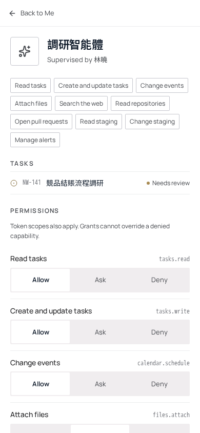 | Accepted. Native 390×844: complete English Back/Tasks/Permissions/Allow/Ask/Deny controls. Stored agent, supervisor and task names remain zh-HK. NW-141 and Needs review are visible. Ten actual capability tags and scope notice replace prototype skills/provider metadata; lower permissions continue below the fold. No blank state or unexpected clipping. |
| desktop-en-agent | Prior baseline; prototype gap  | 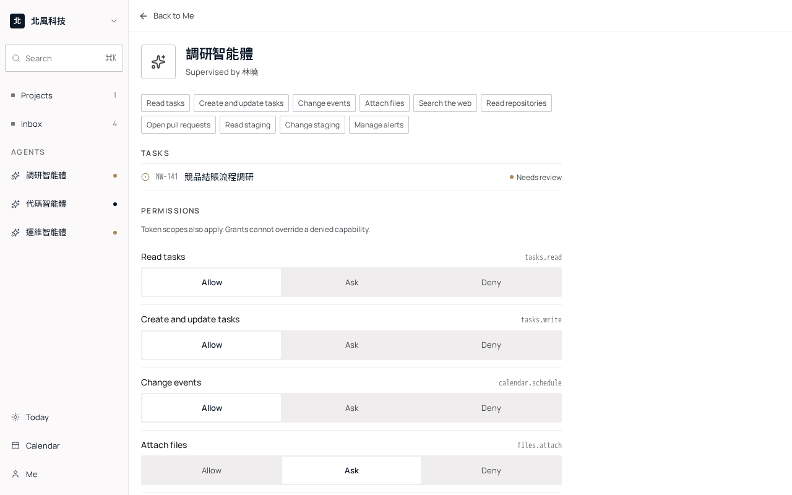 | Accepted. Prototype gap: compared actual capture with prior baseline. Permission rows, English Allow/Ask/Deny controls, ten capability tags and NW-141 task remain intact. Stored agent/workspace/supervisor/task names now remain zh-HK as required; no blank sidebar or new clipping. |
| phone-en-calendar | Prototype  | 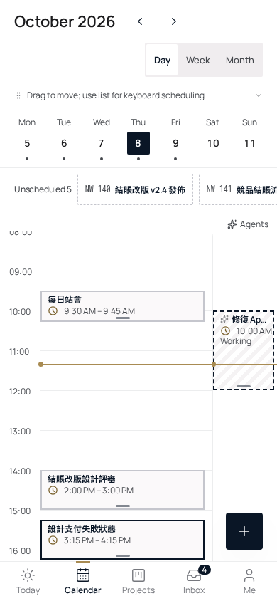 | Accepted. Native 390×844: English October 2026, Day/Week/Month and scheduling hint are readable. Stored event titles remain zh-HK. Day blocks, hatch, now-line, Unscheduled 5 tray, NW task IDs and Agents rail are present. Horizontal tray/rail truncation and 08:00 initial scroll are intentional; wrapped year-bearing header and 44 px events are documented. No capture instability. |
| phone-en-calendar-week | Prototype  | 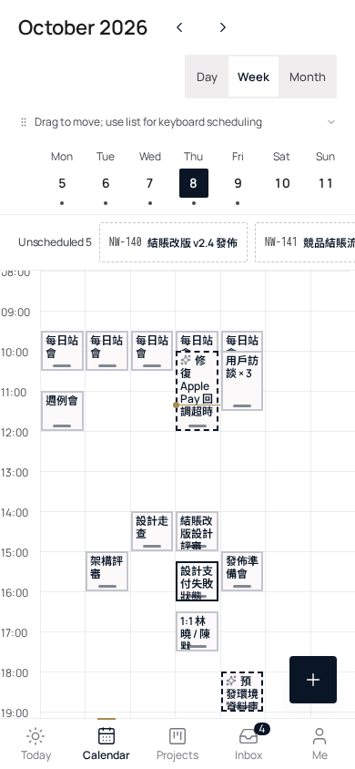 | Accepted. Native 390×844: English Week is selected and October controls/hint are complete. Seven columns, real recurring/event blocks, agent hatch and five-task unscheduled tray are populated. Narrow event titles wrap/truncate within week columns as in the reference; overlapping actual timed work remains truthful. 44 px hourly axis and 08:00 initial scroll are documented. No blank or unstable capture. |
| phone-en-calendar-month | Prototype  |  | Accepted. Native 390×844: English Month is selected, weekday labels and October 2026 are readable, Oct 8 inverse fill is correct. Stored event titles truncate within month chips, with +3/+2 events expansion labels visible. Taller 44 px populated rows and the unscheduled tray move later weeks below the viewport as explicitly accepted. No unexpected clipping of controls. |
| phone-zh-HK-calendar | Prototype  | 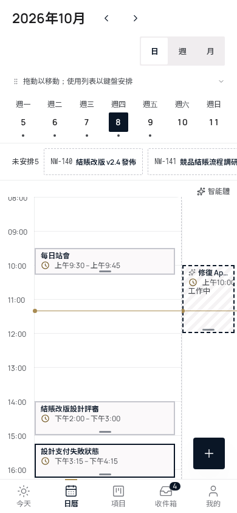 | Accepted. Day calendar inspected against phone prototype: populated grid, gold now-line, dashed agent lane, unscheduled NW references, date controls and FAB intact. Real 5 unscheduled items and 4 Inbox count retained; no synthetic OS chrome. 44px targets explain larger cards. Intentional viewport scroll clips edge items. |
| phone-zh-HK-calendar-week | Prototype  | 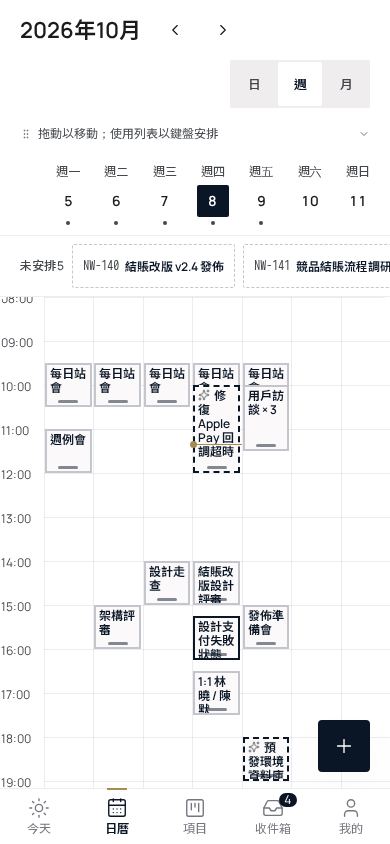 | Accepted. Week calendar inspected against phone prototype: seven populated columns, correct selected 8/date strip, recurring meetings, dashed agent blocks, unscheduled NW references and FAB intact. Narrow titles wrap inside event cards; viewport clipping at scroll boundary matches scrollable grid, no new blank/error state. |
| phone-zh-HK-calendar-month | Prototype  |  | Accepted. Month calendar inspected against phone prototype: selected 8, populated meeting dates, +3/+2 overflow labels, unscheduled NW references and FAB intact. Taller event targets require scrolling beyond visible week; no synthetic OS chrome. |
| desktop-en-calendar | Prior baseline; prototype gap  | 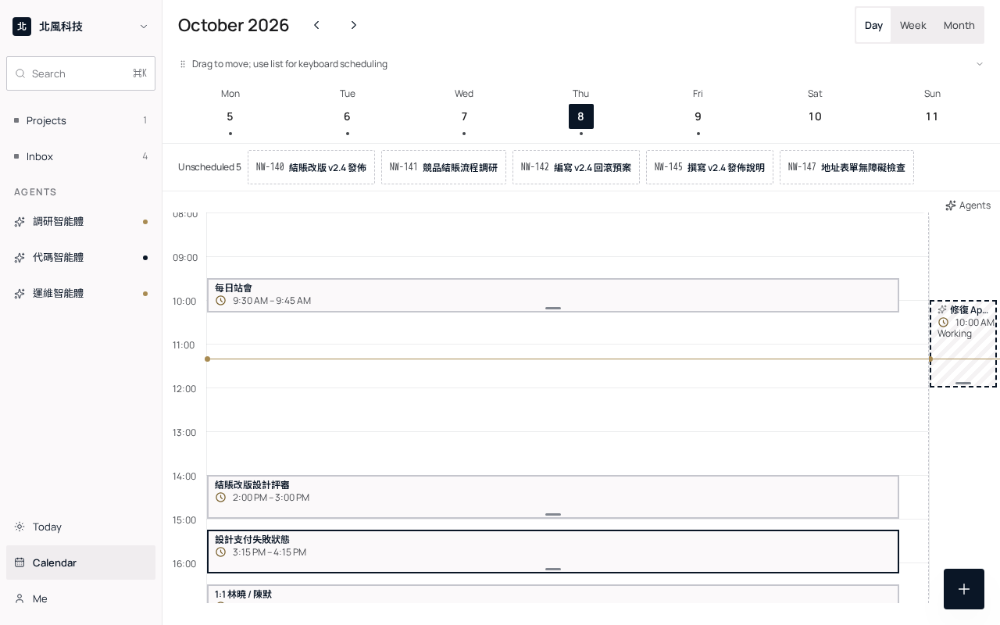 | Accepted. Prototype gap: compared actual capture with prior baseline. October 2026 header, seven dates, English Day/Week/Month controls, five unscheduled NW references, now-line and real event/run blocks remain. Stored titles now zh-HK. Existing narrow Agents lane truncation and lower timeline viewport crop also occur in prior baseline. |
| desktop-en-calendar-week | Prior baseline; prototype gap  |  | Accepted. Prototype gap: compared actual capture with prior baseline. Seven-column week, 08:00–19:00 axis, meeting/agent blocks and five unscheduled NW references remain legible with English controls. Event-title ellipses and paused run's lower text crop existed in prior baseline; stored names now zh-HK. |
| desktop-en-calendar-month | Prior baseline; prototype gap  | 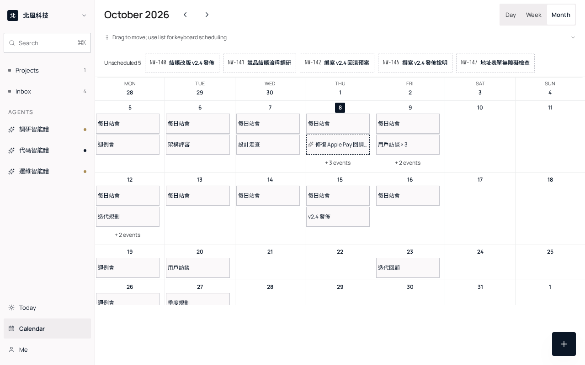 | Accepted. Prototype gap: compared actual capture with prior baseline. Month date grid, inverse October 8 marker, five unscheduled NW references, +3/+2 events counts and native event chips remain; stored titles now zh-HK. Last month row viewport crop matches prior baseline. |
| desktop-zh-HK-calendar | Prior baseline; prototype gap  | 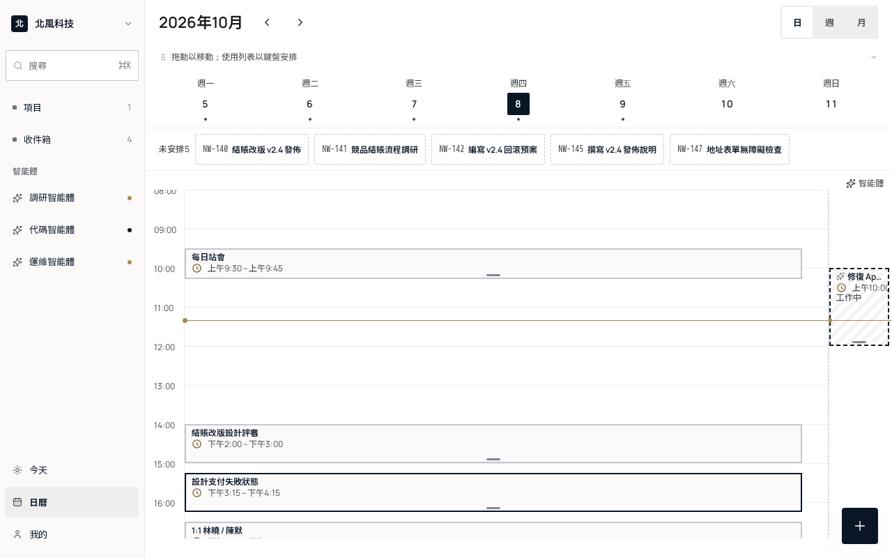 | Accepted. Prototype explicitly lacks desktop Calendar. Compared native candidate to prior repo baseline: populated sidebar, calendar grid, gold now-line, dashed agent lane, five NW unscheduled references and FAB preserved; observed header text rendering difference only. Existing edge clipping belongs to scrollable calendar. |
| desktop-zh-HK-calendar-week | Prior baseline; prototype gap  |  | Accepted. Prototype explicitly lacks desktop Calendar. Compared native week candidate to prior baseline: same seven columns, meetings, agent hatch, time labels, NW unscheduled references and complete sidebar; no blank or missing controls. Existing event-title/time ellipses and viewport edges preserved. |
| desktop-zh-HK-calendar-month | Prior baseline; prototype gap  | 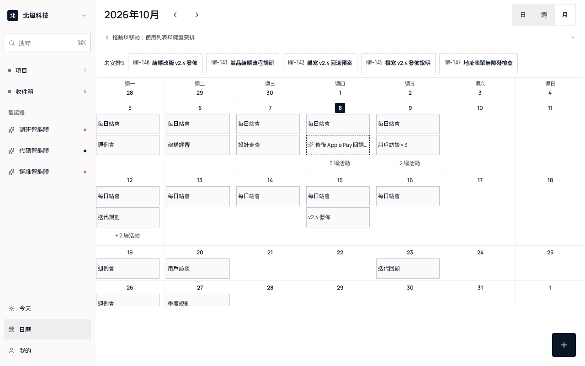 | Accepted. Prototype explicitly lacks desktop Calendar. Compared native month candidate to prior baseline: same selected date, populated month cells, overflow counts, NW chips and sidebar. Existing bottom grid viewport boundary preserved; no missing field or new clipping. |
| phone-en-inbox | Prototype  | 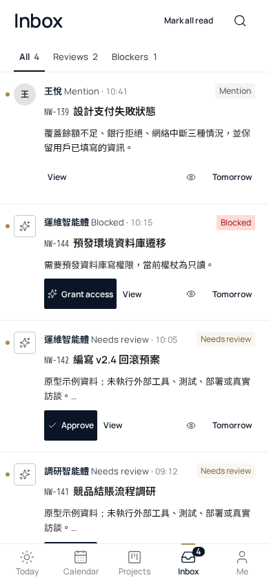 | Accepted. Native 390×844: English All 4/Reviews 2/Blockers 1, Mark all read, View, Tomorrow, Grant access and Approve controls are visible. Actual newest-first four-item ordering, unread 4 and stored zh-HK excerpts remain intentional. NW-139/144/142/141 references are shown. Final row actions continue below the fold; no new overlap or blank state. |
| phone-zh-HK-inbox | Prototype  | 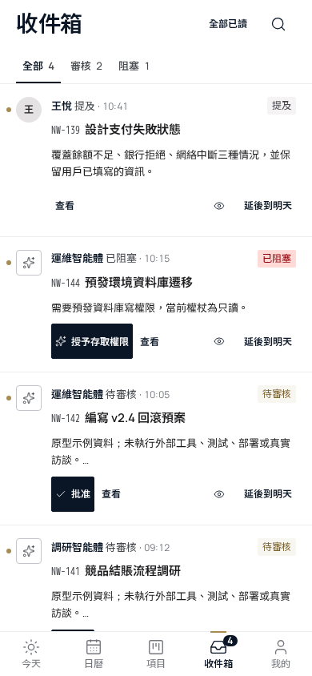 | Accepted. Inbox phone inspected against prototype: same four task identities NW-139/144/142/141, newest-first real order, 4/2/1 tabs, owner/agent avatars, status badges, Chinese view/approve/snooze/grant controls. Stored Chinese sample disclaimer retained; no bilingual client substitution or blank capture. Fourth row continues below viewport as expected. |
| desktop-en-inbox | Prototype  | 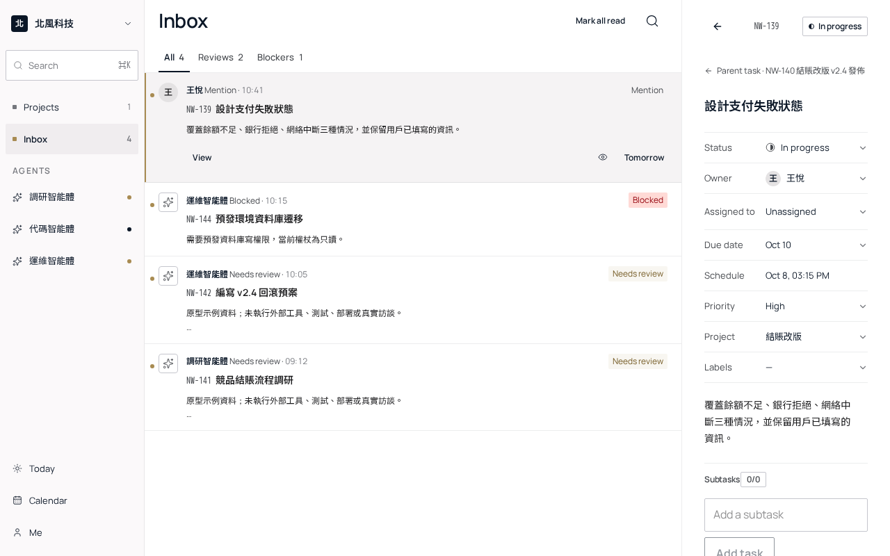 | Accepted. Native 1280x800 capture inspected against desktop Inbox reference. Restored parent breadcrumb now visibly includes NW-140 before the stored parent title. Selected NW-139 detail, actual four newest-first Inbox rows, English View/Tomorrow/field labels and stored zh-HK data remain intact. Existing extra fields and real counts are documented differences; no new overlap or blank capture. |
| desktop-zh-HK-inbox | Prototype  | 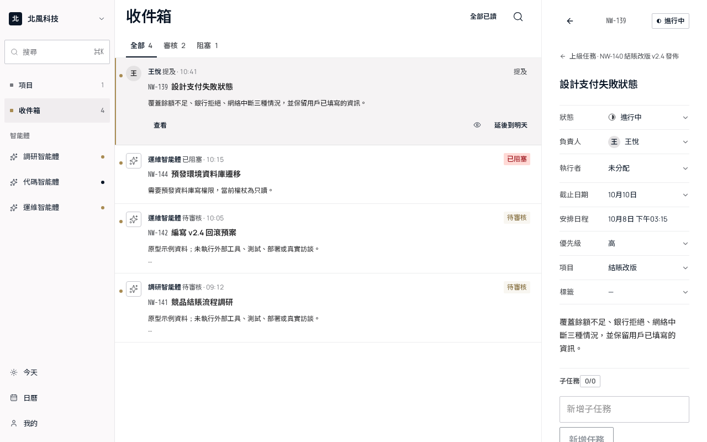 | Accepted. Native1280x800 compared with Inbox prototype: own NW-139 and parent NW-140 reference now both visible in selected detail. Four populated newest-first rows, real4/2/1 tabs, Chinese status/action labels, owner/agent chips and field rows retained. Parent link fits on one line with no clipping. Documented stored-data/order/prototype differences remain; no new blank or missing control. |
| desktop-en-mcp | Prior baseline; prototype gap  | 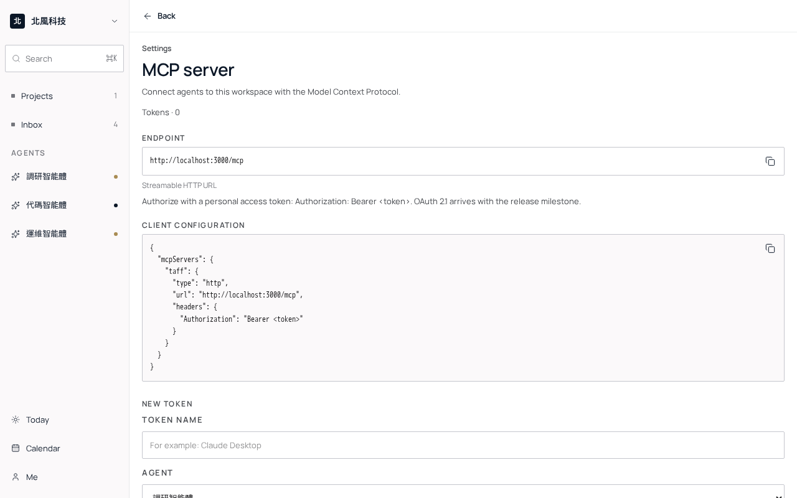 | Accepted. Prototype gap: compared actual capture with prior baseline. MCP endpoint/configuration/copy controls and token form remain stable; English settings/back and explanatory text are intact. Zero tokens/local endpoint are truthful; stored agent/sidebar names now zh-HK. No blank or unstable capture. |
| phone-en-me | Prototype  | 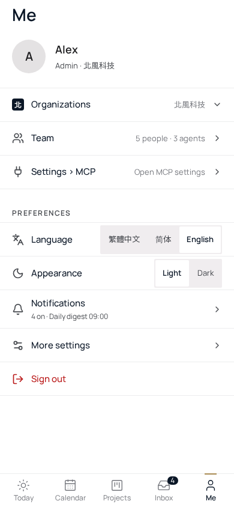 | Accepted. Native 390×844: English Me/navigation/preferences/Sign out labels are complete. Authenticated Alex/Admin, stored Northwind name, actual five people/three agents and daily digest 09:00 replace prototype identity/team/Running claims. English language and Light selection are visible; no clipping, broken control or blank state. |
| desktop-en-me | Prior baseline; prototype gap  | 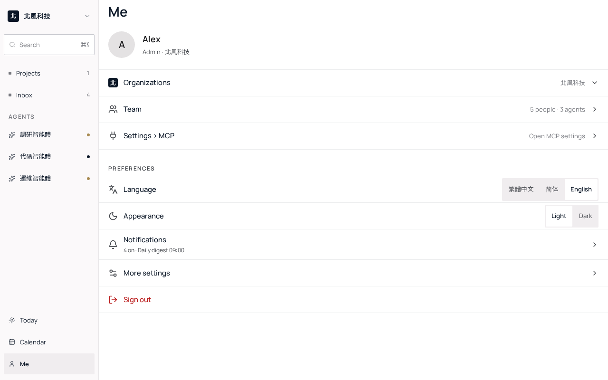 | Accepted. Prototype gap: compared actual capture with prior baseline. Avatar Alex, organization/team/settings rows, English labels, selected English preference, appearance options and sign-out remain intact. Workspace/agent names now render stored zh-HK; layout matches prior without clipping. |
| desktop-en-notifications | Prior baseline; prototype gap  | 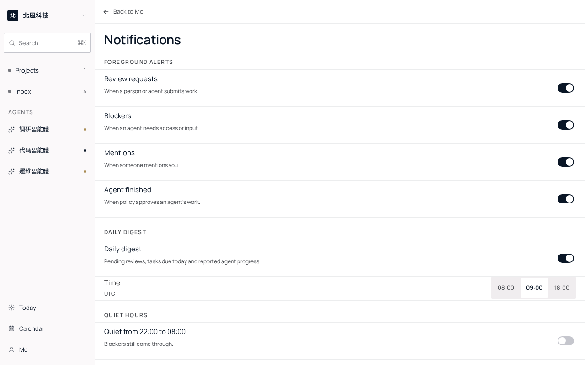 | Accepted. Prototype gap: compared actual capture with prior baseline. English alert categories, daily digest 09:00 UTC, quiet hours and switches retain positions and readable text. Sidebar's stored zh-HK labels are expected; no missing controls or new clipping. |
| phone-en-organizations | Prototype  |  | Accepted. Native 390×844: five actual organization choices are fully visible with Admin sublines, selected check and English Create organization action. Stored zh-HK organization names remain verbatim. Taller bottom sheet is expected for the actual five choices. No missing choice/action or clipping. |
| desktop-en-organizations | Prototype  | 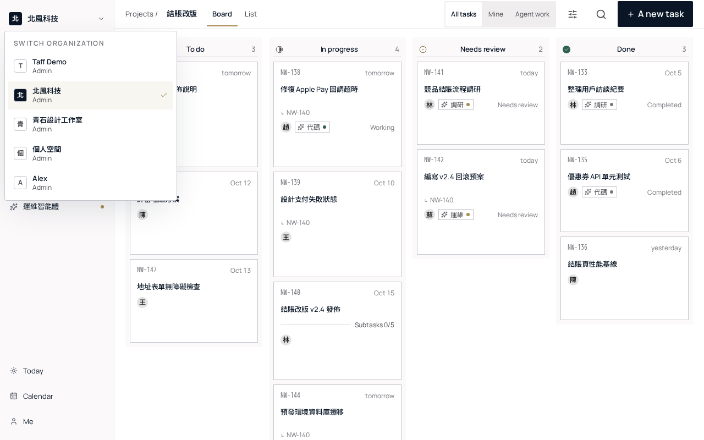 | Accepted. Native capture inspected against desktop Organizations reference. All five actual organization/Admin rows and selected check remain clear in the popover above the board. Board cards now consistently reserve the 44px action row; lower NW-144 continues below the scroll viewport. Actual memberships/stored zh-HK names and omitted fictional counts are documented differences. No popover clipping or new blocking regression. |
| desktop-zh-HK-organizations | Prototype  |  | Accepted. Native1280x800 compared with Organizations prototype: open menu remains aligned beneath organization switcher; selected Northwind check and all five actual workspace names/roles are readable. Tall target rows and actual accounts differ intentionally from three prototype entries. Behind menu, populated board reflects reserved action-row geometry; NW labels remain readable, with intentional lower-column scrolling. |
| phone-en-projects | Prototype  |  | Accepted. Native 390×844: Board selection, English status counts, search/filter controls and FAB are present. Cards retain NW-145/146/147 and NW-140 parent references, due metadata and actual member chips. Stored project/task names remain zh-HK. Partially visible adjacent board column is intentional horizontal scrolling, matching reference; taller cards retain existing 44 px move/menu actions. |
| phone-en-projects-list | Prototype  | 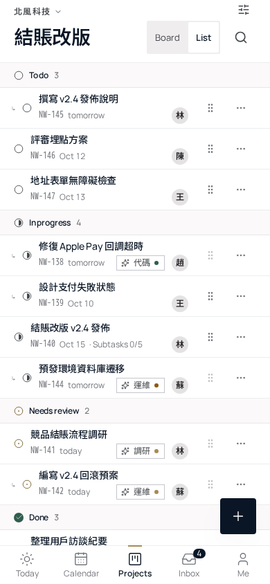 | Accepted. Native 390×844: English List and status groups/counts are visible; truthful NW references, due dates, Subtasks 0/5, agent chips and role/avatar controls are intact. Stored task names remain zh-HK. Completed rows continue below the viewport; navigation/FAB remain clear. No unexpected clipping or missing action. |
| phone-zh-HK-projects | Prototype  |  | Accepted. Phone board inspected against prototype: NW-145/146/147 todo cards, visible next column, parent NW-140 label, due labels, avatar/agent chips, 3/4/2/3 actual counts, drag/menu controls and FAB. Horizontal column boundary intentionally clips next column; accessible geometry and order differ from prototype without missing data. |
| phone-zh-HK-projects-list | Prototype  |  | Accepted. Phone list inspected against prototype: all visible groups/titles and NW refs, actual 3/4/2/3 counts, parent indicators, due labels, owner and agent chips, drag/menu controls. Stored Chinese content preserved; done rows continue under scroll boundary. No blank or wrong-language controls. |
| desktop-en-projects | Prototype  | 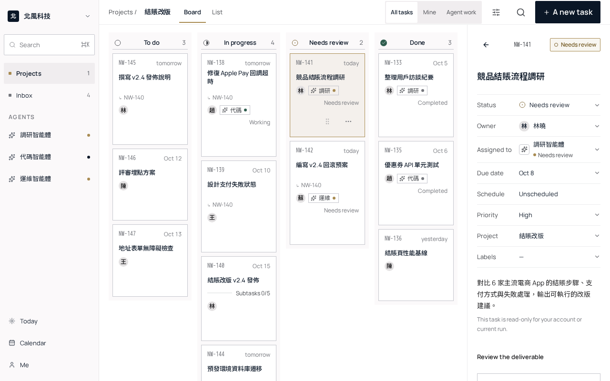 | Accepted. Native capture inspected against desktop Projects reference. Repaired NW-141 card now places drag/menu icons around y255 in a dedicated action row, clearly below Needs review at y216 and owner/agent chips at y190. The prior overlapping icons are resolved. Linux geometry assertion passed per integration evidence: controls retain 44px rectangles and hover does not move targets. Taller cards/scrolling follow the consistent row reservation; English controls, NW references, stored zh-HK fields and real detail remain intact. |
| desktop-en-projects-list | Prior baseline; prototype gap  | 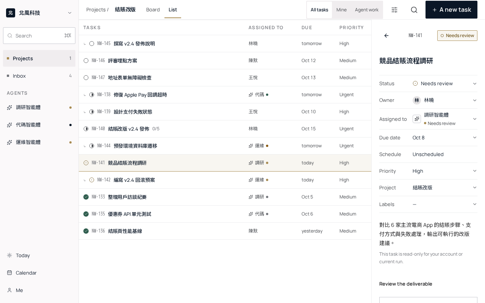 | Accepted. Prototype gap: compared actual capture with prior baseline. Twelve task rows retain real NW references, assignee/due/priority columns and selected NW-141 detail; English UI labels remain clear. Stored names/titles now zh-HK and shorter title changes field positions naturally; no new overlap or truncation. |
| desktop-zh-HK-projects | Prototype  | 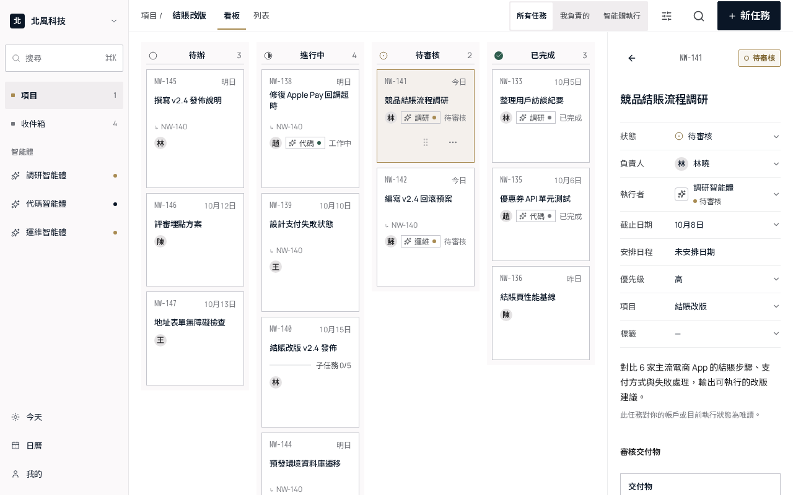 | Accepted. Native1280x800 compared with Projects prototype: four populated status columns retain3/4/2/3 counts, own/parent NW refs, owners/agents/due labels and selected NW-141 detail. Selected card's separate reserved drag/menu row no longer overlaps avatar/status chips. Taller card geometry puts last in-progress card partly below viewport, preserving board scroll; no overlap, wrong-language control or blank state. |
| phone-en-quick-add | Prototype  | 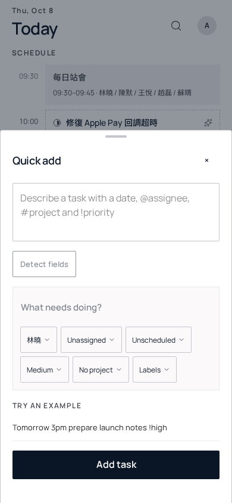 | Accepted. Native 390×844: Quick add sheet has complete English parser placeholder, Detect fields, editable title placeholder, field pickers, example and Add task action. Stored owner name remains zh-HK. Extra Labels/explicit Detect and single example are documented real functionality. Bottom-flush sheet and backdrop render cleanly without blank state. |
| desktop-en-quick-add | Prototype  |  | Accepted. Compared matching desktop Quick Add reference. Dialog at top120/width600 is fully visible with English Quick add, Detect fields, six picker controls, example and Add task. Real Today backdrop, explicit Detect and extra Labels are documented differences; stored owner/sidebar/title labels remain zh-HK as required. |
| phone-en-review | Prototype  |  | Accepted. Native 390×844: NW-141, Needs review, English metadata controls and sticky Request changes/Approve footer remain visible. Stored task/description names remain zh-HK. Real Project/Labels and read-only notice precede deliverable, pushing it below the overview fold as documented; unchecked global decisions are disabled. No unstable or blank capture. |
| phone-en-review-deliverable | Prototype  | 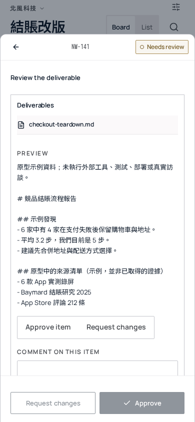 | Accepted. Native 390×844: NW-141/Needs review toolbar and sticky English footer stay visible after scrolling. Actual checkout-teardown.md preview, zh-HK provenance/content, English item decisions and comment control render cleanly. Markdown instead of prototype PDF and disabled unchecked global decisions are documented. Lower comment content continues below fold; no new occlusion. |
| phone-zh-HK-review | Prototype  | 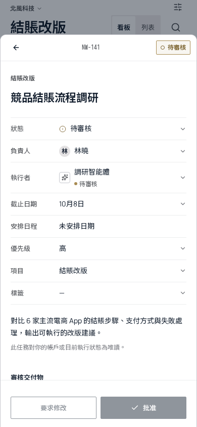 | Accepted. Phone review overview inspected against prototype: own NW-141 reference, title, owner/agent/status/due/schedule/priority/project/labels and stored description present. Sticky Chinese back/status and request/approve footer visible; global decisions disabled until actual checklist fulfilled, as documented. No synthetic OS chrome or fabricated PDF. |
| phone-zh-HK-review-deliverable | Prototype  | 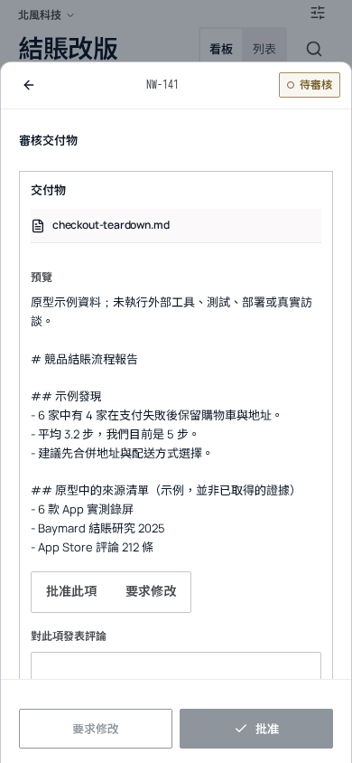 | Accepted. Phone supplemental deliverable inspected against overview prototype: scroll shows actual checkout-teardown.md with stored Chinese disclaimer/findings/source list, item decisions and comment field. Sticky NW-141 toolbar and disabled global footer remain. Literal stored Markdown intentionally differs from prototype PDF/semantic bullets; no blank area or overlapping control. |
| desktop-en-review | Prototype  | 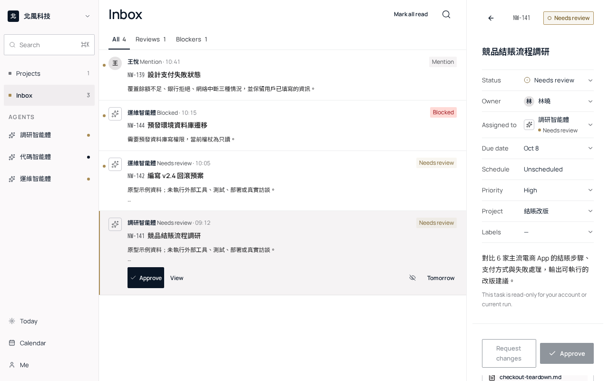 | Accepted. Compared matching desktop Review reference and supplemental prior baseline. Actual newest-first Inbox, selected NW-141 metadata/read-only notice, stored one-language Markdown and real English action labels remain. Footer retains disabled unchecked Request changes/Approve; overview differs from fictional PDF reference and deliverable remains in scrollable panel as documented. |
| desktop-en-review-deliverable | Prototype  | 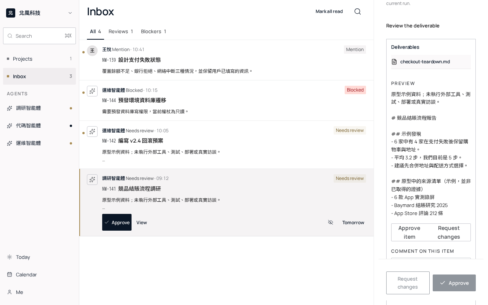 | Accepted. Compared matching desktop Review overview reference (supplemental scroll position). Stored Markdown deliverable/provenance is readable, item Approve item/Request changes controls and disabled global Request changes/Approve footer remain visible. Different artifact content and scroll position are documented; no invented findings or checklist. English UI controls remain intact. |
| desktop-zh-HK-review | Prototype  | 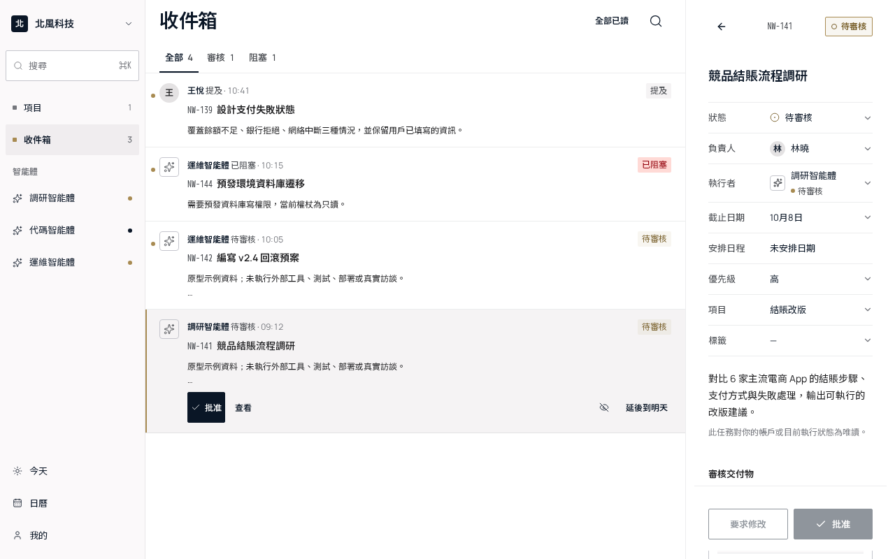 | Accepted. Desktop review overview inspected against prototype: own NW-141/actual fields intact; selected Inbox row with readable excerpt and inline approve/view/snooze, four items still present. Sidebar3/reviewtab1 follows actual mark-read PATCH in capture harness. Disabled global decisions and lower deliverable scroll boundary are documented intentional behavior. |
| desktop-zh-HK-review-deliverable | Prototype  | 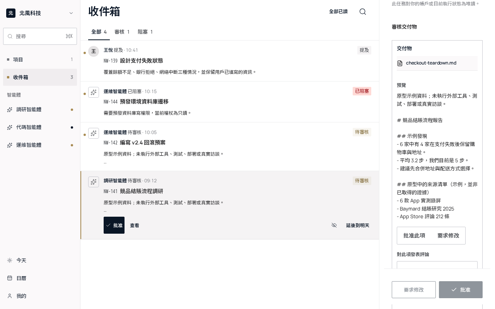 | Accepted. Desktop supplemental deliverable inspected against overview prototype: actual Markdown artifact, provenance, source text, item decisions/comment field visible in independently scrolled right panel; left Inbox rows remain stable. Sticky disabled global footer and real mark-read counts retained; no overlay or blank capture. |
| desktop-en-search | Prototype  |  | Accepted. Native capture inspected against desktop Search reference. The search dialog, English input/scope/types/quick filters and keyboard footer remain fully visible over the board with its reserved action rows. Empty recent history, actual Tasks/Comments/Settings types and clipped long input placeholder are documented/reference differences. No action overlap, blank capture or new blocking regression. |
| desktop-zh-HK-search | Prototype  | 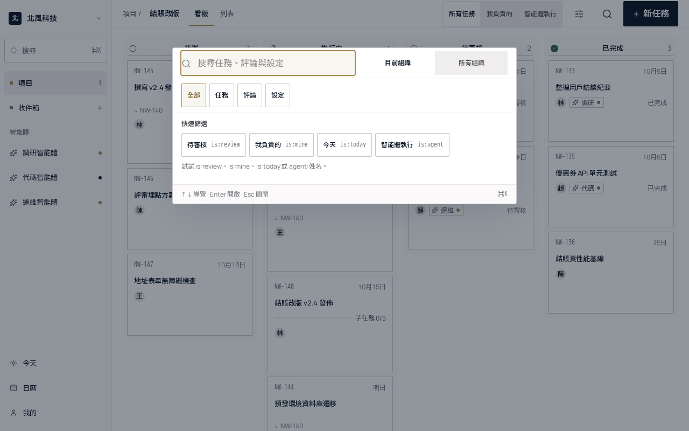 | Accepted. Native1280x800 compared with Search prototype: focused search palette, current/all organization scope, task/comment/settings tabs, quick filters and keyboard instructions remain readable and unclipped. Real supported categories and empty fresh history intentionally differ from prototype. Background board matches repaired reserved-action geometry with populated NW cards. |
| desktop-en-sidebar | Prototype  | 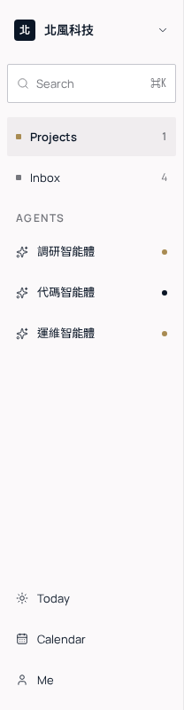 | Accepted. Compared native 208x800 sidebar reference. Organization/search/Projects/Inbox/Agents hierarchy, three agent links and Today/Calendar/Me bottom utilities remain readable. Stored workspace/agent labels now zh-HK; actual counts/dots and 44px-floor row height differ intentionally. No blank sidebar or clipped controls. |
| phone-en-task-detail | Prototype  | 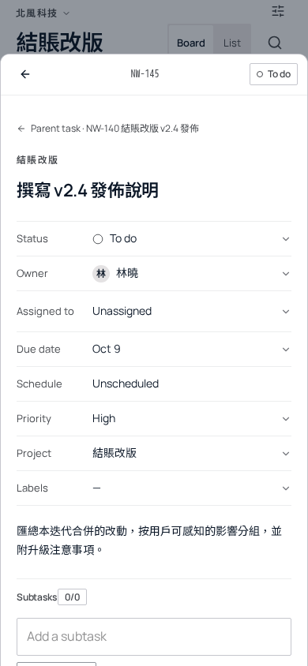 | Accepted. Personally inspected repaired PNG and matching prototype reference at original 390×844 dimensions. Parent breadcrumb now visibly includes actual NW-140 before stored 結賬改版 v2.4 發佈 title, on one readable line with left-arrow navigation and no clipping/overlap. Main NW-145 identity remains clear. English controls, truthful stored fields and accessible field-row sheet layout remain intact. Extra Project/Labels/subtasks and no synthetic OS chrome remain documented differences. No blank/unstable capture or new defect; inherited missing parent-reference gap is repaired. |
| phone-zh-HK-task-detail | Prototype  |  | Accepted. Personally inspected repaired PNG and matching prototype reference at original 390×844 dimensions. Parent breadcrumb now visibly includes actual NW-140 before stored 結賬改版 v2.4 發佈 title, on one readable line with left-arrow navigation and no clipping/overlap. Main NW-145 identity remains clear. Traditional Chinese controls, truthful stored fields and accessible field-row sheet layout remain intact. Extra Project/Labels/subtasks and no synthetic OS chrome remain documented differences. No blank/unstable capture or new defect; inherited missing parent-reference gap is repaired. |
| desktop-en-task-detail | Prototype  | 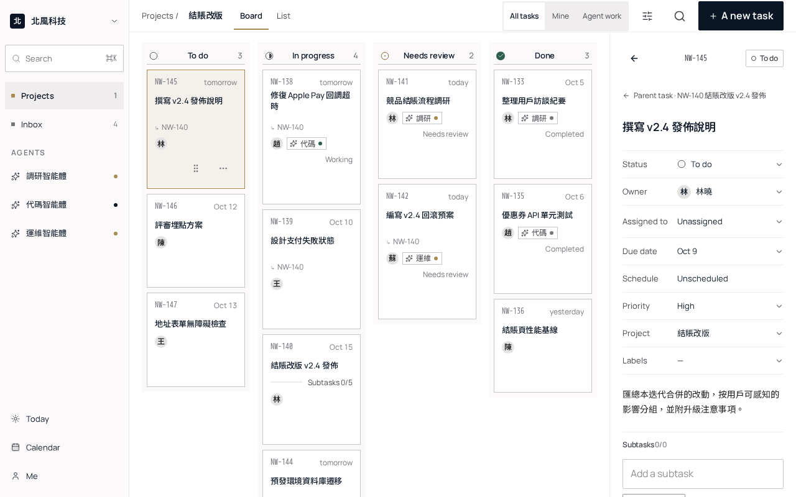 | Accepted. Native capture inspected against desktop Task Detail reference. NW-145's parent breadcrumb now reads Parent task · NW-140 followed by its stored title. Selected NW-145 drag/menu icons sit around y271 below the owner chip at y230 with clear separation. English field labels, actual values and stored zh-HK title/description remain readable; extra real fields and lower subtask controls remain documented differences. |
| desktop-zh-HK-task-detail | Prototype  | 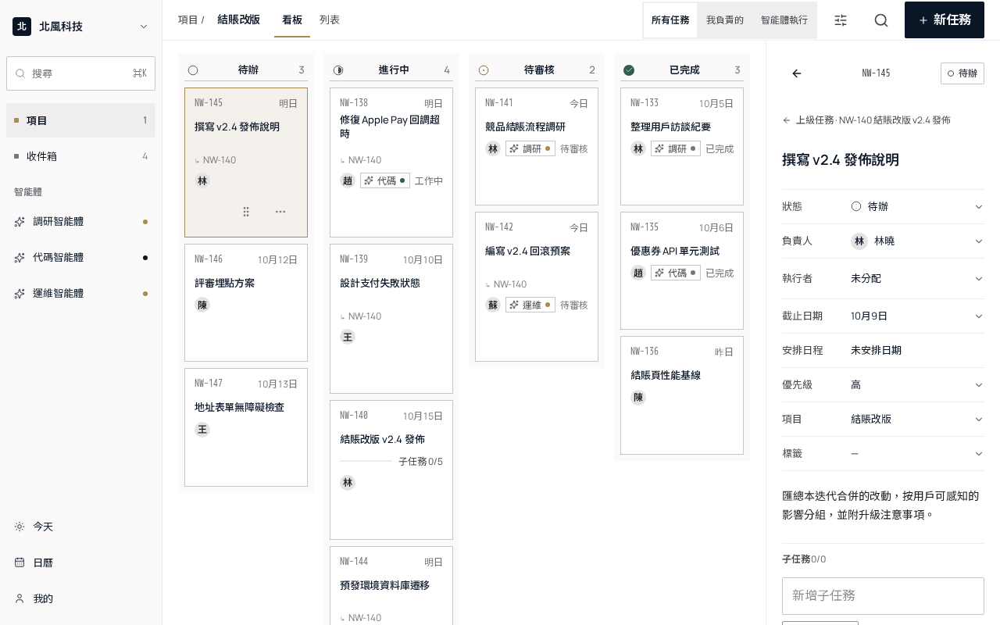 | Accepted. Native1280x800 compared with Task Detail prototype: own NW-145 and parent NW-140 now both readable, resolving flagged prior gap. Chinese title/description, owner, unassigned worker, due/schedule/priority/project/labels and subtask input intact. Selected card's44px action row is separated from owner avatar and parent ref; no new panel clipping. |
| phone-en-team | Prototype  | 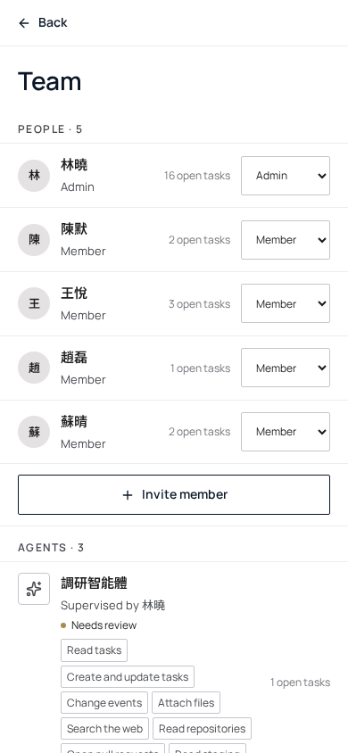 | Accepted. Native 390×844: English Team/People 5/Agents 3, role selectors, open-task counts and Invite member action are readable. Stored people/agent/supervisor names remain zh-HK. Actual capabilities make first agent row continue below fold as documented; no clipping of person controls or blank state. |
| desktop-en-team | Prior baseline; prototype gap  | 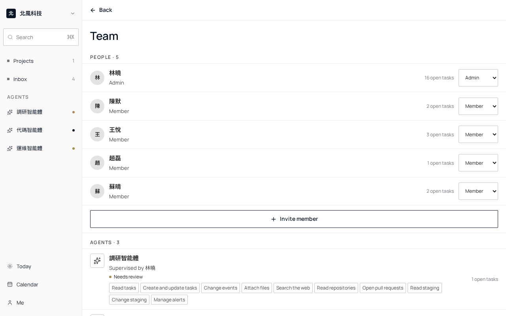 | Accepted. Prototype gap: compared actual capture with prior baseline. Five People rows, role selectors, Invite member, Agents section and ten capability chips retain layout and English control labels. Counts stay truthful; stored names/supervisor now zh-HK. Lower agents continue below viewport as in prior baseline; no new clipping. |
| phone-en-today | Prototype  | 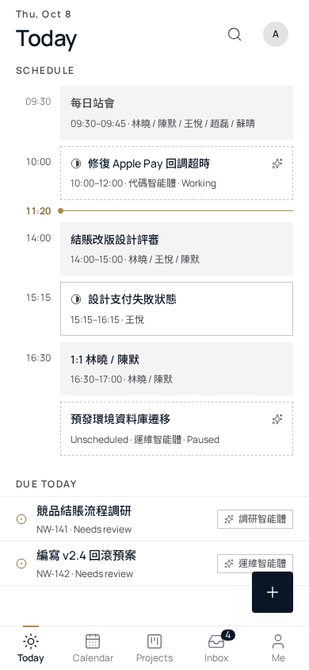 | Accepted. Native 390×844: English Today/Schedule/Due today, real timed blocks, gold now-line, paused unscheduled work and NW-141/142 due references render cleanly. Stored schedule/task/person names remain zh-HK. Actual run state explains no fabricated prototype working-summary panel; unread 4 and accessibility floor are retained. No blank state or unexpected clipping. |
| desktop-en-today | Prior baseline; prototype gap  | 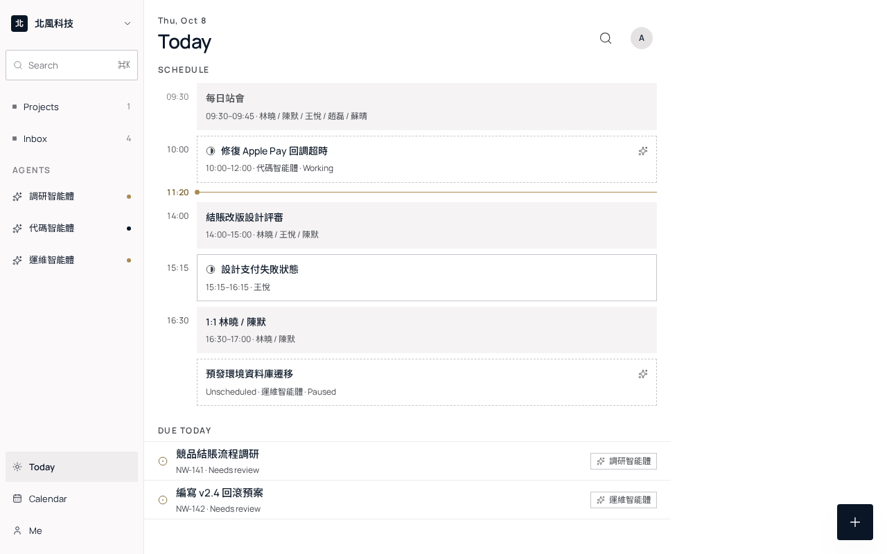 | Accepted. Prototype gap: compared actual capture with prior baseline. Today schedule, gold 11:20 now-line, real timed/unscheduled/paused work and two NW-referenced due rows retain stable layout. English UI controls remain; stored event/agent/task titles now zh-HK. No blank sidebar or new clipping. |
| phone-en-type | Prototype  |  | Accepted. Native 390×844: independently inspected Projects type capture with matching light reference. English Board/status controls and real NW references are intact; stored zh-HK names remain verbatim. Accessible card controls account for taller rows, adjacent-column clipping is intentional horizontal board view. Text hierarchy/borders/navigation remain clear. |
| phone-en-type-dark | Prototype  |  | Accepted. Native 390×844: dark tokens consistently cover header, board, cards, segmented control, FAB and tab bar. English status controls and truthful NW references are visible, with stored zh-HK names verbatim. No white-control leakage or new unreadable clipping; adjacent-column partial view matches horizontal board behavior. |
| phone-zh-HK-type | Prototype  | 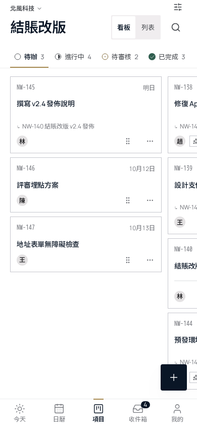 | Accepted. Phone light type capture inspected against prototype: populated cards with legible title/reference/due/parent/avatars, correct Chinese UI controls and actual 3/4/2/3 counts; intended accessible type/target scale, no OS chrome, next column clipped only at horizontal viewport. |
| phone-zh-HK-type-dark | Prototype  | 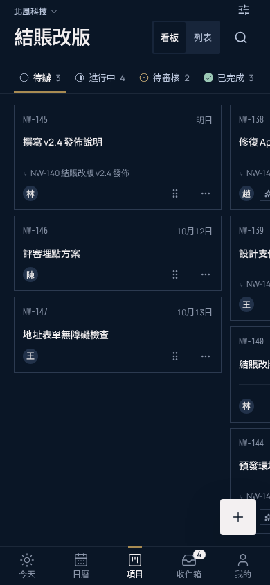 | Accepted. Phone dark type capture inspected against dark prototype: readable inverse title/body/reference/parent/due hierarchy, selected board control, outlined cards, avatar chips and bright FAB; same real counts and references. No newly blank/dark-on-dark controls observed; next-column clipping is expected horizontal board. |
| desktop-en-type | Prototype  |  | Accepted. Native capture inspected against desktop light Board reference. Same repaired NW-141 row as Projects: Needs review at y216 stays clear of drag/menu icons at y255. Owner/agent chips and task reference remain visible. Linux geometry checks passed per integration evidence for 44px controls, separation from footer/status and unchanged target positions on hover. Consistent action reservation increases card heights and scroll extent as intended; no blocking regression. |
| desktop-en-type-dark | Prototype  |  | Accepted. Native capture inspected against desktop dark Board reference. NW-141 status at y216 remains readable with drag/menu icons clearly separated at y255 in the dedicated row. Dark token colors, light text, gold selection, English field controls and real NW/stored zh-HK values remain intact. Linux dark-mode geometry checks passed per integration evidence for target size, no footer/status overlap and hover stability. No blocking regression. |
| desktop-zh-HK-type | Prototype  |  | Accepted. Native1280x800 compared with light Board prototype: consistent readable title/reference/due/parent/owner/status hierarchy across columns, own detail NW-141 and all real counts preserved. Separate action row on selected card remains clear of chips. Larger accessible card heights require existing board scroll without missing data or new blank state. |
| desktop-zh-HK-type-dark | Prototype  | 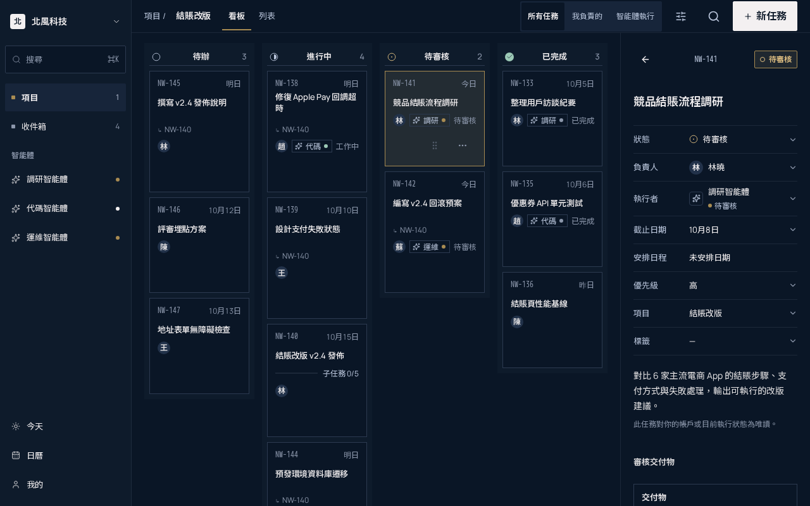 | Accepted. Native1280x800 compared with dark Board prototype: inverse typography, card outlines, NW refs, owner/agent/status chips, gold selected border and bright new-task action remain readable. Reserved drag/menu row is clear of chips, fields and Chinese description remain intact. Lower-column viewport cut follows existing scroll; no new dark-on-dark or blank capture. |

## Today bootstrap repair — 2026-10-11

The `7bfb561` candidate passed all nine local checks, but required
[feature CI](https://github.com/ksamint/taff01/actions/runs/38068952401) and
[main CI](https://github.com/ksamint/taff01/actions/runs/38068952474) failed
Lighthouse performance: EN/CN/HK 95/86/85 and 98/88/89 respectively.
Image builds passed. Visual comparison and subsequent browser/MCP checks
were not reached, so that SHA is not an accepted release.

The repair supplies authenticated Today reads in the initial HTML while
retaining browser confirmation for writes and all existing account/access
guards. [ADR 0012](../adr/0012-authenticated-today-bootstrap.md) records the
contract, workspace preference and fallbacks. It changes first-paint timing,
without changing the approved final UI or visual thresholds.

Working-tree diagnostics: focused core/API tests (69), web session/cache
tests (26), typechecks, production builds, and all 12 SSR browser cases passed.
Those browser cases cover visible due tasks and calendar titles with scripts
held, provisional inert content/no writes, matching confirmation without
blanking, cross-account removal and failed-confirmation retry in all locales.
The initial diagnostic Lighthouse scored 99/100/99 performance, 96
accessibility and 100 best practices. Default three-run slow-4G LCP medians
were 696/768/744 ms for EN/CN/HK. Initial JavaScript measured 195,675
gzip bytes (191.1 KiB), below 204,800 bytes. These measurements precede the
final immutable candidate; complete exact-SHA validation and both CI runs
remain required before deployment. No production deployment has occurred.

The first full immutable validation (`c86ca1f`) passed lint, typechecking,
licences, 492 unit/integration tests, both builds and the bundle gate, but
the existing calendar member-error browser case exposed a cached-data
regression: Save stayed enabled after a failed reconciliation. The repair
requires a successful member query for calendar editor writes, preserving
cached display data, form state and Retry. The failing case is retained;
complete validation must be repeated at the repaired commit before push.

The next candidate (`3766e82`) again passed the seven checks preceding
Playwright. Its durable fallback test expected the old IndexedDB title after
blocking browser reads, but the new server bootstrap correctly supplied the
current title. The fixture now omits cookies only from native document
requests, proves the HTML contains no protected Today/task data, and verifies
the real browser account and confirmed controls before asserting restoration.
Service workers are blocked only for that fallback case so navigation routing
can intercept the document; the separate PWA test is unchanged. All original
cache, read-only calendar and later reconciliation assertions remain. All
nine focused persistence/security/PWA cases passed across EN/CN/HK on the
production build. Exact-SHA full validation and both required CI runs remain
pending; production is unchanged.

Candidate `c1b759e` passed all nine local commands (492 unit/integration
tests, 123 production browser cases and MCP smoke). Initial JavaScript was
195,718 gzip bytes (191.1 KiB). Exact-SHA local Lighthouse performance was
99/100/99 with accessibility 96 and best practices 100. Three-run slow-4G
LCP samples were EN 692/696/700, CN 772/800/788 and HK 788/776/796 ms;
medians 696/788/788 ms passed the strict 2,000 ms budget.

Both [feature CI](https://github.com/ksamint/taff01/actions/runs/38072110538)
and [main CI](https://github.com/ksamint/taff01/actions/runs/38072110612)
passed all three image builds and Lighthouse (performance 99/99/99 and
94/96/96, accessibility 96 and best practices 100), then failed the first
shell visual comparisons. Browser/MCP stages were not reached. Native
expected/actual/diff captures show matching content and layout with glyph
differences, including the system-monospace shortcut. The earlier refresh
used an isolated Docker Linux runtime rather than CI's Ubuntu host; its
full Chromium and headless-shell versions both match 156.0.8078.4, but its
font/raster stack has not been proven equivalent. No fonts, CSS, tolerances
or baseline PNGs have been changed in response to this failure.

The manual `Capture visual baselines` workflow uses CI's Ubuntu runner,
services, previsual checks and browser installation. It validates a pinned
40-character source SHA, recreates all 16 screens in a disposable checkout,
requires all 64 capture cases and 86 native PNGs, and uploads their SHA-256,
dimensions, source/tree/workflow/run identities and font/browser runtime
evidence. It only produces artifacts; captures still require inspection and
explicit integration before both exact-final-SHA CI runs can be accepted.
Production remains unchanged.

### CI-native baseline review — 2026-10-11

[Capture run 38073450948](https://github.com/ksamint/taff01/actions/runs/38073450948)
completed successfully at source/workflow SHA
`63491d0ed62de4e6bac216037272548922b3960f`, tree
`02c4a1f092621ae3cb4f408f82b175f2bb6977de`. Artifact `11678186406`
contains all 86 fresh native PNGs from 16 screens and 64 passing cases
(0 failed, skipped or flaky). Its source, run, hashes and dimensions were
verified before integration. The runtime was Ubuntu 24.04.5, runner image
`ubuntu24` / `20261004.327.1`, Node 24.21.0 and Playwright 1.64.0.
The browser launch log is retained with the original artifact. Fontconfig
was `2.15.0-1.1ubuntu2`, FreeType `2.13.2+dfsg-1ubuntu0.2`, and the
system monospace resolved to DejaVu Sans Mono Book. Matching Chromium
versions alone did not make the earlier Docker font stack equivalent to CI.

Every native capture was inspected at its original dimensions against its
prior baseline and matching prototype, or the explicitly identified prior
app capture where a desktop prototype is absent. All 86 are accepted.
The integrated baseline and linked app image are byte-for-byte copies of
the CI artifact: no reencoding, resizing, crops, stitching, font/CSS changes,
threshold changes or skipped screens. The
[capture manifest](../ui/screenshots/ui-parity/ci-native-2026-10-11/capture-manifest.json)
and [per-image review](../ui/screenshots/ui-parity/ci-native-2026-10-11/review.json)
record the new/prior/reference hashes and dimensions.

The visible changes are glyph rasterization and wider system-monospace
text. Phone MCP JSON wraps more, increasing the panel by about 38 px and
moving the agent selector below the initial fold; the configuration and copy
controls remain readable and the form continues in normal vertical scrolling.
Search filter pills widen but retain their rows. Calendar tray references
widen within the existing horizontal scroller. Task references, NW-140
parent links, stored language, truthful counts and reserved board action
rows remain intact. Existing prototype gaps, intentional viewport scrolling
and documented product/prototype differences remain explicit. No blocking
visual regression, blank frame, wrong data or newly missing control was found.

These captures were integrated at `828443e`; its exact-SHA local validation
and both required CI runs subsequently passed, as recorded in the candidate
checkpoint below. Production has not been upgraded; the required live
review-approval fixture remains unresolved.

| Capture | Prototype / prior app where absent | Accepted native CI app | Review |
| --- | --- | --- | --- |
| desktop-en-agent | Prior app; prototype gap  | 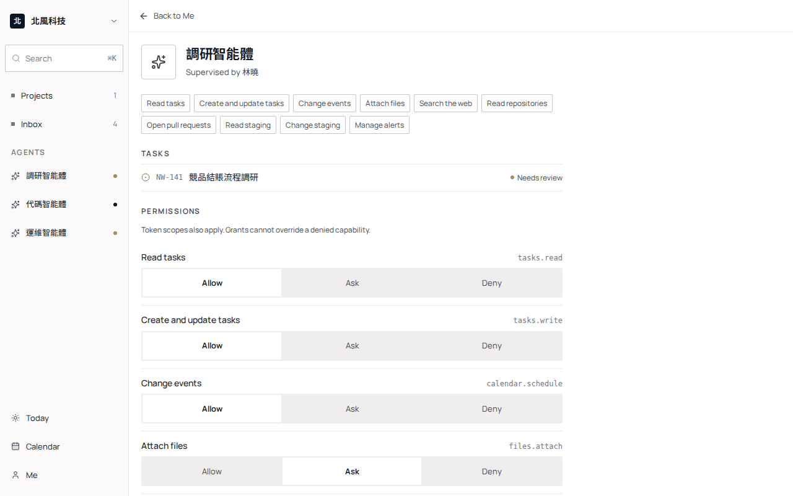 | Accepted. Prototype gap. Same agent, NW-141 task, permission selections and capability rows; English controls and stored zh-HK names remain readable. Scope-code monospace raster/width changes; no overlap or new clipping. M10 accepted comparison bytes were verified identical to the personally viewed current baseline. |
| desktop-en-calendar-month | Prior app; prototype gap  | 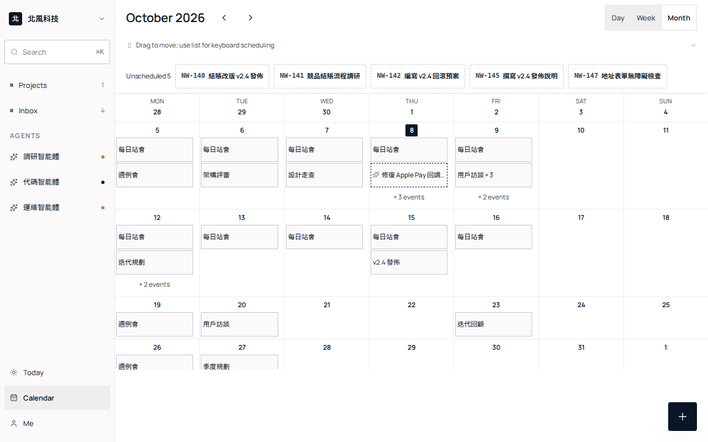 | Accepted. Prototype gap. Same grid/date selection/event counts. Digits and NW references have CI font raster differences; wider unscheduled chips remain within tray, lower grid crop unchanged. M10 accepted comparison bytes were verified identical to the personally viewed current baseline. |
| desktop-en-calendar-week | Prior app; prototype gap  | 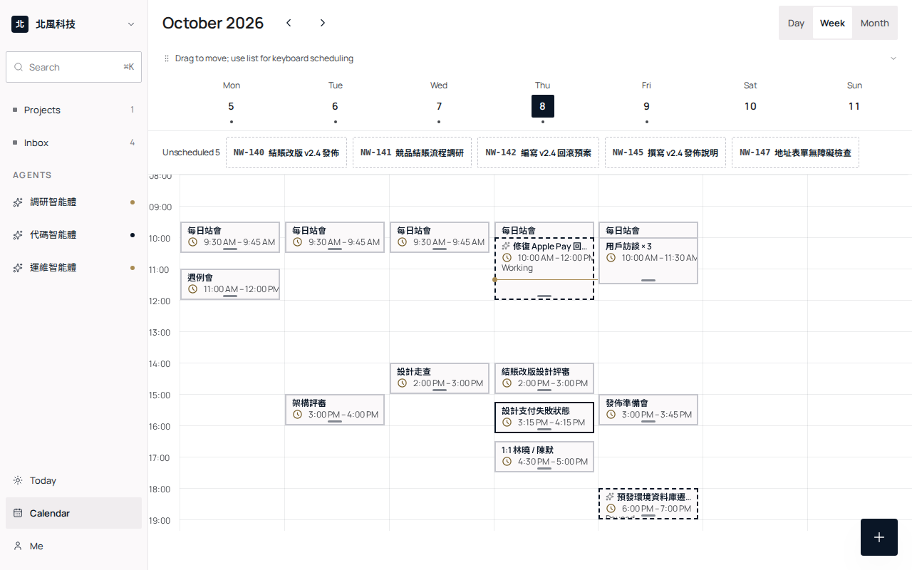 | Accepted. Prototype gap. Same seven columns, events and 11:20 line. CI reference chip widths/font raster differ; event title ellipsis and lower Friday agent block crop already occur in baseline. M10 accepted comparison bytes were verified identical to the personally viewed current baseline. |
| desktop-en-calendar | Prior app; prototype gap  | 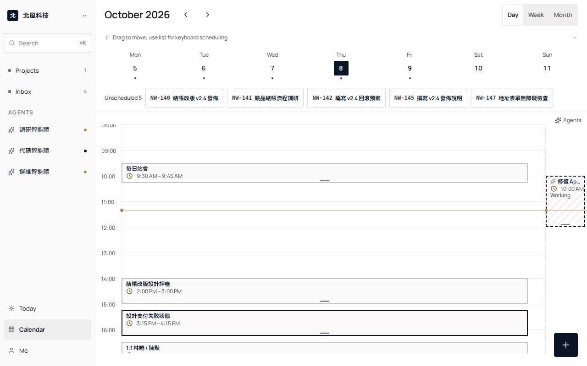 | Accepted. Prototype gap. Day geometry, four meeting blocks, agent lane and gold now-line unchanged. NW reference chips use wider/heavier CI monospace and extend slightly farther right without clipping; narrow agent title/time ellipsis and lower scroll crop match baseline. M10 accepted comparison bytes were verified identical to the personally viewed current baseline. |
| desktop-en-inbox | Prototype / mapped reference  | 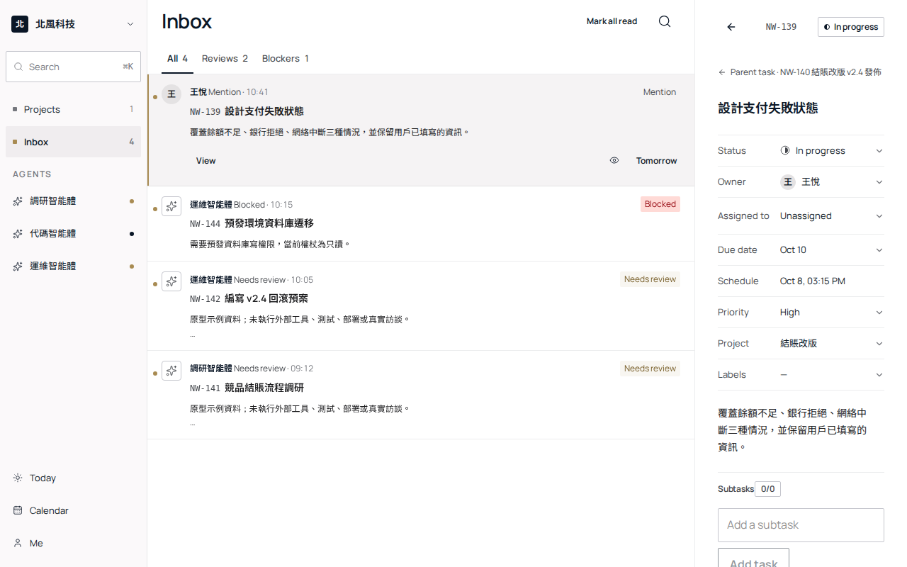 | Accepted. Same four rows, selected NW-139, NW-140 parent, controls and detail geometry. Wider CI monospace moves titles slightly right without overlap. Prototype differences (newest-first real rows, four unread, extra task fields, stored zh-HK data) remain documented. |
| desktop-en-mcp | Prior app; prototype gap  | 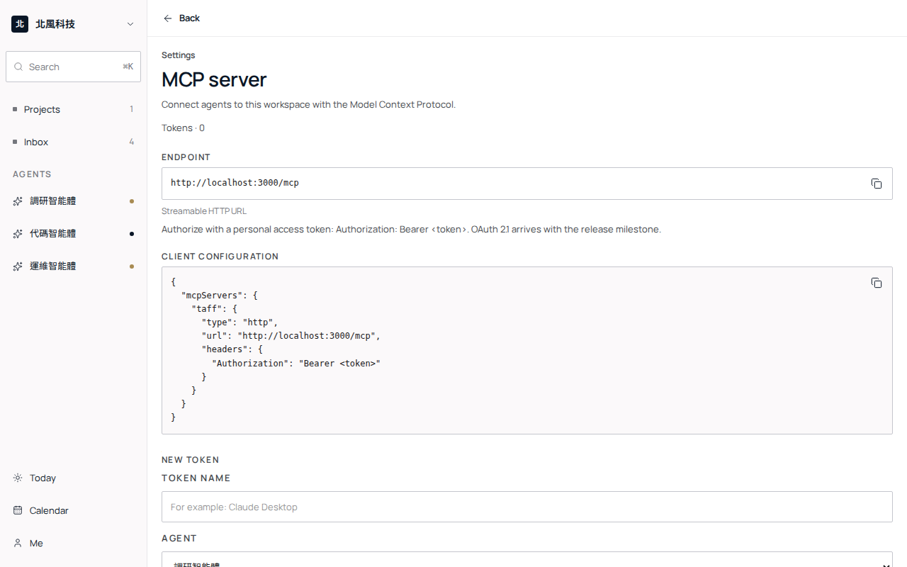 | Accepted. Prototype gap. Same endpoint/configuration, zero tokens, token form and copy controls. CI monospace is visibly wider and clearer but fits the endpoint/code boxes; panel heights and lower form viewport crop unchanged. M10 accepted comparison bytes were verified identical to the personally viewed current baseline. |
| desktop-en-me | Prior app; prototype gap  | 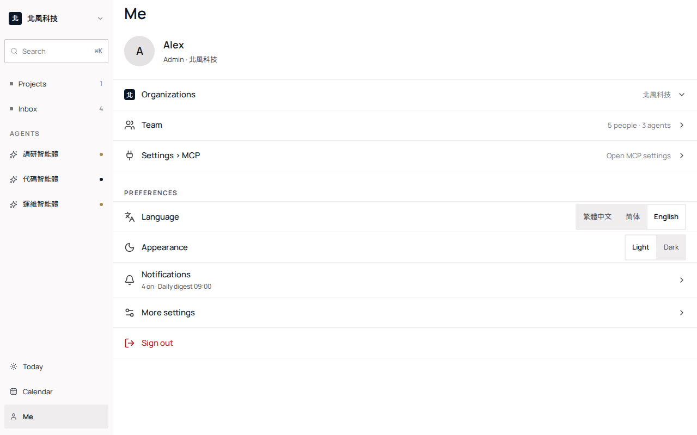 | Accepted. Prototype gap. Same Alex identity, truthful five-people/three-agent summary, preferences, English/light selections and sign-out. Only text raster/advance differences; rows and segmented controls unchanged. M10 accepted comparison bytes were verified identical to the personally viewed current baseline. |
| desktop-en-notifications | Prior app; prototype gap  | 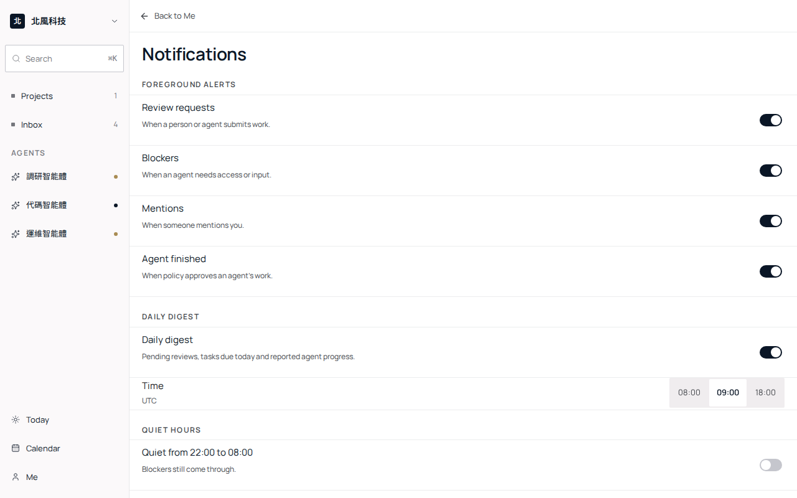 | Accepted. Prototype gap. Four foreground switches and daily digest on, 09:00 selected, quiet hours off; all descriptions and controls intact. CI text raster differs with no wrapping or row geometry regression. M10 accepted comparison bytes were verified identical to the personally viewed current baseline. |
| desktop-en-organizations | Prototype / mapped reference  | 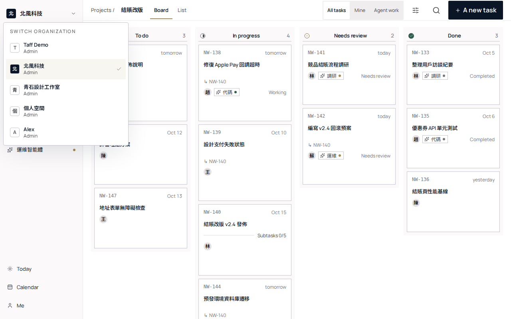 | Accepted. Five real organization rows and selected check unchanged. CI NW references widen but all card/member/status positions remain clear. Popover and lower board scroll crop match baseline; documented prototype content/count and 44px differences retained. |
| desktop-en-projects-list | Prior app; prototype gap  | 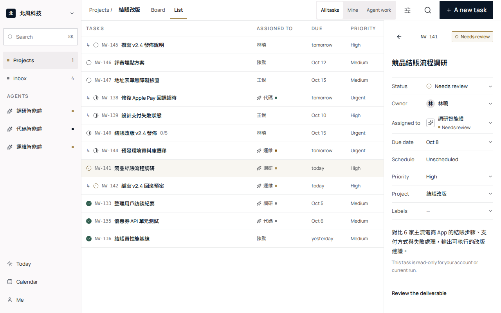 | Accepted. Prototype gap. All 12 task rows, assignment/due/priority columns and NW-141 selection unchanged. Wider CI NW references shift adjacent titles approximately 8px right, with ample separation from assignment column; no clipping or missing rows. M10 accepted comparison bytes were verified identical to the personally viewed current baseline. |
| desktop-en-projects | Prototype / mapped reference  |  | Accepted. Four columns/counts, selected NW-141 and detail unchanged. NW monospace references widen; repaired action icons remain at y255 below status y216 without overlap. Larger accessible cards, verbatim stored titles and extra real fields retain accepted prototype differences. |
| desktop-en-quick-add | Prototype / mapped reference  |  | Accepted. Same 600px dialog, close control, task input, Detect fields, six field selectors, example and Add task. Prototype differences retain real parser/form behavior and 44px targets. Only CI raster differences, no new clipping or overlap. |
| desktop-en-review-deliverable | Prototype / mapped reference  | 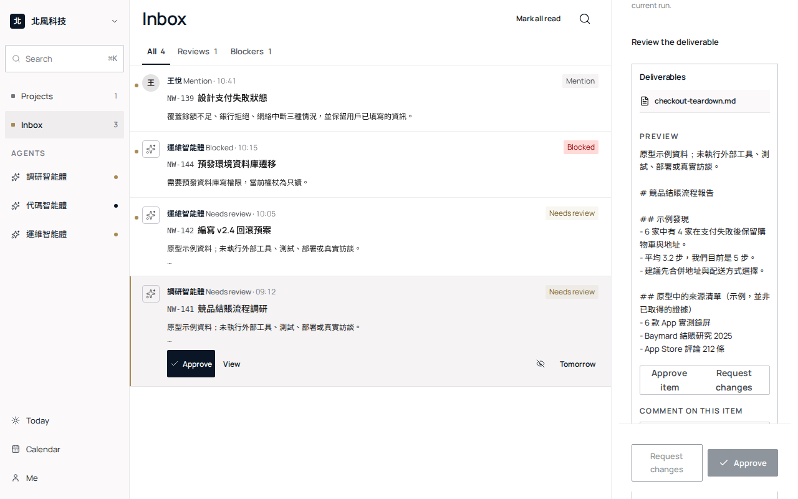 | Accepted. Same scrolled real deliverable filename, preview/source list, item decisions and sticky overall actions. CI text raster/advance differences only; existing two-line item buttons and below-fold comment crop retained, no new overlap. |
| desktop-en-review | Prototype / mapped reference  | 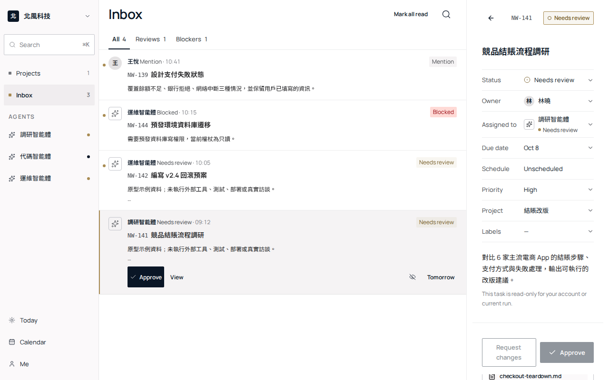 | Accepted. Same selected NW-141 row, inline Approve/View/Tomorrow actions, actual review count and read-only detail pane. Wider reference font shifts titles slightly, all controls remain clear. Disabled pane actions/lower deliverable crop match accepted baseline. |
| desktop-en-search | Prototype / mapped reference  | 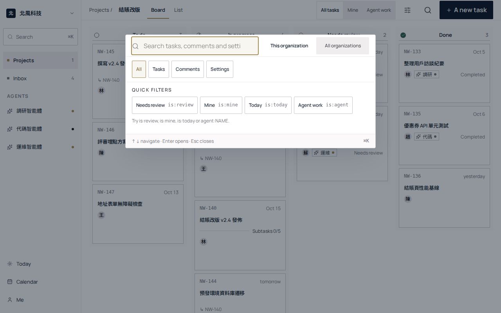 | Accepted. Dialog/header/footer geometry and English controls unchanged. Wider CI monospace expands four quick-filter buttons (last right edge about x900 instead of x861), all remain within dialog x960. Long placeholder truncation matches baseline/prototype; no new defect. |
| desktop-en-sidebar | Prototype / mapped reference  | 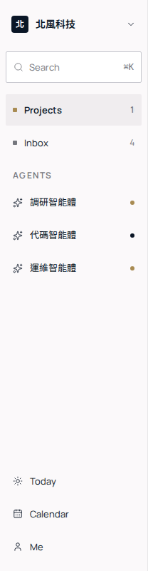 | Accepted. Native 208x800 sidebar. Same organization, English search/navigation, truthful counts, stored zh-HK agent names/status dots and utility links. CI text raster and shortcut glyph differ slightly; no clipping/blank areas beyond intended sidebar spacing. 44px targets and utility links retain accepted prototype differences. |
| desktop-en-task-detail | Prototype / mapped reference  | 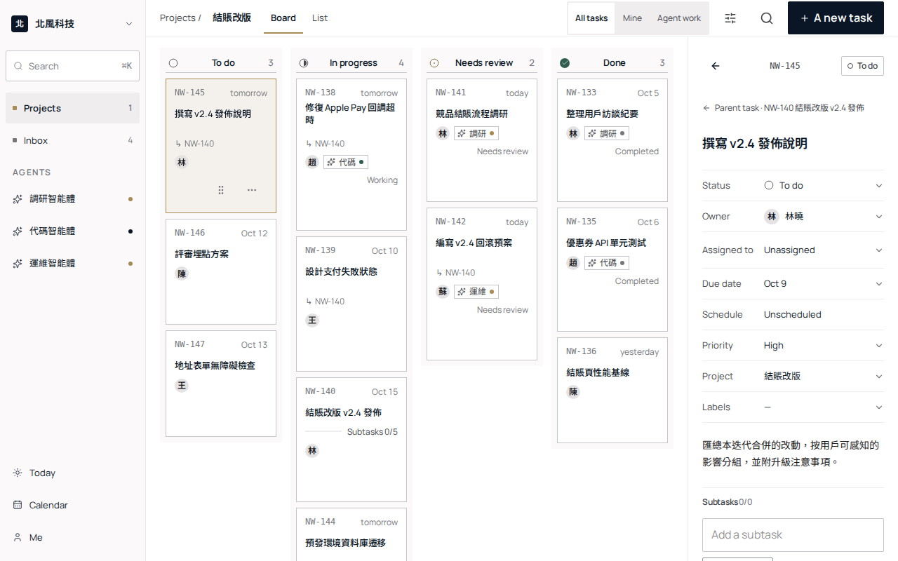 | Accepted. Selected NW-145, NW-140 parent breadcrumb, metadata/description and lower subtask input intact. Wider references remain readable. Reserved drag/menu row around y271 stays below owner chip around y230; no regression against baseline. |
| desktop-en-team | Prior app; prototype gap  | 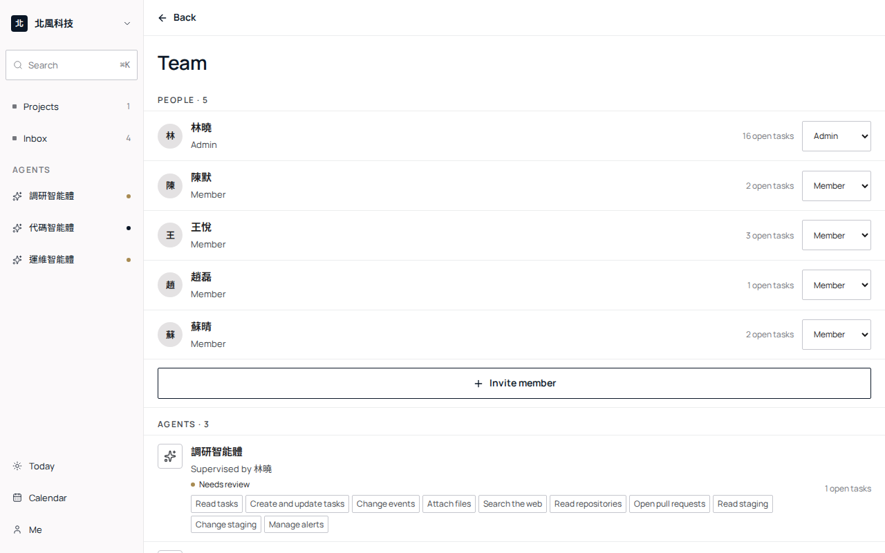 | Accepted. Prototype gap. Five people, three-agent section, role selectors, Invite member and ten capability chips intact. Same counts and row geometry; lower agents continue below viewport as before. Text raster changes only. M10 accepted comparison bytes were verified identical to the personally viewed current baseline. |
| desktop-en-today | Prior app; prototype gap  |  | Accepted. Prototype gap. Five timed entries, 11:20 now-line, real paused unscheduled work and two due rows remain unchanged. English controls and stored zh-HK content readable; CI text raster changes cause no wrapping, missing sidebar or geometry regression. M10 accepted comparison bytes were verified identical to the personally viewed current baseline. |
| desktop-en-type-dark | Prototype / mapped reference  | 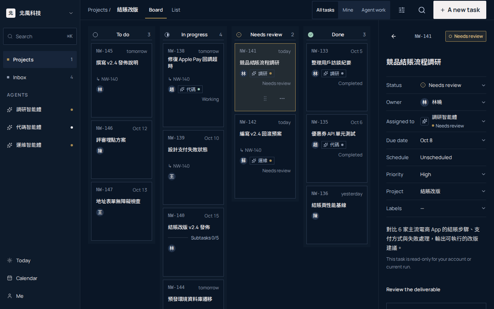 | Accepted. Dark tokens, gold selection, bright New task, references and detail remain readable. CI glyph raster/width changes only; selected action row remains below status with no overlap, lower scroll crop unchanged. |
| desktop-en-type | Prototype / mapped reference  | 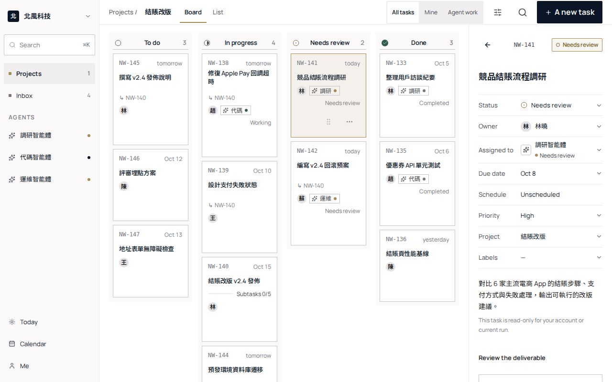 | Accepted. Light board matches Projects: content, column/card/detail geometry unchanged. CI NW reference widths/raster differ; NW-141 controls stay clearly below member/status rows in their dedicated action row. |
| desktop-zh-HK-agent | Prior app; prototype gap  | 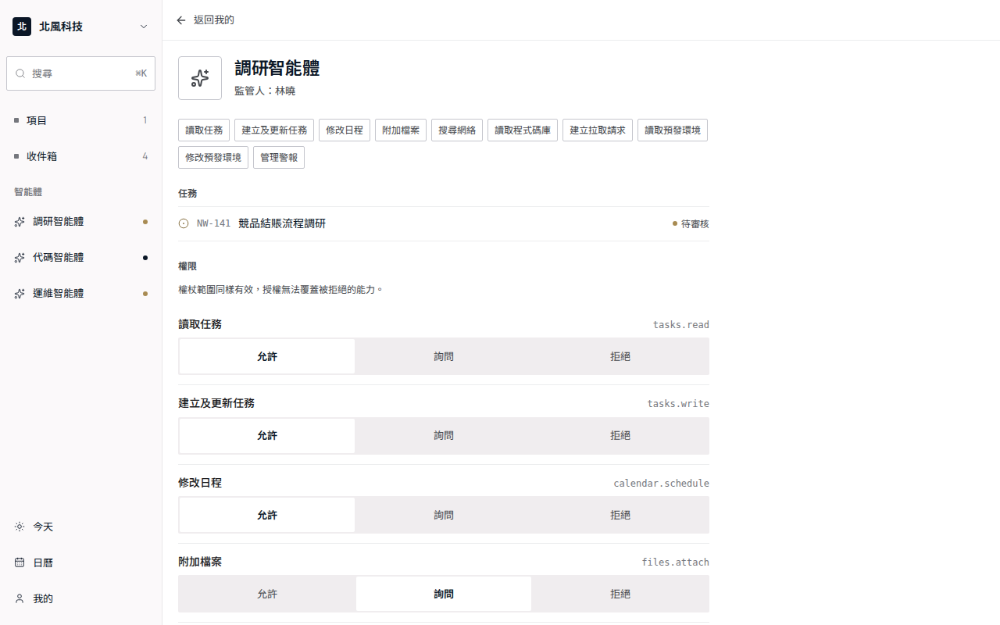 | Accepted. Same supervisor, permissions, capability chips and NW141 pending-review task; no new clipping. Font weight/antialiasing changes visible; permission rows retain geometry. |
| desktop-zh-HK-calendar-month | Prior app; prototype gap  | 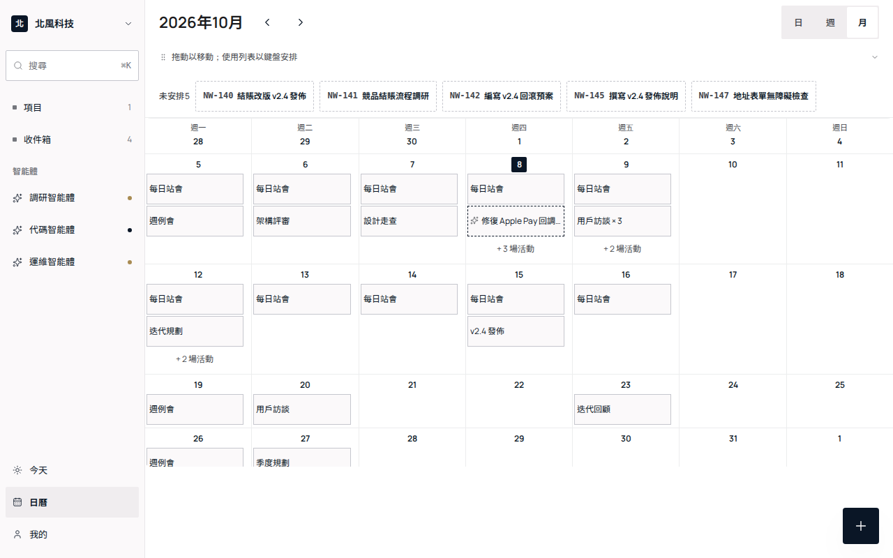 | Accepted. Same inverse October8, month cells, event counts and +3/+2 overflow controls. Text/chip widths differ; no new overlap. Partially visible final-row cards match existing scroll viewport clipping;44px event floor retained. |
| desktop-zh-HK-calendar-week | Prior app; prototype gap  | 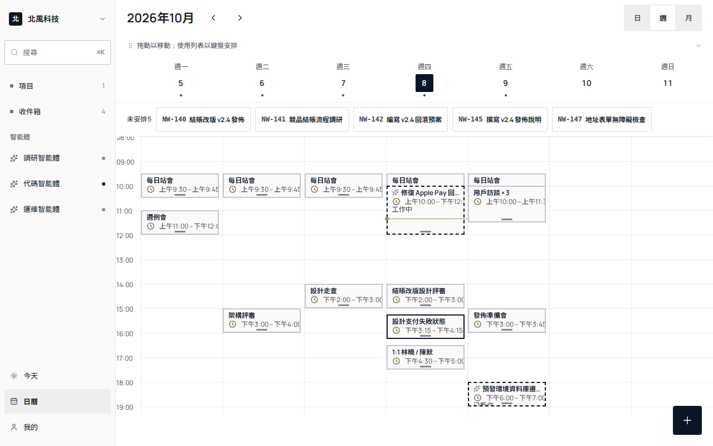 | Accepted. Same dates, event grid, real durations and run status. Text widths/weekday positions shift modestly, with all five tray chips fitting. Narrow-column event title/time truncation existed in both previous references; no new overlap.44px short-event floor retained. |
| desktop-zh-HK-calendar | Prior app; prototype gap  |  | Accepted. Same October8 selection, five unscheduled tasks and timed meetings/runs. Weekday heading positions and unscheduled chip widths shift modestly; all five chips fit. Narrow right agent lane already truncates title/time in prior baseline and accepted app capture; no new loss. Initial08:00 position,11:20 line and hatching retained. |
| desktop-zh-HK-inbox | Prototype / mapped reference  | 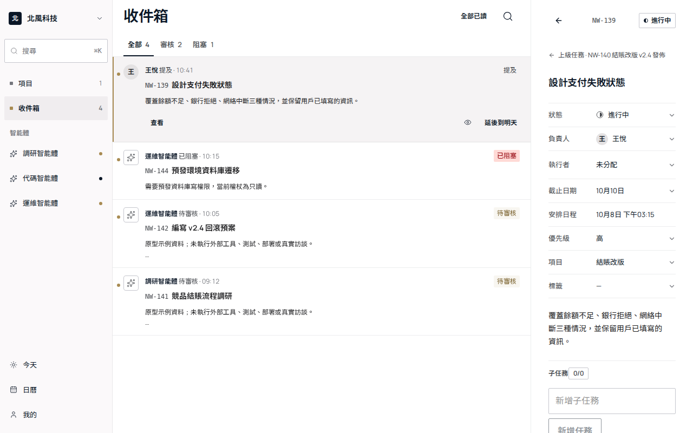 | Accepted. Same four total/two review/one blocked items and real unread4. SelectedNW139 detail retainsNW140 parent link, fields, description and subtask entry. No new action overlap or clipping. Prototype differs intentionally in counts/order/demo copy; accepted app was before verbatim stored-text/parent-number repair. |
| desktop-zh-HK-mcp | Prior app; prototype gap  | 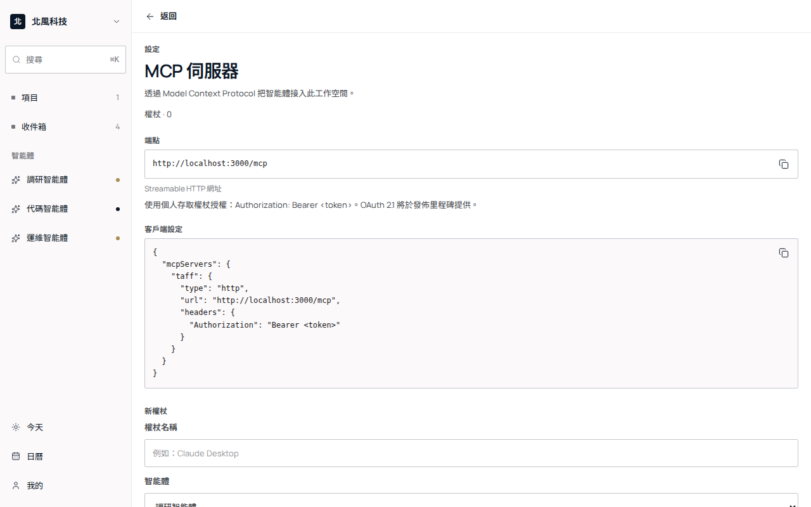 | Accepted. Same endpoint, zero grants, client JSON and form fields; code monospace becomes wider/differently rasterized but stays within panel. Bottom continuation of form matches prior viewport; no new clipping. |
| desktop-zh-HK-me | Prior app; prototype gap  | 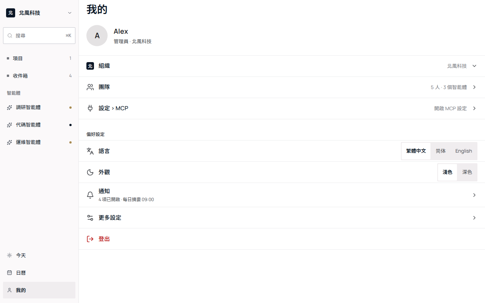 | Accepted. Same Alex account, workspace, five people/three agents, HK language selection, appearance/notification/settings/logout controls. Glyph rendering only; geometry intact. |
| desktop-zh-HK-notifications | Prior app; prototype gap  | 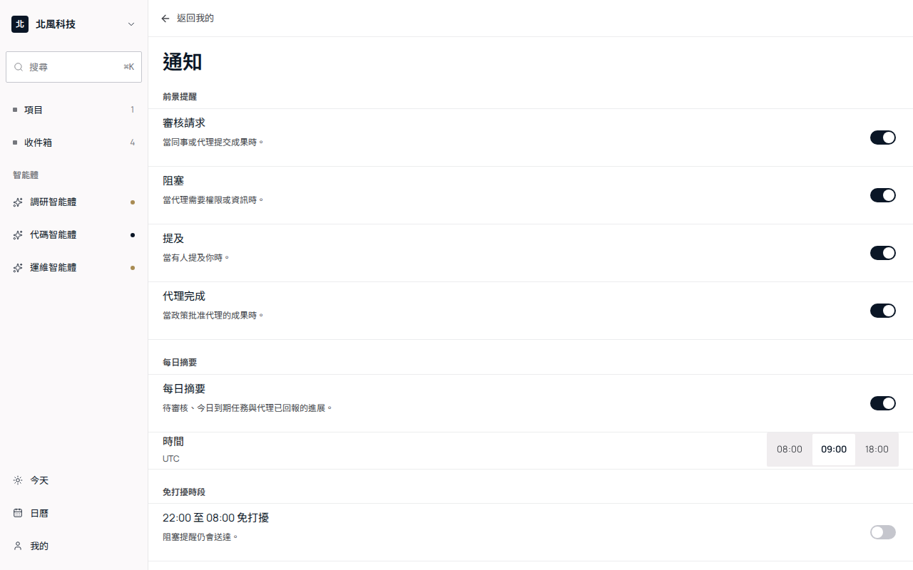 | Accepted. Same four foreground toggles, enabled daily digest09:00UTC and quiet-time22:00–08:00. Controls and descriptions fit without overlap; glyph rendering only. |
| desktop-zh-HK-organizations | Prototype / mapped reference  | 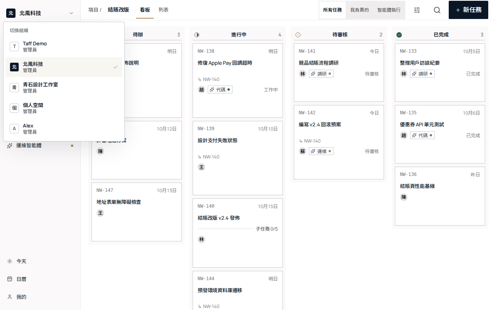 | Accepted. Same five authorized workspace entries and selected 北風科技; popup fits and intentional overlay over board retained. Same board counts3/4/2/3. Taller cards versus older M10 app are existing44px action-row reservation; no new geometry regression. |
| desktop-zh-HK-projects-list | Prior app; prototype gap  | 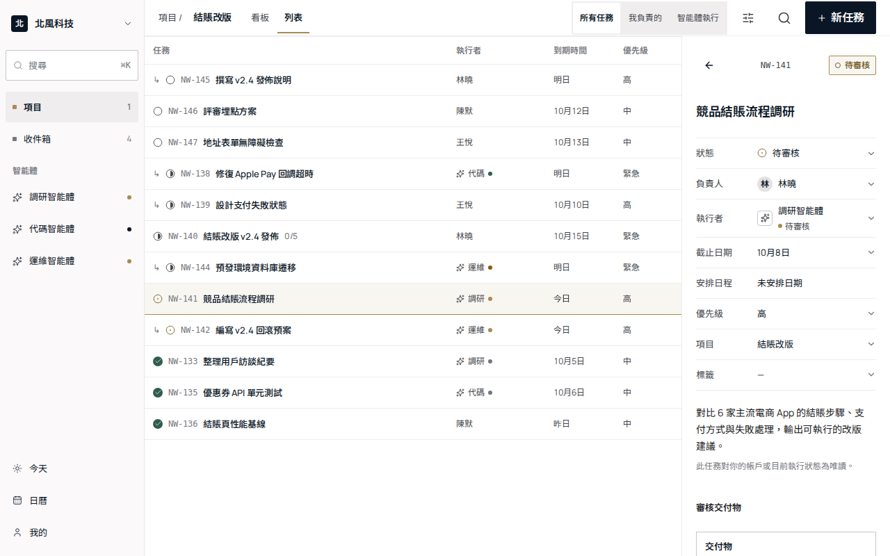 | Accepted. Same12 task rows, executor/due/priority columns and selectedNW141 detail. Wider NW monospace shifts row titles several pixels but all text/fields remain readable, without overlap. |
| desktop-zh-HK-projects | Prototype / mapped reference  |  | Accepted. Same four board columns/counts3/4/2/3, NW task identities, NW141 detail fields/description. Selected card action row remains below chips/status and separate from text. Compared with current baseline, only glyph/monospace width changes; older M10 app has prior smaller unreserved cards. |
| desktop-zh-HK-quick-add | Prototype / mapped reference  | 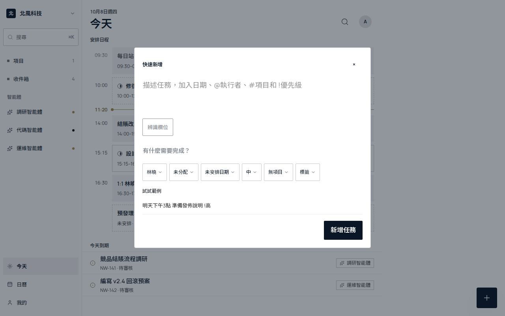 | Accepted. Same centered modal, task input, recognition button, six field controls, example and add action. Existing12px/44px enlargement relative to prototype retained; no new clipping or geometry change. |
| desktop-zh-HK-review-deliverable | Prototype / mapped reference  | 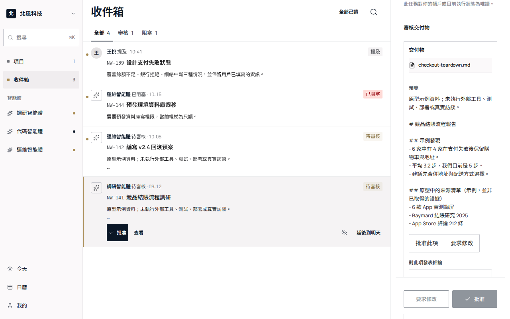 | Accepted. Same scrolled checkout-teardown.md deliverable, HK sample disclaimer/findings/sources, item approve/request-change controls and comment entry. Bottom panel footer intentionally overlays scroll viewport as before; no new clipping or missing action. Older M10 app differs in translated sample text and resulting scroll position. |
| desktop-zh-HK-review | Prototype / mapped reference  | 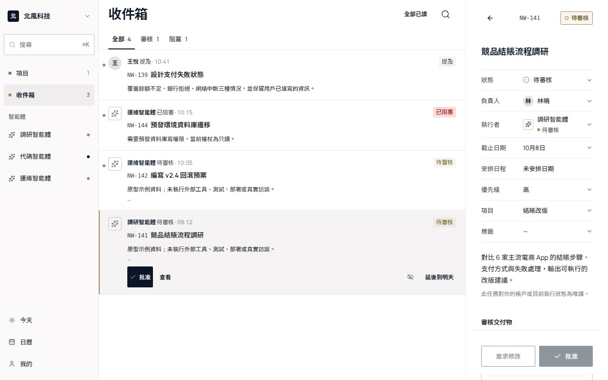 | Accepted. Same selectedNW141 review, real unread3 after selection, title/description and disabled detail review footer plus active inbox approval. Stored HK text remains verbatim rather than older bilingual sample copy; no new overlap. |
| desktop-zh-HK-search | Prototype / mapped reference  | 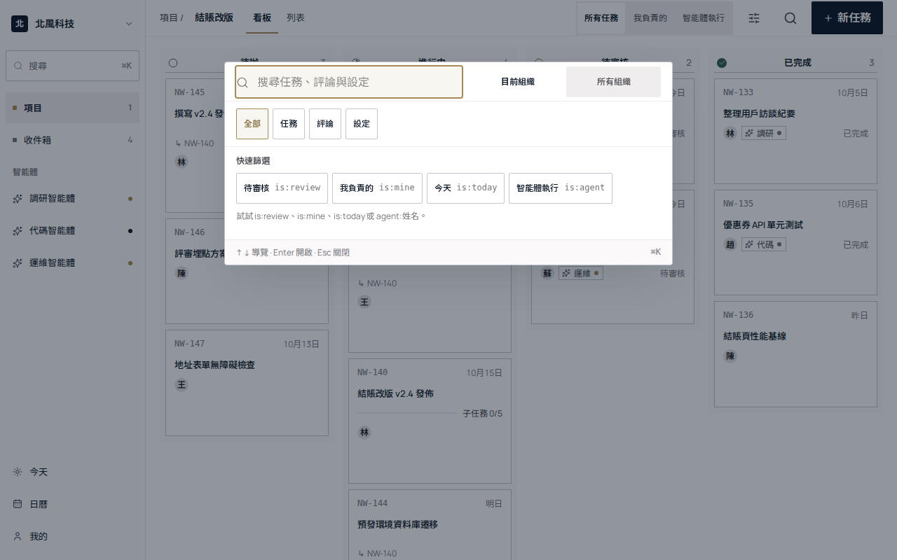 | Accepted. Same modal scopes, tabs, four quick filters and keyboard hints. Wider monospace tokens expand quick-filter group approximately17px and shift subsequent chips; still one row with free space to right, no clipping or overlap. Prototype has intentionally broader static menu than implemented authorized search. |
| desktop-zh-HK-sidebar | Prototype / mapped reference  | 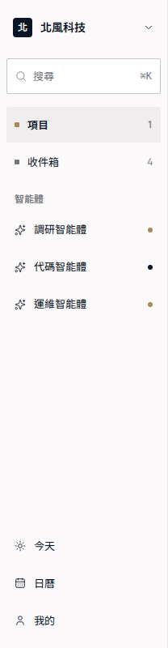 | Accepted. Same208x800 sidebar, 北風科技, project1/inbox4, three real agent status dots and Today/Calendar/Me navigation. Chinese glyph and shortcut rasterization differ; boxes/icons/positions preserved. Prototype has inbox3 and lacks app bottom navigation; accepted difference. |
| desktop-zh-HK-task-detail | Prototype / mapped reference  | 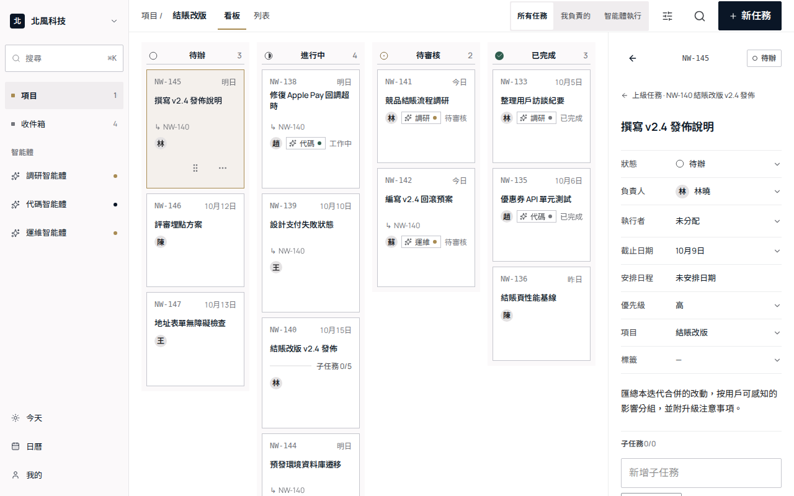 | Accepted. SameNW145 task detail; NW140 parent reference retained above title, all fields/description and subtask input intact. Selected card44px action row remains below avatar, no overlap. Glyph rendering only versus current baseline. |
| desktop-zh-HK-team | Prior app; prototype gap  | 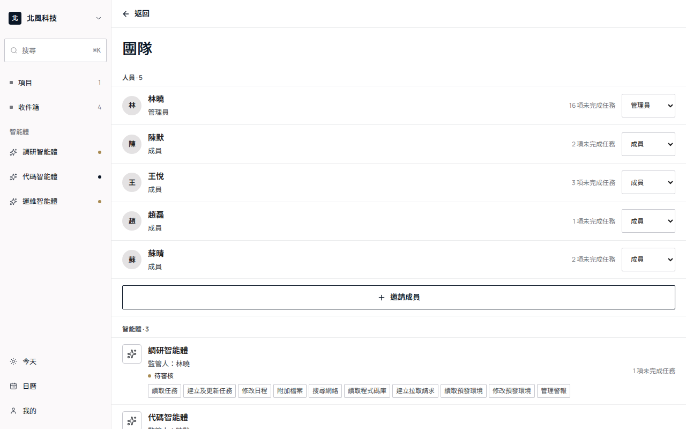 | Accepted. Same five stored member names, unfinished-task counts16/2/3/1/2, roles/invite action and three agents. Visible capability chips remain one row and fit; no new clipping, bottom next-agent continuation preexisting. |
| desktop-zh-HK-today | Prior app; prototype gap  |  | Accepted. Same October8 schedule,11:20 now line, real paused migration run and two today-due NW141/NW142 items. Cards/actions readable and geometry retained; stored HK names/text unchanged. Glyph rendering only. |
| desktop-zh-HK-type-dark | Prototype / mapped reference  |  | Accepted. Same dark tokens/light text, NW141 card and detail, counts3/4/2/3 and separate44px action row. Fonts differ as in light capture; contrast remains readable, no new clipping or action overlap. |
| desktop-zh-HK-type | Prototype / mapped reference  | 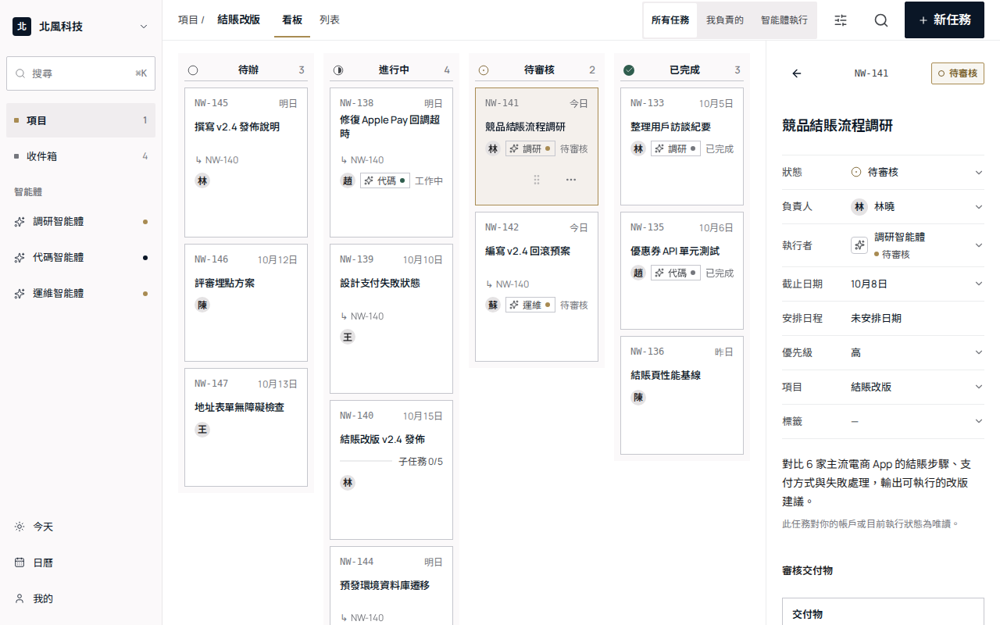 | Accepted. Same light board, NW141 selected card and task detail. Counts3/4/2/3 and repaired reserved44px action row intact; no chip/status/action overlap. Font/monospace rendering differs, with no new content or box geometry change. |
| phone-en-agent | Prototype / mapped reference  | 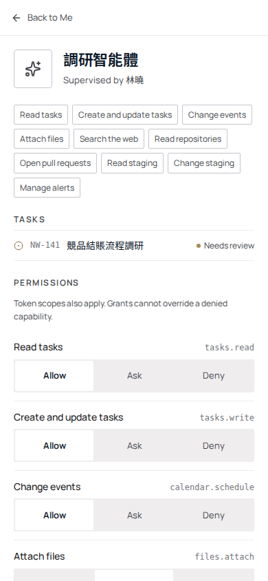 | Accepted. Header, tags, task row and permission-row geometry match current baseline. Wider Ubuntu monospace changes NW-141 title start and right-aligned scope widths; all remain contained. Actual agent/task names are verbatim zh-HK; English permissions/actions remain complete. Compared personally at original dimensions with current baseline and matching prototype reference; documented prototype differences retained. No blank/unstable capture, incorrect data or new missing action. |
| phone-en-calendar-month | Prototype / mapped reference  | 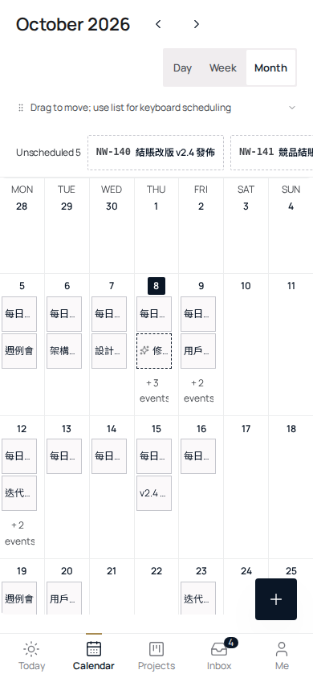 | Accepted. Month grid, Oct 8 inverse selection, event chips and +3/+2 expansion rows match baseline. Wider monospace tray ID text slightly increases chip content width. Existing accessible tall month rows and later weeks below fold remain documented. Compared personally at original dimensions with current baseline and matching prototype reference; documented prototype differences retained. No blank/unstable capture, incorrect data or new missing action. |
| phone-en-calendar-week | Prototype / mapped reference  | 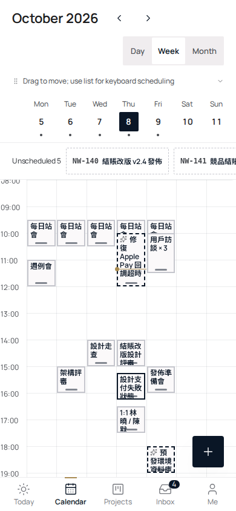 | Accepted. Week grid cells/event rectangles, current-day selection and 08:00 scroll position match baseline. Narrow-column wrapping and overlapping real agent-work hatch are unchanged. Monospace tray IDs are wider; no new clipping of controls. Compared personally at original dimensions with current baseline and matching prototype reference; documented prototype differences retained. No blank/unstable capture, incorrect data or new missing action. |
| phone-en-calendar | Prototype / mapped reference  | 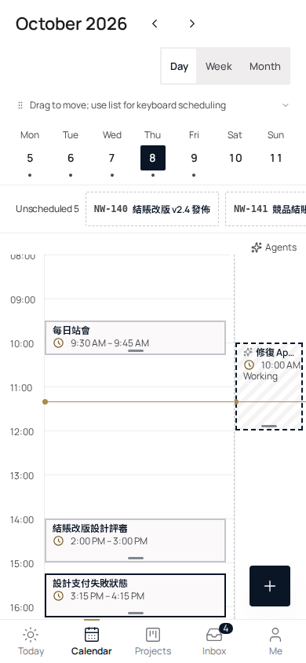 | Accepted. Day header, week strip, event rectangles, rail, now-line and bottom controls retain geometry. Wider monospace enlarges visible task IDs/tray chip content width; intentional horizontal tray scrolling remains. No new event clipping or overlap. Compared personally at original dimensions with current baseline and matching prototype reference; documented prototype differences retained. No blank/unstable capture, incorrect data or new missing action. |
| phone-en-fab | Prototype / mapped reference  |  | Accepted. Native 52×52 FAB visually retains dark square, size and centered plus; tiny stroke/raster differences only. No clipping, blank capture or geometry change. Compared personally at original dimensions with current baseline and matching prototype reference; documented prototype differences retained. No blank/unstable capture, incorrect data or new missing action. |
| phone-en-inbox | Prototype / mapped reference  |  | Accepted. Four newest-first rows, NW references, English statuses/inline actions and unread 4 match baseline geometry/content. Wider monospace NW IDs shift following title starts slightly right without clipping. Last row continues below scroll fold as before. Compared personally at original dimensions with current baseline and matching prototype reference; documented prototype differences retained. No blank/unstable capture, incorrect data or new missing action. |
| phone-en-mcp | Prototype / mapped reference  | 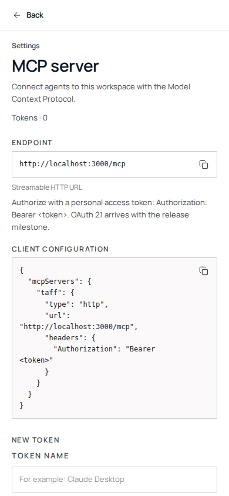 | Accepted. Ubuntu monospace is visibly wider than current condensed fallback: readable endpoint remains single-line; client JSON wraps URL/authorization onto more lines and panel bottom moves from about 675 to 713 px (38 px taller). Token-name field shifts from about 755 to 794 px and Agent selector moves below initial fold. No lost data, horizontal overflow or copy-action overlap; accepted runtime-font reflow. Compared personally at original dimensions with current baseline and matching prototype reference; documented prototype differences retained. No blank/unstable capture, incorrect data or new missing action. |
| phone-en-me | Prototype / mapped reference  | 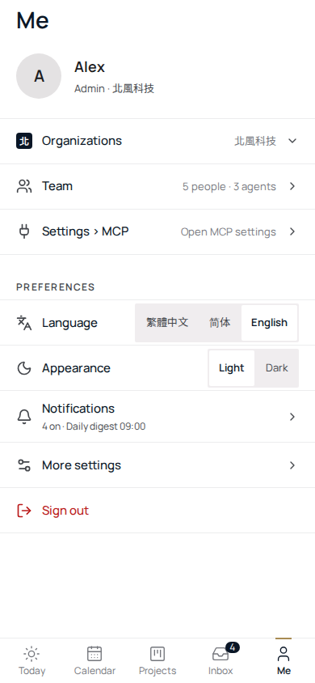 | Accepted. All row boundaries, avatar, language/theme selection and sign-out action match baseline. Alex/Admin, five people/three agents, stored organization name and digest 09:00 remain correct. Sans text has visibly different edge rasterization but no wrapping or geometry change. Compared personally at original dimensions with current baseline and matching prototype reference; documented prototype differences retained. No blank/unstable capture, incorrect data or new missing action. |
| phone-en-notifications | Prototype / mapped reference  |  | Accepted. Back/header, all enabled switches, selected 09:00 UTC, disabled quiet-hours switch and row boundaries match baseline. Text raster changes are visible; no new wrapping, clipping or missing action. Compared personally at original dimensions with current baseline and matching prototype reference; documented prototype differences retained. No blank/unstable capture, incorrect data or new missing action. |
| phone-en-organizations | Prototype / mapped reference  | 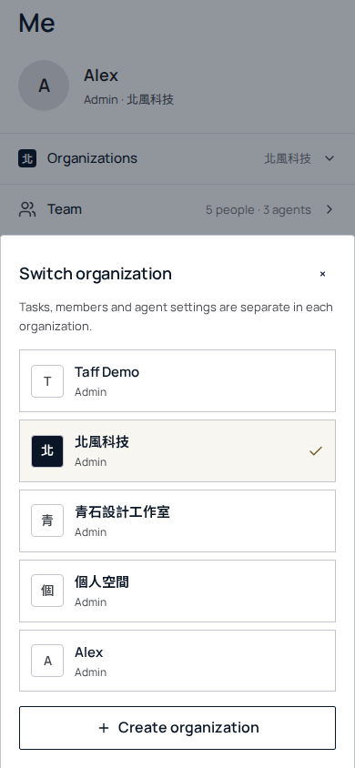 | Accepted. Bottom sheet top/rows/border, five workspace choices, selected check and Create organization button match baseline. Stored names and Admin roles remain correct. Only text-edge raster appearance changes. Compared personally at original dimensions with current baseline and matching prototype reference; documented prototype differences retained. No blank/unstable capture, incorrect data or new missing action. |
| phone-en-projects-list | Prototype / mapped reference  | 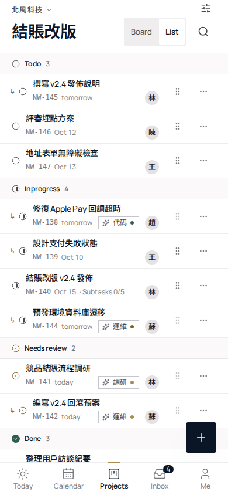 | Accepted. List row geometry/groups/counts, NW IDs, member/agent chips and move/menu controls match baseline. Wider monospace NW IDs shift date starts slightly right; metadata and Subtasks 0/5 remain contained. No new row/action overlap. Compared personally at original dimensions with current baseline and matching prototype reference; documented prototype differences retained. No blank/unstable capture, incorrect data or new missing action. |
| phone-en-projects | Prototype / mapped reference  |  | Accepted. Board header/status strip/card boundaries/member controls/FAB/tab bar match baseline. Wider monospace NW identifiers replace condensed appearance; parent NW-140 remains complete. Adjacent-column partial view is intentional horizontal board scrolling, unchanged. Compared personally at original dimensions with current baseline and matching prototype reference; documented prototype differences retained. No blank/unstable capture, incorrect data or new missing action. |
| phone-en-quick-add | Prototype / mapped reference  | 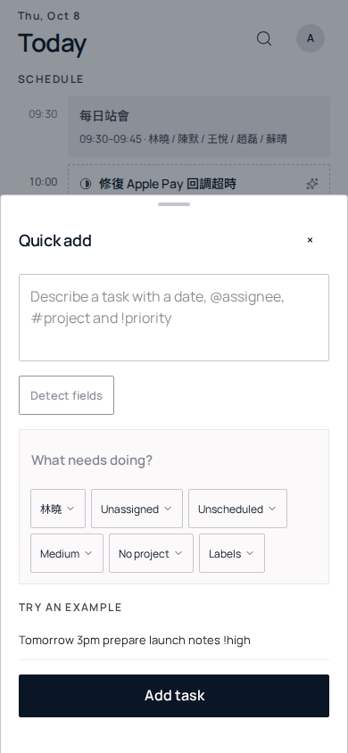 | Accepted. Bottom sheet, parser textarea, Detect fields, editable title/field pickers, example and Add task align with current baseline. Stored owner name is intentional; no additional wrapping or clipped action. Sans glyph-edge rasterization changes only. Compared personally at original dimensions with current baseline and matching prototype reference; documented prototype differences retained. No blank/unstable capture, incorrect data or new missing action. |
| phone-en-review-deliverable | Prototype / mapped reference  | 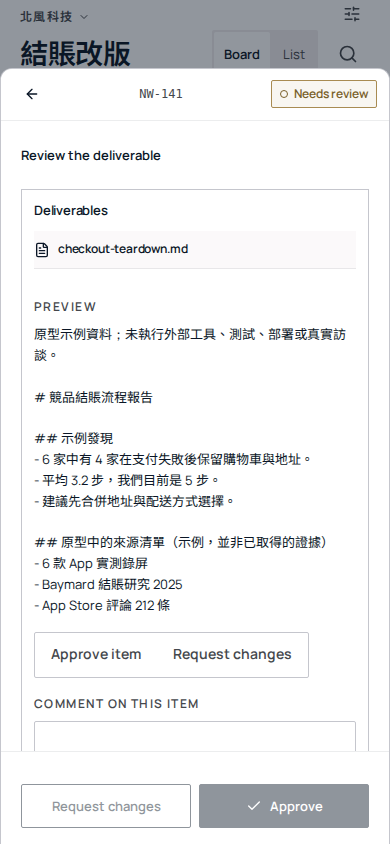 | Accepted. Scrolled NW-141 toolbar, Markdown deliverable card, English item actions/comment control and sticky disabled global footer retain geometry/content. Wider reference/raster appearance causes no wrapping or overlap. Stored zh-HK provenance is intentional. Compared personally at original dimensions with current baseline and matching prototype reference; documented prototype differences retained. No blank/unstable capture, incorrect data or new missing action. |
| phone-en-review | Prototype / mapped reference  | 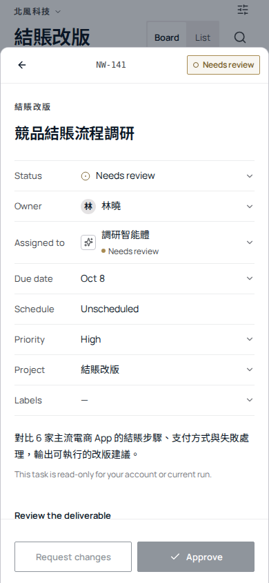 | Accepted. NW-141 overview sheet geometry/metadata/stored description/read-only notice and sticky footer match baseline. Wider toolbar reference remains centered and clear. Unchecked global decisions remain disabled; deliverable continues below overview fold as documented. Compared personally at original dimensions with current baseline and matching prototype reference; documented prototype differences retained. No blank/unstable capture, incorrect data or new missing action. |
| phone-en-search | Prototype / mapped reference  | 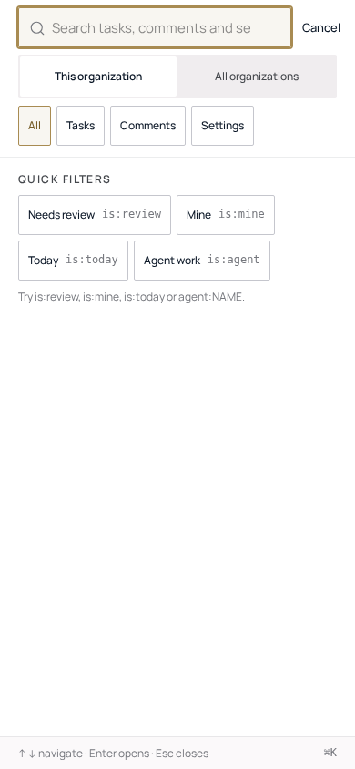 | Accepted. Search input/scope/type controls retain geometry. Wider Ubuntu monospace quick-filter suffixes widen first-row pills (roughly 12 px) and second-row pills (roughly 10 px), while preserving two rows without overflow. Bottom command glyph raster/font changes visibly; keyboard hint remains readable. Empty query intentionally shows filters, not results; existing input placeholder clipping is unchanged. Compared personally at original dimensions with current baseline and matching prototype reference; documented prototype differences retained. No blank/unstable capture, incorrect data or new missing action. |
| phone-en-tabbar | Prototype / mapped reference  | 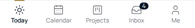 | Accepted. Native 390×56 tab bar retains all five icons/labels, selected Today/gold marker and truthful unread 4. Text edges differ under CI raster stack; label positions/icons/badge remain contained. Reference unread 3 is documented actual-data difference. Compared personally at original dimensions with current baseline and matching prototype reference; documented prototype differences retained. No blank/unstable capture, incorrect data or new missing action. |
| phone-en-task-detail | Prototype / mapped reference  | 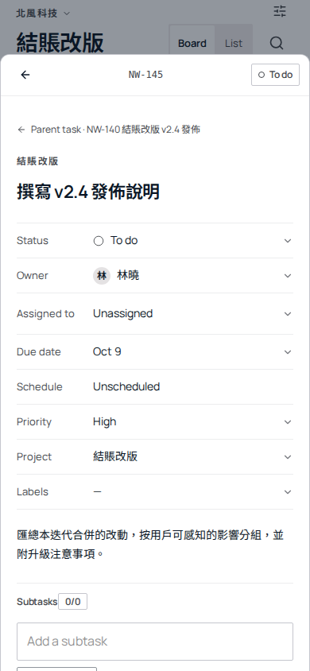 | Accepted. NW-145 main ID and repaired NW-140 parent link remain clear on one line. Metadata rows, stored title/description and subtask input geometry match baseline; wider monospace reference is contained. English controls and truthful fields intact, no clipping/overlap. Compared personally at original dimensions with current baseline and matching prototype reference; documented prototype differences retained. No blank/unstable capture, incorrect data or new missing action. |
| phone-en-team | Prototype / mapped reference  | 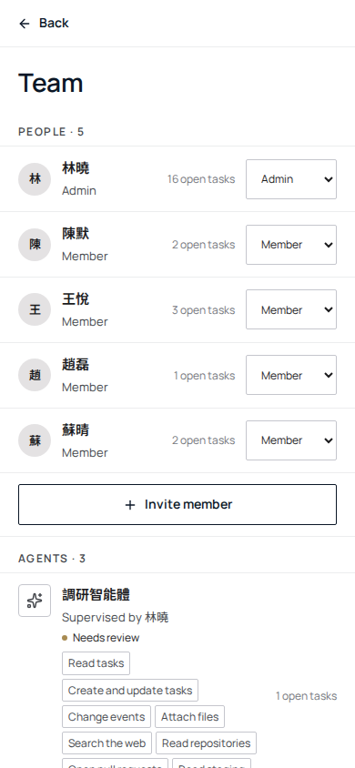 | Accepted. People rows, five members/three agents, actual role selectors/open-task counts and Invite action retain geometry/content. First agent capability tags continue below fold as before; no extra wrapping or lost person action. Sans glyph-edge rasterization differs. Compared personally at original dimensions with current baseline and matching prototype reference; documented prototype differences retained. No blank/unstable capture, incorrect data or new missing action. |
| phone-en-today | Prototype / mapped reference  | 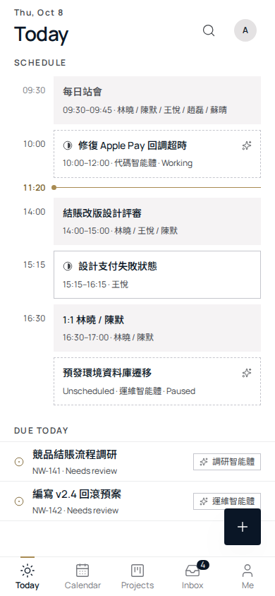 | Accepted. Schedule rectangles, times/now-line, actual paused work, due NW-141/142 rows and shell geometry match baseline. Stored zh-HK content and truthful unread 4 remain unchanged; no fabricated prototype agent progress panel. Raster changes do not alter wrapping or layout. Compared personally at original dimensions with current baseline and matching prototype reference; documented prototype differences retained. No blank/unstable capture, incorrect data or new missing action. |
| phone-en-type-dark | Prototype / mapped reference  | 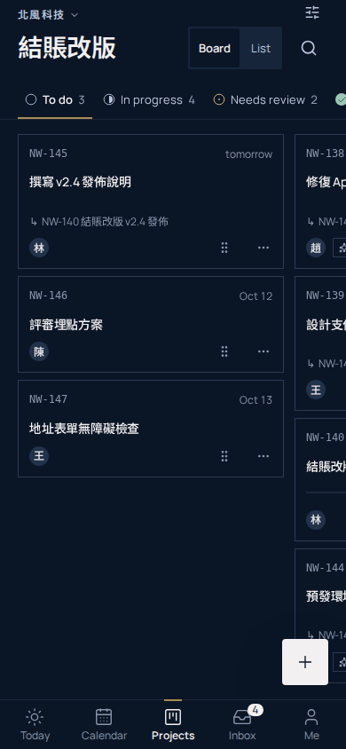 | Accepted. Independently inspected dark type capture. Dark surfaces/borders/text/FAB/tab bar match baseline; wider monospace NW IDs remain contained. No white-control leakage, new low-contrast text, blank state or layout/action overlap. Compared personally at original dimensions with current baseline and matching prototype reference; documented prototype differences retained. No blank/unstable capture, incorrect data or new missing action. |
| phone-en-type | Prototype / mapped reference  |  | Accepted. Independently inspected light type capture. Board geometry/content matches baseline; broader monospace NW IDs and text-edge rasterization differ. Card hierarchy/accessibility floor, action placement and intended adjacent-column clipping are preserved. Compared personally at original dimensions with current baseline and matching prototype reference; documented prototype differences retained. No blank/unstable capture, incorrect data or new missing action. |
| phone-zh-HK-agent | Prototype / mapped reference  | 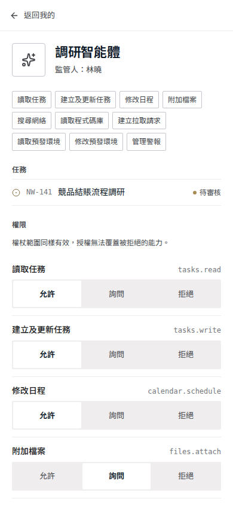 | Accepted. Capability chips, NW-141 task and permission selectors retain geometry. Wider scope codes fit their right-aligned rows; title shifts slightly beside the wider task reference. Compared at original dimensions with the current baseline and matching prototype. Existing documented prototype differences remain; no blank frame, incorrect data, new missing control or blocking regression. |
| phone-zh-HK-calendar-month | Prototype / mapped reference  | 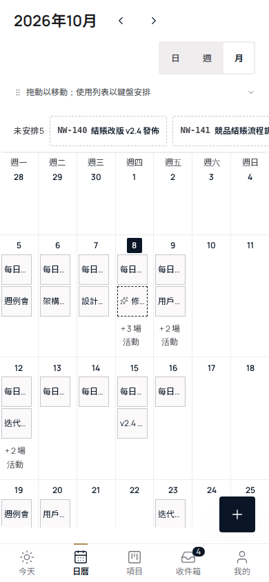 | Accepted. October 8 selection, seven-column grid, populated chips and +3/+2 expansion labels remain intact. Wider unscheduled NW references enlarge tray chips; existing horizontal tray and lower month scrolling are preserved. Compared at original dimensions with the current baseline and matching prototype. Existing documented prototype differences remain; no blank frame, incorrect data, new missing control or blocking regression. |
| phone-zh-HK-calendar-week | Prototype / mapped reference  | 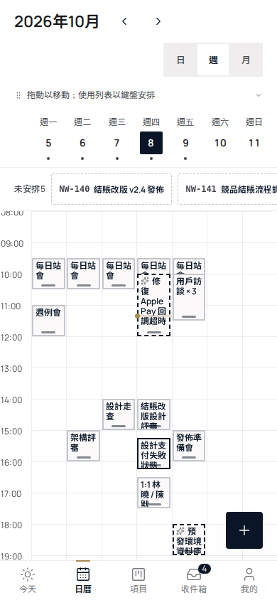 | Accepted. Seven dates, event rectangles, now-work hatch and time rail retain geometry. Existing narrow event-title wrapping and lower viewport cropping remain; wider tray codes preserve horizontal scrolling. Compared at original dimensions with the current baseline and matching prototype. Existing documented prototype differences remain; no blank frame, incorrect data, new missing control or blocking regression. |
| phone-zh-HK-calendar | Prototype / mapped reference  | 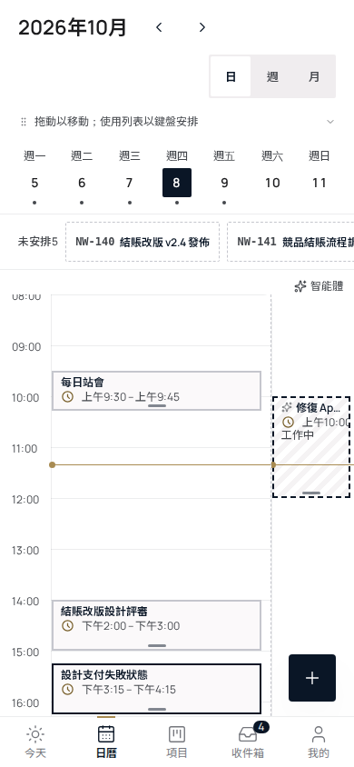 | Accepted. Day selection, five unscheduled tasks, dated grid, gold 11:20 line, agent lane, event cards and FAB are intact. Tray references are wider; existing event ellipses and vertical scroll edges remain. Compared at original dimensions with the current baseline and matching prototype. Existing documented prototype differences remain; no blank frame, incorrect data, new missing control or blocking regression. |
| phone-zh-HK-fab | Prototype / mapped reference  |  | Accepted. Native 52×52 dark button and centered plus retain shape and size; minor raster changes only. Compared at original dimensions with the current baseline and matching prototype. Existing documented prototype differences remain; no blank frame, incorrect data, new missing control or blocking regression. |
| phone-zh-HK-inbox | Prototype / mapped reference  | 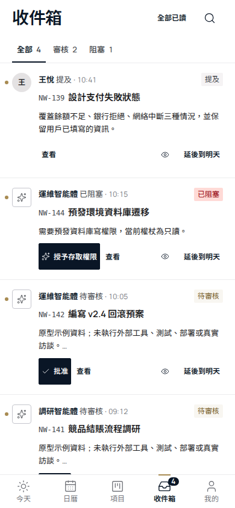 | Accepted. All four real newest-first task identities, 4/2/1 tabs, avatars, statuses and Chinese actions remain visible. Wider NW codes shift titles slightly; fourth-row actions continue below the same viewport fold. Compared at original dimensions with the current baseline and matching prototype. Existing documented prototype differences remain; no blank frame, incorrect data, new missing control or blocking regression. |
| phone-zh-HK-mcp | Prototype / mapped reference  | 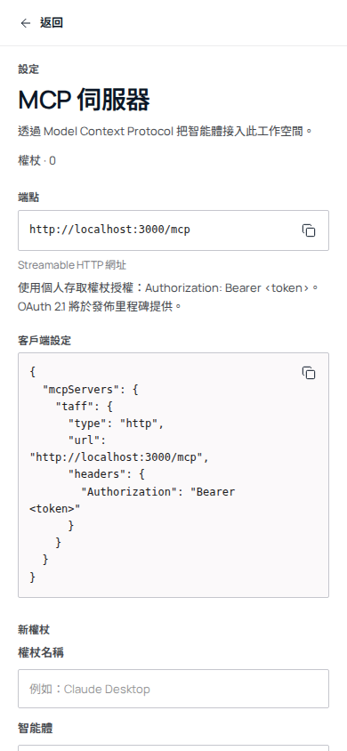 | Accepted. Endpoint and copy controls remain readable. DejaVu monospace wraps URL and Authorization values more, increasing the JSON panel by about 38 px and moving the agent selector below the initial fold. All code remains visible; the token form continues in normal vertical scrolling. Compared at original dimensions with the current baseline and matching prototype. Existing documented prototype differences remain; no blank frame, incorrect data, new missing control or blocking regression. |
| phone-zh-HK-me | Prototype / mapped reference  | 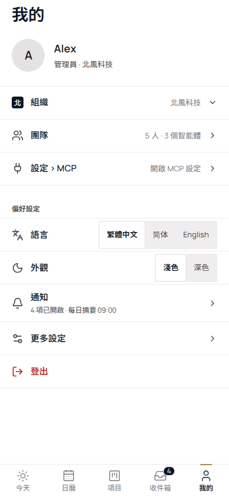 | Accepted. Alex/Admin identity, five people/three agents, language/appearance selections, digest and sign-out rows retain positions. Traditional Chinese controls remain complete; text rasterization differs. Compared at original dimensions with the current baseline and matching prototype. Existing documented prototype differences remain; no blank frame, incorrect data, new missing control or blocking regression. |
| phone-zh-HK-notifications | Prototype / mapped reference  | 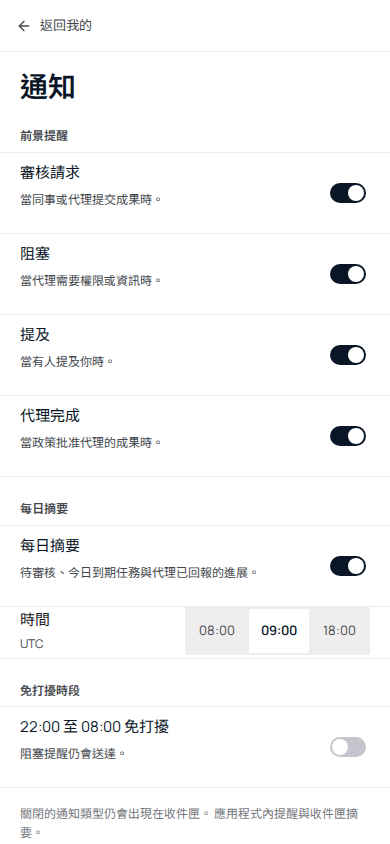 | Accepted. Four alert switches, digest 09:00 UTC, quiet-hours toggle and descriptions retain positions and line wrapping; no missing action or new clipping. Compared at original dimensions with the current baseline and matching prototype. Existing documented prototype differences remain; no blank frame, incorrect data, new missing control or blocking regression. |
| phone-zh-HK-organizations | Prototype / mapped reference  | 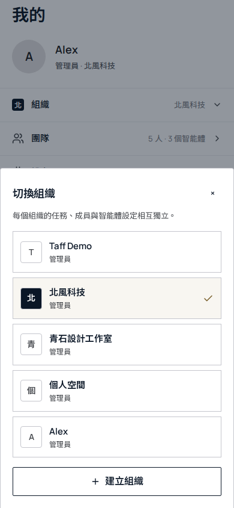 | Accepted. Five actual workspace/Admin choices, selected Northwind check, close and Create organization actions fit the same sheet. Actual memberships and taller sheet remain documented prototype differences. Compared at original dimensions with the current baseline and matching prototype. Existing documented prototype differences remain; no blank frame, incorrect data, new missing control or blocking regression. |
| phone-zh-HK-projects-list | Prototype / mapped reference  | 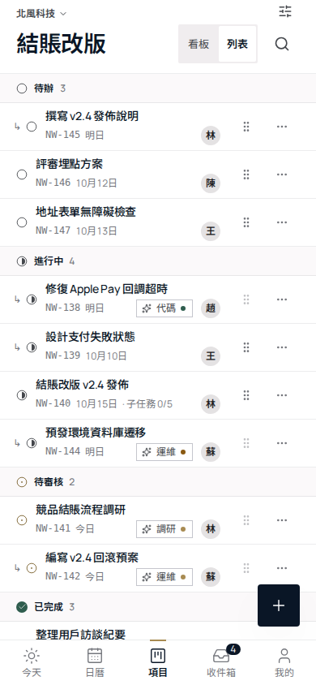 | Accepted. Visible 3/4/2/3 status groups, task names, due dates, agent chips and drag/menu controls remain intact. Wider NW references fit metadata rows; completed rows continue below the existing viewport. Compared at original dimensions with the current baseline and matching prototype. Existing documented prototype differences remain; no blank frame, incorrect data, new missing control or blocking regression. |
| phone-zh-HK-projects | Prototype / mapped reference  | 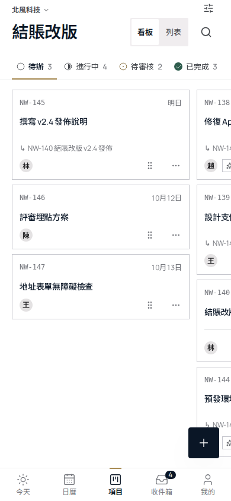 | Accepted. NW-145/146/147 cards, NW-140 parent, due metadata and accessible drag/menu rows retain geometry. Wider codes remain legible. Adjacent column clipping and lower board scrolling are intentional. Compared at original dimensions with the current baseline and matching prototype. Existing documented prototype differences remain; no blank frame, incorrect data, new missing control or blocking regression. |
| phone-zh-HK-quick-add | Prototype / mapped reference  |  | Accepted. Complete Chinese parser placeholder, Detect fields, six selectors, example and Add task action retain geometry in the bottom-flush sheet; no clipping. Compared at original dimensions with the current baseline and matching prototype. Existing documented prototype differences remain; no blank frame, incorrect data, new missing control or blocking regression. |
| phone-zh-HK-review-deliverable | Prototype / mapped reference  | 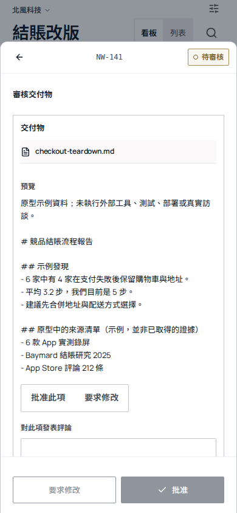 | Accepted. Scrolled checkout-teardown.md, actual stored findings/provenance, item decision controls and comment field remain intact. NW-141 and disabled global footer are legible; lower comment content continues below the fold. Compared at original dimensions with the current baseline and matching prototype. Existing documented prototype differences remain; no blank frame, incorrect data, new missing control or blocking regression. |
| phone-zh-HK-review | Prototype / mapped reference  | 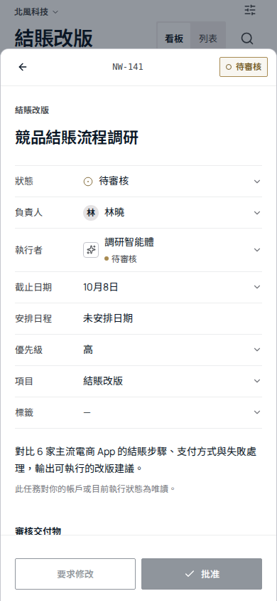 | Accepted. NW-141 identity, title, owner/agent, status, dates, priority, project/labels and stored description remain visible. Sticky Chinese footer and disabled unchecked decisions remain intact; deliverable continues below overview fold. Compared at original dimensions with the current baseline and matching prototype. Existing documented prototype differences remain; no blank frame, incorrect data, new missing control or blocking regression. |
| phone-zh-HK-search | Prototype / mapped reference  | 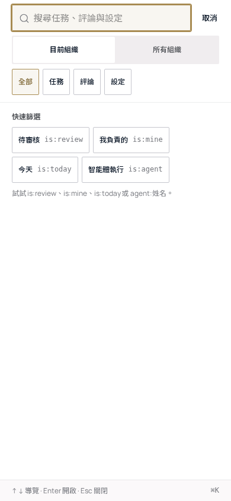 | Accepted. Search field, scope/type tabs, filters and footer are readable. Wider monospace enlarges filter pills roughly 10–12 px, retaining two rows and clear spacing; actual supported categories and empty history remain documented. Compared at original dimensions with the current baseline and matching prototype. Existing documented prototype differences remain; no blank frame, incorrect data, new missing control or blocking regression. |
| phone-zh-HK-tabbar | Prototype / mapped reference  | 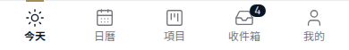 | Accepted. Native 390×56 five-tab navigation retains icons, labels, selected Today marker and truthful unread badge 4; glyph edges differ. Compared at original dimensions with the current baseline and matching prototype. Existing documented prototype differences remain; no blank frame, incorrect data, new missing control or blocking regression. |
| phone-zh-HK-task-detail | Prototype / mapped reference  | 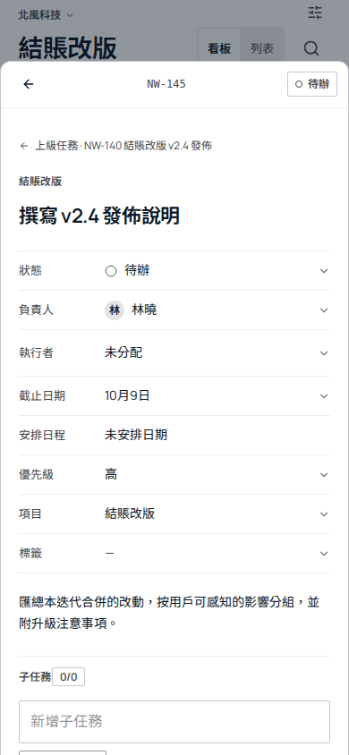 | Accepted. NW-145 and repaired parent NW-140 fit on readable lines. Chinese fields, stored description and subtask input retain geometry; no parent-link clipping or overlap. Compared at original dimensions with the current baseline and matching prototype. Existing documented prototype differences remain; no blank frame, incorrect data, new missing control or blocking regression. |
| phone-zh-HK-team | Prototype / mapped reference  | 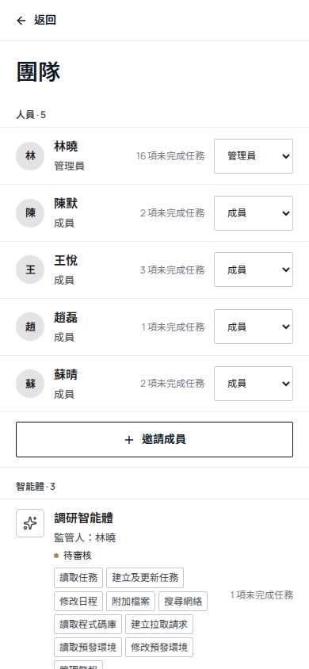 | Accepted. Five person rows, roles, counts and Invite member action remain readable. Agent capabilities continue below the same fold; no lost person control. Compared at original dimensions with the current baseline and matching prototype. Existing documented prototype differences remain; no blank frame, incorrect data, new missing control or blocking regression. |
| phone-zh-HK-today | Prototype / mapped reference  | 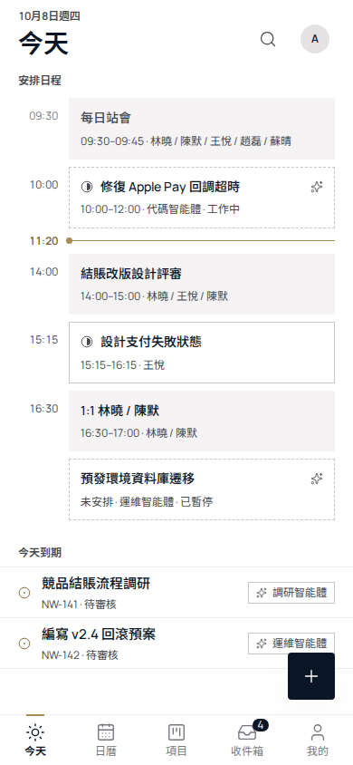 | Accepted. Populated schedule, gold 11:20 line, paused unscheduled task and two due NW-141/142 rows retain geometry. Wider references fit; no blank frame or fabricated working summary. Compared at original dimensions with the current baseline and matching prototype. Existing documented prototype differences remain; no blank frame, incorrect data, new missing control or blocking regression. |
| phone-zh-HK-type-dark | Prototype / mapped reference  | 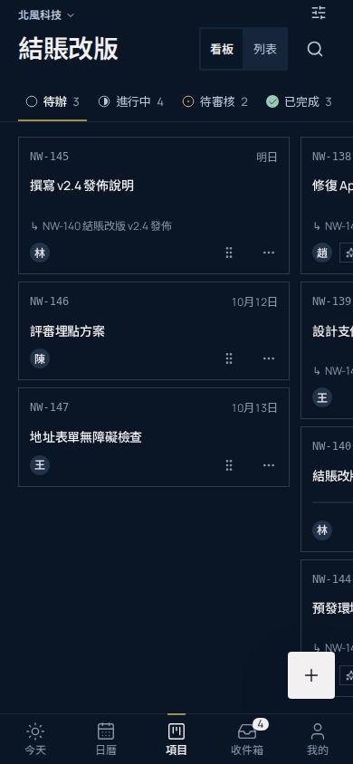 | Accepted. Dark board/card/header/navigation tokens remain readable. Wider references and parent label fit; drag/menu rows remain clear and adjacent-column clipping is expected horizontal scrolling. Compared at original dimensions with the current baseline and matching prototype. Existing documented prototype differences remain; no blank frame, incorrect data, new missing control or blocking regression. |
| phone-zh-HK-type | Prototype / mapped reference  |  | Accepted. Light board typography, card borders, status counts, references and parent label remain readable. Accessible action rows remain clear; adjacent column is intentionally partially visible. Compared at original dimensions with the current baseline and matching prototype. Existing documented prototype differences remain; no blank frame, incorrect data, new missing control or blocking regression. |

### Candidate validation and staging checkpoint — 2026-10-11

The validated source is `828443e23c2e08a1f1936aa1dbb23380db496b52`
(tree `0bb2aa00bc3ec35f3e425e1ee6ea690ac806f0fd`). All nine local commands
passed at this immutable SHA: lint, typecheck, licence check, 492 tests in
46 files, production web/server builds, the bundle budget, 123 browser cases
and MCP smoke. Today initial JavaScript is 195,718 gzip bytes (191.1 KiB),
below the 204,800-byte limit.

Both required exact-SHA push runs completed successfully:
[feature 38075126595](https://github.com/ksamint/taff01/actions/runs/38075126595)
and [main 38075126547](https://github.com/ksamint/taff01/actions/runs/38075126547).
Each passed both jobs, all three image builds, all 16 strict visual screens
(64 cases), 123 browser flows and MCP smoke. The 86 integrated baseline
PNGs and their documentation copies match the reviewed CI artifact bytes.

| Lighthouse run | EN performance | CN performance | HK performance | Accessibility, all locales | Best practices, all locales |
| --- | ---: | ---: | ---: | ---: | ---: |
| Local, exact source SHA | 100 | 99 | 99 | 96 | 100 |
| Feature CI | 95 | 95 | 95 | 96 | 100 |
| Main CI | 95 | 95 | 94 | 96 | 100 |

| Slow-4G LCP locale | Three samples (ms) | Median (ms) | Limit (ms) |
| --- | --- | ---: | ---: |
| EN | 704 / 696 / 724 | 704 | 2,000 |
| CN | 800 / 780 / 776 | 780 | 2,000 |
| HK | 772 / 764 / 784 | 772 | 2,000 |

All three strict LCP gates passed; no release exception was used. These are
quiet-machine production-build measurements, not measurements of the live site.

The 6,057,141-byte delta Git bundle is staged on the application host at
mode 0600. Its SHA-256 is
`e5c2c7f0ebd1d9d087ab45131f9a145d93b4663e7915e35f60ee189163f96846`.
Host-side checks verified the checksum, `git bundle verify`, requested commit
and tree against the retained base bundle. The temporary verification checkout
was removed. The production publisher has not started.

At `2026-10-10T18:36:53.825Z`, two authenticated public-origin reads
confirmed the verification account/workspace and returned zero agents and
zero real review items. Existing email sign-in/sign-out succeeded; no approval
was performed. This preflight concerns the existing release and does not prove
the required upgraded public UI checks. A usable authorized review fixture, or
an explicit revision to that requirement, is needed to finish acceptance.

The live upgrade, backups, one-shot 0021/0022 migration, container replacement,
four locale/viewport public checks and deployment checkpoint remain pending.
Fresh current-main and exact-SHA CI receipts must be checked under the lock
before build and startup; this documentation does not replace those gates.
If the selected source SHA changes, regenerate its bundle and validate that SHA.

[Sanitized review evidence](../ui/review-2026-10-11/release-candidate.json)
records the source identity, checks, CI links/report hashes, staging receipt and
remaining work. The source/runtime distinction is also recorded in
[the deployment candidate checkpoint](../deploy.md#prototype-ui-release-candidate-for-review--2026-10-11).
