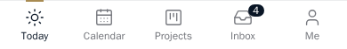
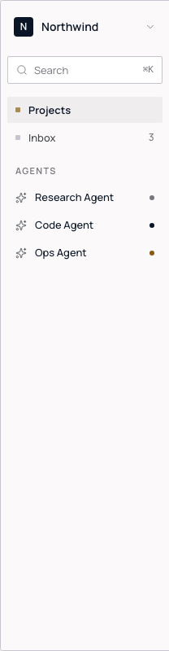
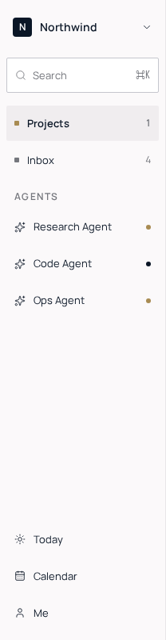
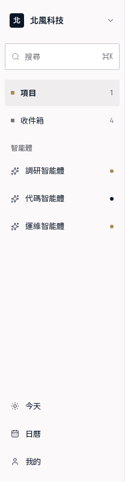

# M10 — UI parity with the approved prototype

Source: `docs/agent-goal-ui-parity.md`, before the remaining M9 items.
Implementation branch: `codex/ui-parity`, based on `main` at `6d78415`.

## Starting review

Read `docs/ui/review-2026-10-10/README.md` and personally inspected all 14
PNG images before changing code. The reviewed app is `55b315b`; the review
and parity objective were added to main in `84eb670`; `6d78415` adds the
source-port requirement and markup line map.

The implementation source is the prototype's markup and inline styles, not
its screenshots. Each block is ported to TSX, its styles lifted into CSS
classes using the existing tokens, and its bindings replaced by the current
app's queries and mutation handlers. Prototype icons map to Lucide; its
Button, Switch and Badge map to the existing `components/ui` primitives,
extending a primitive only when a used variant is missing. Captures check
the result. The existing accessibility floor takes precedence over the
prototype's smaller targets and 11 px labels.

| Screen | Observed difference to address |
| --- | --- |
| Shell | Global top bar and large heading consume the phone's first third; the prototype has compact screen headers, a square FAB, toast, and desktop organization/search/agent sidebar. |
| Today | Tall run cards and inline creation replace the prototype's timed schedule, agent block, now-line, and compact due rows. |
| Projects | Project/filter forms and status selectors dominate the board; reference cards put the ID, due date, title, parent and member chips in a compact hierarchy. Desktop lacks the selected-task panel. |
| Task detail | Full-page title/description/date forms replace the bottom sheet's field rows and inline deliverable review. |
| Inbox | Tall grouped cards omit agent identity, excerpt and inline approval; the reference has dense rows, unread dots, status chips and a desktop review panel. |
| Calendar | Extra route heading and header controls push the grid down; the reference uses a compact month/segmented header, hint, day dots, unscheduled chips and bordered blocks. |
| Me | Account/workspace forms and separated sections replace the avatar, role/team line, chevron rows and segmented preferences. |
| Type and density | 48 px route titles and generous form spacing must follow the prototype's 28 px titles, 15 px card titles and 12 px metadata. |

## Acceptance ledger

A screen remains pending until its real seeded app capture is shown beside
its matching reference, the committed visual baseline passes, and existing
behavioral flows remain green. Reference captures alone do not approve the
app. No production database will be seeded for this work.

| Step | State | Evidence |
| --- | --- | --- |
| 0 — offline prototype and capture tooling | Accepted locally; strict checks before push pending | 38 native zh/en reference captures; independent full navigation rerun passed with zero external requests or browser errors. [Matrix and provenance](../ui/reference/README.md). |
| 1 — shell | Visuals accepted at `dfcbefb`; committed-baseline and behavioral gates pending | Six native element captures personally inspected by the root agent; reference/app comparisons below. Phone tabs/FAB from lines 376–410, desktop sidebar from 940–953; existing session/cache guards retained. |
| 2 — Today and Northwind seed | Pending | |
| 3 — Projects | Pending | |
| 4 — task detail and review | Pending | |
| 5 — Inbox | Pending | |
| 6 — Calendar | Pending | |
| 7 — Me | Pending | |
| 8 — type, density and dark theme | Pending | |

Before each push: lint, typecheck, licence gate, unit tests, web build,
server build, bundle budget, Playwright and MCP smoke. Final performance
acceptance also includes Lighthouse and three LCP runs in each locale.

## Step 0 evidence

React 18.3.1 and the prototype fonts are local, with MIT/OFL licences and
source hashes. The self-serving runner captures 22 phone and 16 supported
desktop views, verifies native dimensions, font loading and initial task
state, and rejects external requests and browser errors. The root agent
independently walked every view in both languages using this runner, then
inspected the resulting references. English and Chinese both retain NW-138
working at 2/4; the simulation is frozen only by the capture harness.

The prototype does not define desktop Today, Calendar, Me, MCP or agent
profile layouts. Those gaps are listed explicitly in the reference matrix.
Phone references retain synthetic OS chrome; comparisons account for that
chrome without adding a fake status bar to the app.

## Shell candidate

The signed-in global header is removed. Quick Add moves to the 52 px dark
square FAB, language and sign-out to Me, and search to compact screen
headers and the desktop sidebar. The sidebar follows the source's 208 px
width, organization menu, search/⌘K control, two primary links and agent
rows; bottom utility links retain desktop access to Today, Calendar and Me.
The standing 44 px target floor enlarges the prototype's 32 px sidebar
controls. Counts and agent dots use actual API data. Foreground alerts keep
notification preferences and device delivery, with the source's dark bottom
toast and View action. Other screen ports remain pending.

The real Northwind fixture prerequisite is included: 12 Checkout tasks,
five workspace members, three agents, real reviews/blockers/inbox and
recurring scheduled meeting tasks. Quartz and Personal are separate demo
organizations. Deterministic identities let repeat seeds preserve edits,
passwords, approvals, permissions and calendar changes. Canonical untouched
fixture fields translate in all three locales; edited content stays verbatim.
`SEED_DATE` anchors isolated visual data to October 8; normal seeding uses
the current day in the existing demo account's time zone. No production
database is seeded.

Current checks: six-package typecheck, licence gate and three seed unit
tests pass. PostgreSQL integration and browser assertions are pending: the
local PostgreSQL container accepts internal connections but the host driver
query timed out before assertions. The initial browser run was stopped
while waiting for API readiness, with its owned processes cleaned up.
Acceptance will use the prepared isolated Linux environment.

## Shell visual checkpoint — 2026-10-10

The root agent personally inspected all six `dfcbefb` app captures and
accepted the Shell visuals. The six accepted PNGs are copied unchanged to
`e2e/__screenshots__/ui-parity.spec.ts/`, using the visual configuration's
four project names. This is visual acceptance, not a claim that the nine
validation gates have passed: the committed-baseline check and behavioral
acceptance remain pending.

The implementation inputs remain the HTML blocks: phone FAB and tabs at
376–410, desktop sidebar at 940–953. These comparisons use only native
pixel crops of the corresponding reference captures, without scaling or
reconstructed pixels. The phone tab crop omits the 28 px synthetic OS home
area; the app does not add fake OS chrome. The 52 px FAB and 208 px desktop
sidebar are compared at their source dimensions. [Crop coordinates and
hashes](../ui/screenshots/ui-parity/shell/README.md) preserve provenance.

| Region / locale | Prototype reference crop | Accepted real app |
| --- | --- | --- |
| Phone tabs / English |  |  |
| Phone tabs / Hong Kong Chinese |  |  |
| Phone FAB / English |  |  |
| Phone FAB / Hong Kong Chinese |  |  |
| Desktop sidebar / English |  |  |
| Desktop sidebar / Hong Kong Chinese |  |  |

Documented differences preserve working behavior and the accessibility
floor: targets are at least 44 px and text at least 12 px, enlarging the
source's 32 px controls and 11 px labels. The real API returns four unread
Inbox items, while the prototype shows three; badges and agent status dots
retain actual data. Desktop utility links for Today, Calendar and Me retain
access to those existing routes below the source sidebar's primary links
and agents. The native Lucide icon mappings and these differences are part
of the accepted Shell capture, not screenshot substitutions.

CI now runs the explicit Shell visual check before behavioral flows, after
the existing isolated `db:seed` step and builds. Behavioral tests can edit
the fixture and repeat seeding intentionally preserves edits, so running
visuals first avoids depending on a destructive reset. The visual check
uses the committed baselines and does not update them in CI.

## Integrated source ports — candidate, acceptance pending

The source ports also include Notifications (613–635), the house Switch,
and Quick Add (794–812). Preference persistence, parsing, assignment,
creation and their error paths retain the existing handlers. Twelve further
offline phone references cover Calendar week/month, Projects list,
Notifications, Team and Quick Add; the root agent inspected each.

At `8489383`, Today generated four real seeded captures and passed an
independent comparison without updates. These are diagnostic captures, not
approved Today baselines: inspection prompted a compact worker-chip styling
correction. The font harness now loads the four actual stylesheet faces before
capture. It preserves their families, sources, weights and Unicode ranges;
product `font-display: optional` and cold performance measurements are unchanged.
Four Shell tab/sidebar baselines were explicitly reinspected and replaced to
correct the earlier fallback-font renders, with provenance in the Shell manifest.

Visual navigation now selects the real Project task cards for the phone sheet
and desktop detail pane. Desktop review opens the real Inbox control, then
restores the isolated recipient's read state in a `finally` block. Screens wait
for their dependent data before capture. These runner changes require the next
sealed browser run; no production deployment or database changes are included.

Today, Projects, task detail and review, Inbox, Calendar and Me now have TSX
and token CSS ports from the line map. The shared shell persists across routes;
Next intercepted task routes preserve the preceding phone screen. Desktop
Projects and Inbox bind the existing task editor in the source's detail pane.
Source Search, agent profile, MCP and Team blocks are also ported. Existing
permissions, version checks, form drafts, optimistic rollback, recurrence,
notifications, token reveal-once and cache identity guards remain in their
original handlers. House Button, Input, Label, SheetDialog and the shared
Lucide StatusGlyph map the prototype primitives.

Review found and repaired nested-dialog Escape propagation, cross-workspace
task member/run/comment scoping, and account-specific timezone initialization.
Schedule controls sit outside the metadata form; an embedded approval failure
keeps checks, item decisions and comment drafts. Existing 105 browser cases
retain their behavioral assertions; twelve regression cases cover Me preferences,
schedule-save isolation, approval rollback and cross-workspace nested editing.
The expanded suite has 117 cases; integrated browser execution is pending.

A local production build exposed Next 16 parallel-route validation: an explicit
implicit-slot fallback now preserves 404 behavior while the modal slot clears
on navigation. The build succeeds. A preliminary integrated Today measurement
is 196,993 bytes gzipped, below 204,800; this measurement precedes the last
auxiliary CSS imports and is not final acceptance. Full typecheck and lint pass.

The immutable Shell candidate `dfcbefb` completed seven required checks and
all three Lighthouse/LCP locale runs, but failed Playwright (95 passed,
10 failed); MCP smoke was not reached. Failures concern the held run navigation,
profile rollback after route changes, consumed invitation URL restoration and
one MCP attachment capability response. The integrated candidate addresses the route
lifetime and selector issues; it must pass the full runner before any push.
The failing candidate's evidence is retained and its disposable infrastructure
removed. Production and the previously accepted validation environment remain
unchanged.

Gaps reflect real APIs: runs report events but no planned-step total, so no
percentage or pending steps are fabricated. Agent client/skills/health and MCP
connection health are absent. Search supports tasks, comments and settings;
it has no member/event search. The prototype has no desktop-specific Today,
Calendar, Me, agent profile or MCP layout. These supported responsive screens
need captures, baselines and side-by-side acceptance before being marked done.

The `786dbfb` diagnostic capture pass exposed shared house styles overriding
unlayered screen ports: phone Projects retained desktop controls, Search lost
its grid, and task fields lost source styling. The original Base declarations
are now moved byte-for-byte to a native cascade layer beneath the screen CSS.
Projects uses the existing task toolbar to close its pane; compact card/list
spacing and readable disabled fields preserve their handlers and 44 px targets.
Inbox waits for its task pane and keeps action controls in the source row.

Calendar capture dates now freeze native Temporal alongside Playwright Date:
Chromium's native Temporal clock otherwise selected the real day without the
seed's events. The helper asserts the frozen instant. Task-detail/review
diagnostic renders wrote all four images but collided during trace teardown;
per-screen output directories and an exclusive, bounded validation lock prevent
shared artifacts and overlapping browser runs. These diagnostics are retained,
not accepted baselines. Fresh comparisons and all nine required checks remain
pending for the sealed revision.
